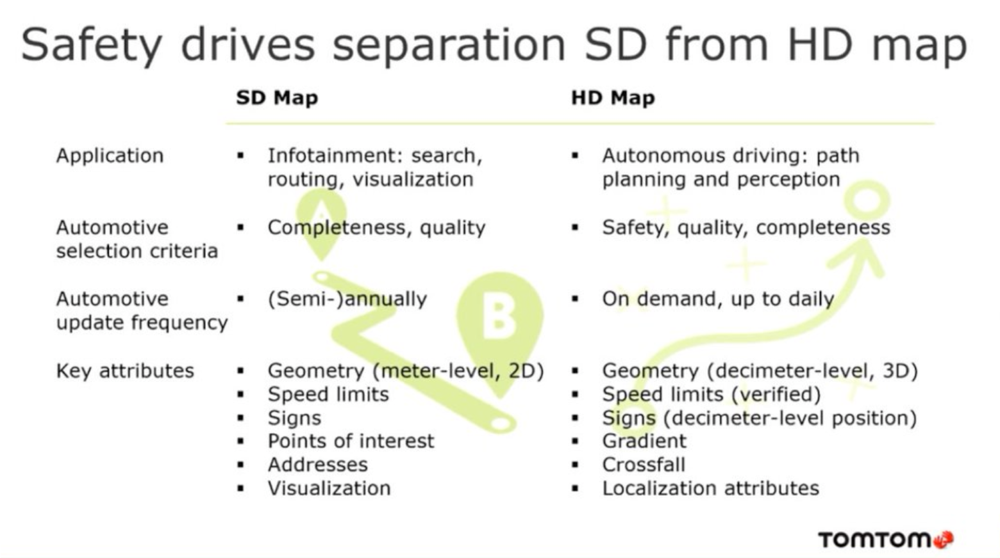
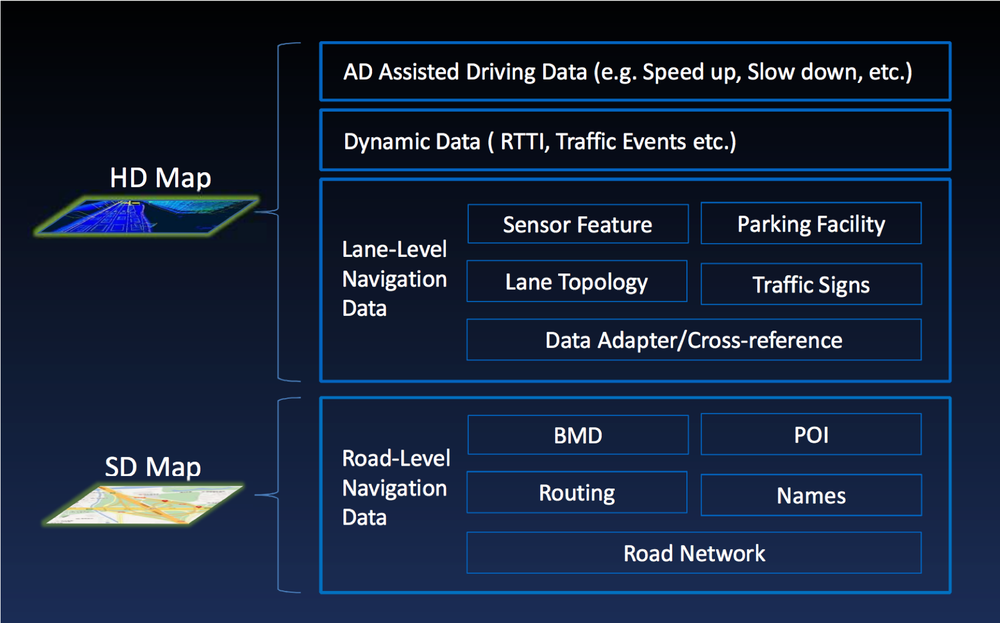
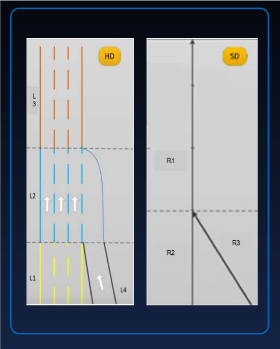
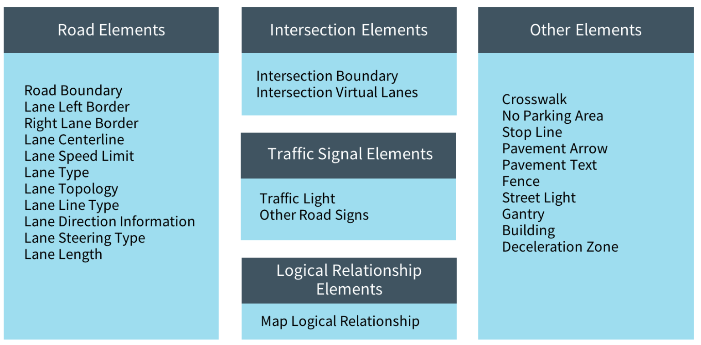

# Apollo HD Map

## What is HDMap

Compare with standard navigation map, HDMap lack of visual and logical capabilities which is needed by human drivers, instead, it provides precise information to assist automatic driving.  Important information includes accurate three-dimensional representation of the road network and lots of semantic information.

## Contents in HDMap
Tough contains similar information, but they are for different purpose:  

<br/>

In Apollo's design, HDMap and SDMap be integrated into one road network architecture.<br/>


HDMap provide rich information at "lane" level compare with SDMap at "road" level<br/>



## Apollo HDMap

Apollo uses [OpenDRIVE format](http://www.opendrive.org) in industry and defines API for HDMap, here is the map element defined in Apollo:



## Interface definition

Apollo use protobuf to record hdmap contents, you could find the definition in [proto folder](https://github.com/ApolloAuto/apollo/tree/master/modules/map/proto) and final data type defined in [hdmap_common.h](https://github.com/ApolloAuto/apollo/blob/master/modules/map/hdmap/hdmap_common.h)

### Interface related with lanes
Proto Definition:[map_lane.proto](https://github.com/ApolloAuto/apollo/blob/master/modules/map/proto/map_lane.proto) <br/>

HDMap module will convert data from proto to class [LaneInfo](https://github.com/ApolloAuto/apollo/blob/a0eadc58cb8cfb4266cb830e59aaa85614daef5d/modules/map/hdmap/hdmap_common.h#L138)<br/>

Consumer of HDMap will call interface definied in [hdmap.h](https://github.com/ApolloAuto/apollo/blob/a0eadc58cb8cfb4266cb830e59aaa85614daef5d/modules/map/hdmap/hdmap.h#L191) for LaneInfo like the one below <br/>
```C++
  /**
   * @brief get nearest lane from target point,
   * @param point the target point
   * @param nearest_lane the nearest lane that match search conditions
   * @param nearest_s the offset from lane start point along lane center line
   * @param nearest_l the lateral offset from lane center line
   * @return 0:success, otherwise, failed.
   */
  int GetNearestLane(const apollo::common::PointENU& point,
                     LaneInfoConstPtr* nearest_lane, double* nearest_s,
                     double* nearest_l) const;
```


# Reference
- [TomTom HD Map](https://www.tomtom.com/automotive/automotive-solutions/automated-driving/hd-map-roaddna/)
- [Apollo Auto](https://github.com/ApolloAuto)


