- [C++ Futures at Instagram Notes](#c-futures-at-instagram-notes)
  - [Instagram's  story](#instagrams--story)
    - [fbthrift](#fbthrift)
      - [Synchronous I/O](#synchronous-io)
        - [Disadvantage](#disadvantage)
      - [Using non-blocking I/O](#using-non-blocking-io)
        - [Advantage](#advantage)
        - [Disadvantage](#disadvantage-1)
      - [Future chaining](#future-chaining)
    - [Result](#result)
  - [Reactor pattern](#reactor-pattern)
    - [Why](#why)
    - [What](#what)
  - [Reactor pattern in detail](#reactor-pattern-in-detail)
    - [Notes from Reactor paper](#notes-from-reactor-paper)
    - [Notes from Scalable IO in Java](#notes-from-scalable-io-in-java)
      - [Native version](#native-version)
      - [Single thread Reactor](#single-thread-reactor)
      - [Using Thread pool](#using-thread-pool)
      - [Multiple reactor](#multiple-reactor)
  - [OS support for I/O multiplexing](#os-support-for-io-multiplexing)
    - [select](#select)
    - [poll](#poll)
    - [epoll](#epoll)
      - [Why epoll is fast](#why-epoll-is-fast)
    - [Difference](#difference)

# C++ Futures at Instagram Notes

This page records the summary and expansion of Instagram's tech blog: [C++ Futures at Instagram](https://instagram-engineering.com/c-futures-at-instagram-9628ff634f49).  

The following part of this article will first describe the evolution of Instagram's scale up network from simple synchronous I/O to none-blocking I/O to future version.  Then describe the common design pattern for supporting this and then lower level operating system support for I/O multiplexing.

## Instagram's  story

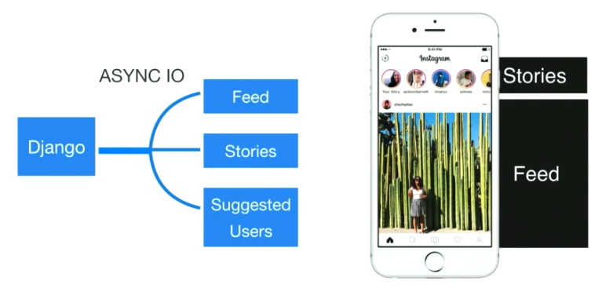


Django process model is a synchronous processing model with long latency, each process can only serve one request at a time.  To scale up network latency, Instagram use async IO for independent services and leverage the power of future->then to organize their code structure.  The picture below shows Instagram's infrastructure to support the two high-performing recommendation services: suggested users and chaining


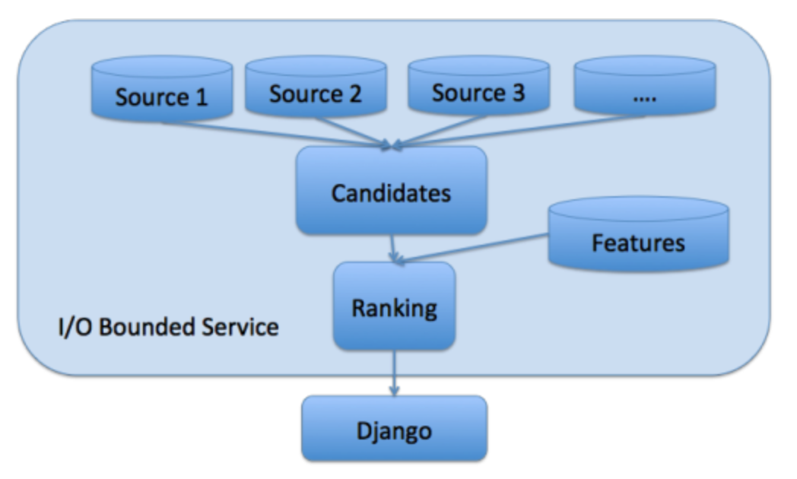

Frontend(Django)   
-> Rank service(c++, communicate by fbthrift) -> Candidate account service load data from different sources  
-> Features used by machine learning 


### fbthrift

Instagram using fbthrift for internal information passing.  A fbthrift server has three kinds of threads: acceptor threads, I/O threads and worker threads.
- An acceptor thread accepts the client connection and assigns it to an I/O thread;
- The I/O thread reads the input data sent by a client, and passes it to a worker thread and the I/O thread will again be responsible for sending outbound requests later;
- The worker thread deserializes the input data into parameters, calls the request handler of the service in its context and spawns additional threads for outbound calls or computation.  The important part is that the thrift request handler runs in a worker thread and not in an I/O thread. This allows the server to be responsive to clients — even if all the worker threads are busy, the server will still have free I/O threads to send an overloaded response to clients and close sockets.


#### Synchronous I/O
Loaded candidates and features synchronously.
- All the I/O calls were issued in parallel in separate threads(different request will have different I/O)
- At the end of the handler was a join() primitive which blocked until all the threads were done
- Which means, one worker thread for one client request
- One single request might break as many threads as the number of outbound calls

##### Disadvantage
It leads to a large memory footprint — each thread by default has a stack size of several MBs.
Too many thread needed: if each request will have M outbound calls, then N request need N * M threads
Thread scheduling also becomes a bottleneck in the kernel at around 400 threads.
With this model, we had to run several hundred instances of server across many machines to support our QPS, because we are not utilizing CPU resource or memory efficiently.


#### Using non-blocking I/O
fbthrift offers three ways to handle requests: synchronous, asynchronous and future-based.  Below is an API example generated by fbthrift:

```C++
class TestServiceSvIf : public TestServiceSvAsyncIf, public apache::thrift2::ServerInterface {
  ...
  virtual void sendResponse(std::string& _return, int64_t size);
  virtual void async_sendResponse(std::unique_ptr<apache::thrift2::HandlerCallback<std::unique_ptr<std::string>>> callback, int64_t size) = 0;
  virtual folly::Future<std::unique_ptr<std::string>> future_sendResponse(int64_t size);
  ...
}
```

non-blocking I/O 
- Every I/O thread has a list of file descriptors on whose status change it waits on in an event loop (it detects this status change through the select()/poll()/epoll() system call). 
- When the status of the file descriptor changes to “completed,” the I/O thread calls the associated callback. 
- Shared I/O thread, need client provide callback, I/O thread holds file descriptor corresponding to I/O operation(provided by eventlib)
 
##### Advantage
- Waiting on select()/poll()/epoll() puts a thread to sleep, which means it does not busy wait. Thus, it is efficient.  To be clear, the synchronous I/O does not necessarily busy wait either, but it requires allocating one thread per I/O call.
- One I/O thread can take care of the I/O of multiple outbound requests. 
This reduces the memory footprint and synchronization costs associated with a large number of threads, and leads to a more scalable system.
- One worker thread does not need to wait for all the I/O associated with a single client request to complete before moving on to the next client request.  
Due to the communication between worker thread and outbound also using async strategy.
- **Thus, one worker thread can perform computation for multiple concurrent client requests**.

##### Disadvantage
Callback Hell

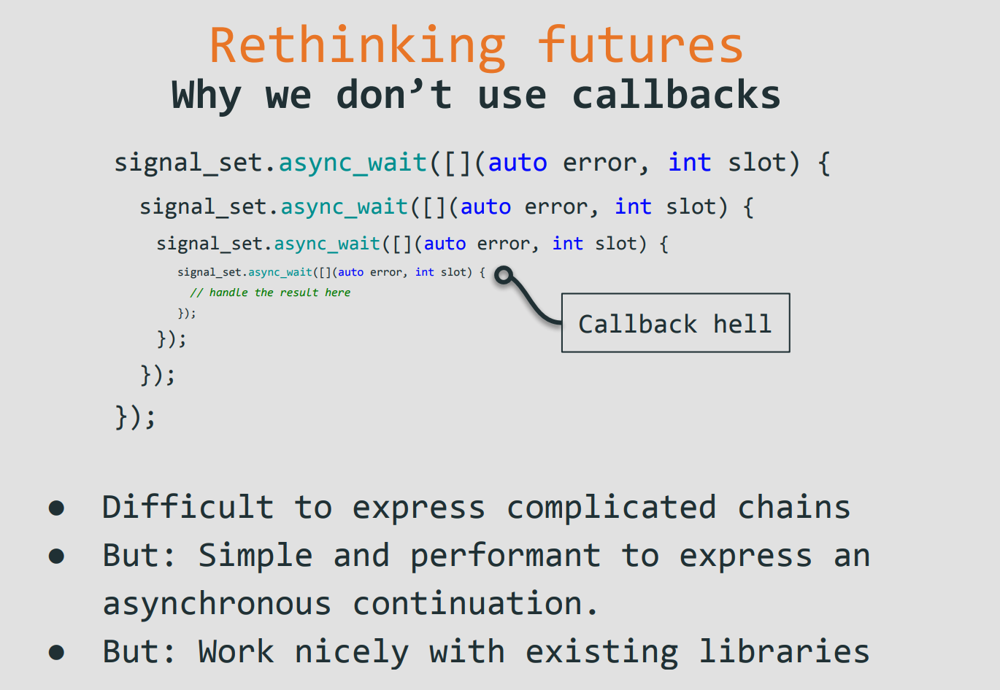


#### Future chaining

From


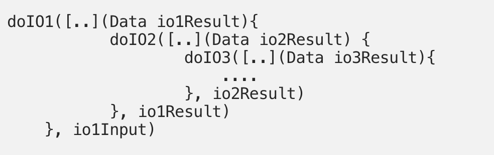

To

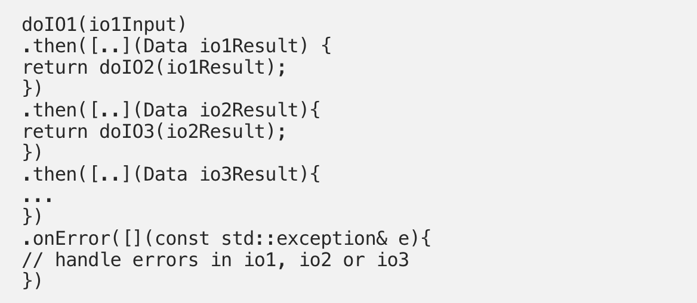

### Result

```
We were able to increase the peak CPU utilization of the Suggested User service from 10–15% to 90% per instance. This enabled us to reduce the number of instances of the Suggested Users service from 720 to 38.

Chaining achieved 40 ms average end-to-end latency and under 200ms p99, handling more than 30,000 queries per second. It runs on only 38 instances (each instance handles around 800 requests per second).
```

## Reactor pattern

### Why
A simple network programming looks like
```
while(true){
   socket = accept();
   handle(socket)
}
```
Its easy to implement, but it’s a low performance version: if current request is not finished, all following request will be blocked.  We could quickly implement a `connection per thread` version:
```
while(true){
   socket = accept();
   new thread(socket);
}
```
The following question would be: What's the cost for creating thread(memory: several MB per-thread, system load), could I create un-limit threads and what's the impact for that?  
There are famous articles for this: [The C10K problem](http://www.kegel.com/c10k.html), [Scalable Network Programming](http://bulk.fefe.de/scalable-networking.pdf), [Fast UNIX Servers](https://nick-black.com/dankwiki/index.php/Fast_UNIX_Servers) and many others.  The short answer for upper questions is, you could not create as many thread as you expected, it will be a trouble when come to thousands level of thread scheduling:

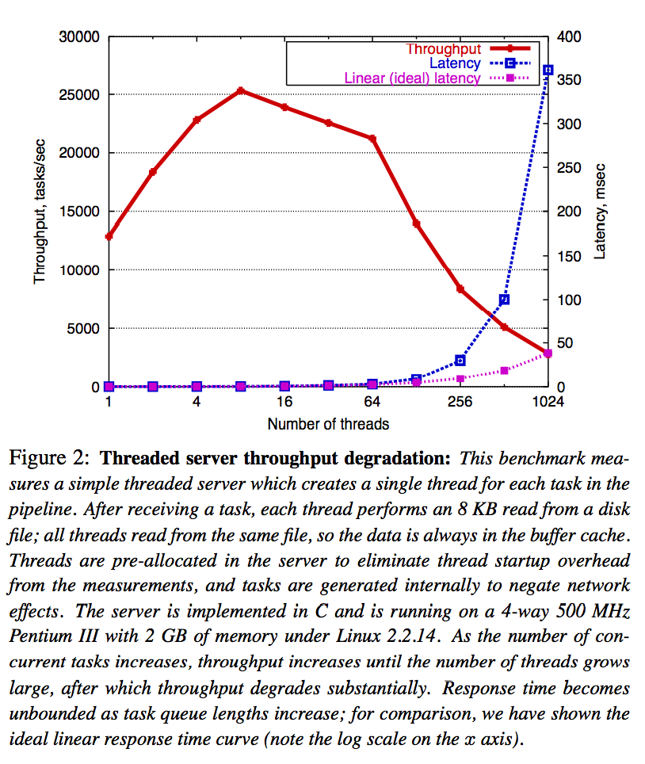


(picture come form paper of [SEDA: An Architecture for Well-Conditioned, Scalable Internet Services](http://sosp.org/2001/papers/welsh.pdf), Linux 2.6 and later has much stronger scheduler but create threads still be an expensive operation)

To be summary, the big issue for thread-per-connection is:(from [Reactor by Douglas C. Schmidt](http://www.dre.vanderbilt.edu/~schmidt/PDF/reactor-siemens.pdf))
```
Efficiency: Threading may lead to poor performance due to context switching, synchronization, and data movement [2];
Programming simplicity: Threading may require complex concurrency control schemes;
Portability: Threading is not available on all OS platforms.
```

Most of I/O operation following the pattern listed below
```
Read request
Decode request
Process service
Encode reply
Send reply
```
We could think about have dedicate module to handle accept(eg, TCP connection), read I/O(eg, from network), process, and then write back/send.  

For accept part, I assume I have a none-blocking, and event driven strategy, which means, I expect system could notify me when there is a event comes and tell me what category the event is.  Then I could use dedicate I/O thread to read data, then submit task into a thread pool for processing and then use dedicate I/O thread to write data.  This is a simple version of Reactor, it focus on abstract a high performance pattern and let user focus on what kind of event they need to deal with and how to deal.  For system's notification, such as select/poll/epoll, will be described later and let's focus on Reactor pattern first.

### What

From [wiki](https://en.wikipedia.org/wiki/Reactor_pattern)
```
The reactor design pattern is an event handling pattern for handling service 
requests delivered concurrently by one or more inputs. The service handler 
then demultiplexes the incoming requests and dispatches them synchronously to 
associated request handlers.
```

From [Reactor by Douglas C. Schmidt](http://www.dre.vanderbilt.edu/~schmidt/PDF/reactor-siemens.pdf)
```
The Reactor design pattern handles service requests that are delivered 
concurrently to an application by one or more clients. Each service in an 
application may consistent of several methods and is represented by a separate
event handler that is responsible for dispatching service-specific requests. 
Dispatching of event handlers is performed by an initiation dispatcher, which 
manages the registered event handlers. Demultiplexing of service requests is 
performed by a synchronous event demultiplexer. Also known as Dispatcher, 
Notifier
```

## Reactor pattern in detail

### Notes from [Reactor paper](http://www.dre.vanderbilt.edu/~schmidt/PDF/reactor-siemens.pdf)

The paper use a log server as an example: Let's say we have a logging server support our clients to upload their logs via network, for different category of logs we might have different strategy to handle them, such as record to database, print out or show result on console.

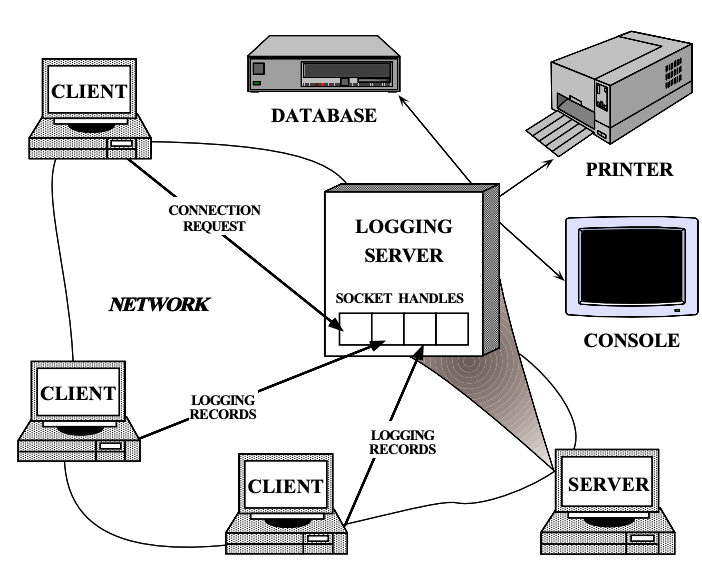


Here is the class diagram from paper:

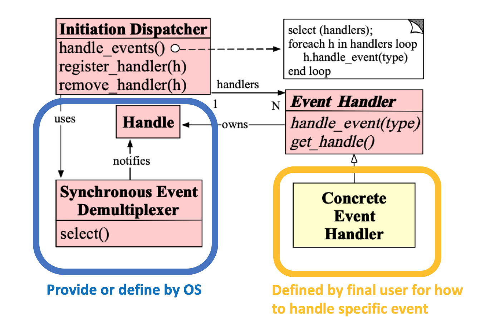


- Handle
   - Identify resources that are managed by an OS.
   - These resources commonly include network connections, open files, timers, synchronization objects, etc.
   - Every connection is represented in the server by a socket handle.
- Synchronous Event Demultiplexer 
  - Blocks awaiting events to occur on a set of Handles.
  - It returns when it is possible to initiate an operation on a Handle without blocking.
  - (select/poll/epoll)
- Initiation Dispatcher
  - Defines an interface for registering, removing, and dispatching Event Handlers. Ultimately, the
  - Synchronous Event Demultiplexer is responsible for waiting until new events occur. When it detects new events, it informs the Initiation
  - Dispatcher to call back application-specific event handlers.
- Event Handler
   - Specifies an interface consisting of a hook method that abstractly represents the dispatching operation for service-specific events.
- Concrete Event Handler
  - Implements the hook method, as well as the methods to process these events in an application-specific manner. 
  - Applications register Concrete Event Handlers with the Initiation Dispatcher to process certain types of events. 
  - When these events arrive, the Initiation Dispatcher calls back the hook method of the appropriate Concrete Event Handler.

For complete code from paper, you could go to here for reference. [todo]


The following sequence diagram is an example from paper shows how logging acceptor triggering logging handler.

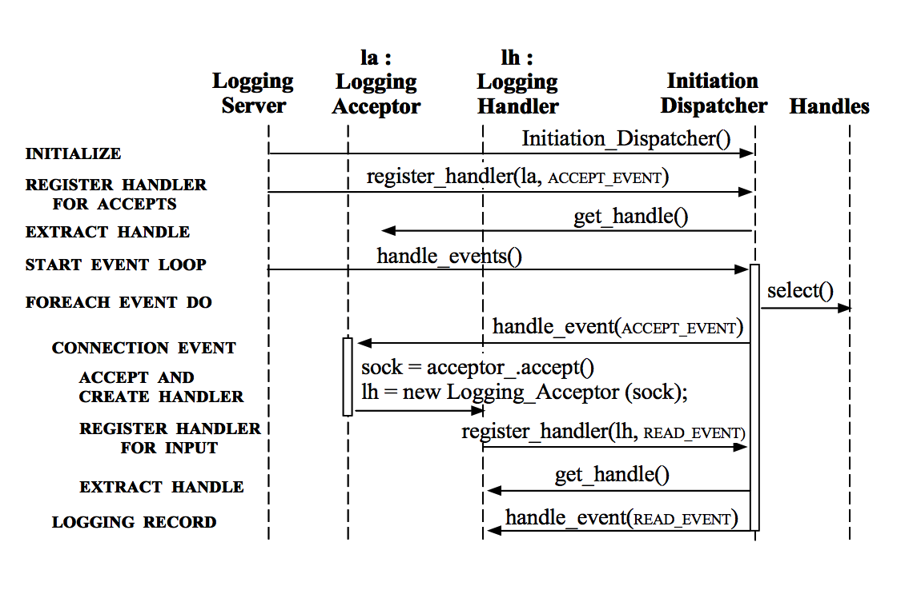

- During initialization, InitiationDispatcher is constructed
- `LoggingAcceptor la(addr);`, in `LoggingAcceptor`'s constructor, will register himself to listen to system's addr and then register the object itself into InitiationDispatcher 
- Then will come to handle_event loop, system's select() start waiting
- to be continued


### Notes from [Scalable IO in Java](http://gee.cs.oswego.edu/dl/cpjslides/nio.pdf)

#### Native version
`connection per thread`

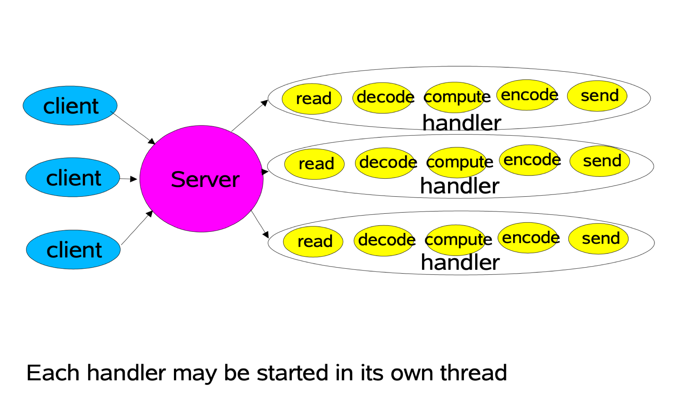

```java
class Server implements Runnable {
    public void run() {
        try {
            ServerSocket ss = new ServerSocket(PORT);
            while (!Thread.interrupted())
            new Thread(new Handler(ss.accept())).start(); // connection per thread
            // or, single-threaded, or a thread pool
        } catch (IOException ex) { /* ... */ }
    }
    
    static class Handler implements Runnable {
        final Socket socket;
        Handler(Socket s) { socket = s; }
        public void run() {
            try {
                byte[] input = new byte[MAX_INPUT];
                socket.getInputStream().read(input);
                byte[] output = process(input);
                socket.getOutputStream().write(output);
            } catch (IOException ex) { /* ... */ }
        }       
        private byte[] process(byte[] cmd) { /* ... */ }
    }
}
```

#### Single thread Reactor


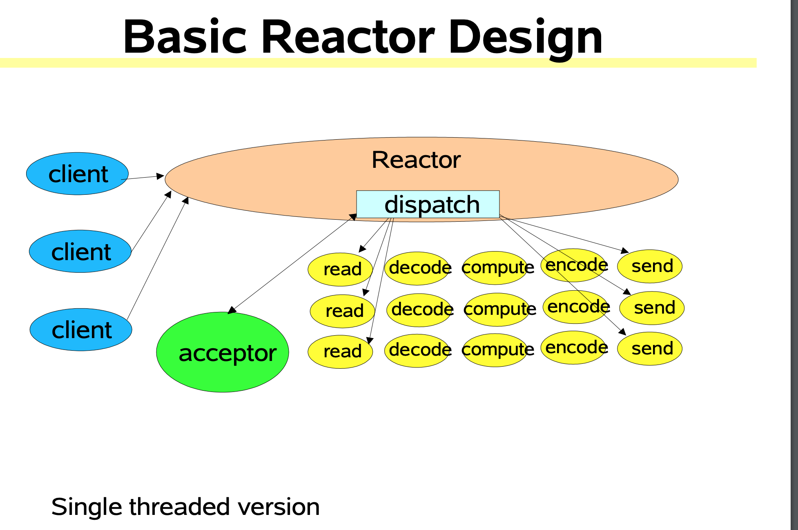

```java
class Reactor implements Runnable { 
    final Selector selector;
    final ServerSocketChannel serverSocket;
    Reactor(int port) throws IOException { //Reactor initialization
        selector = Selector.open();
        serverSocket = ServerSocketChannel.open();
        serverSocket.socket().bind(new InetSocketAddress(port));
        serverSocket.configureBlocking(false); // none-blocking
        SelectionKey sk = serverSocket.register(selector, SelectionKey.OP_ACCEPT); //multi-step,step 1,receve event of OP_ACCEPT
        sk.attach(new Acceptor()); //attach callback object, Acceptor
    }
    
    public void run() { 
        try {
            while (!Thread.interrupted()) {
                selector.select();
                Set selected = selector.selectedKeys();
                Iterator it = selected.iterator();
                while (it.hasNext())
                    dispatch((SelectionKey)(it.next()); //Reactor responsible for dispatch coming event
                selected.clear();
            }
        } catch (IOException ex) { /* ... */ }
    }
    
    void dispatch(SelectionKey k) {
    	Runnable r = (Runnable)(k.attachment()); // execute callback object registered before
    	if (r != null)
    	    r.run();
    }
    
    class Acceptor implements Runnable { // inner
        public void run() {
            try {
                SocketChannel c = serverSocket.accept();
                if (c != null)
                new Handler(selector, c);
            }
            catch(IOException ex) { /* ... */ }
        }
    }
}

final class Handler implements Runnable {
    final SocketChannel socket;
    final SelectionKey sk;
    ByteBuffer input = ByteBuffer.allocate(MAXIN);
    ByteBuffer output = ByteBuffer.allocate(MAXOUT);
    static final int READING = 0, SENDING = 1;
    int state = READING;
    
    Handler(Selector sel, SocketChannel c) throws IOException {
        socket = c; c.configureBlocking(false);
        // Optionally try first read now
        sk = socket.register(sel, 0);
        sk.attach(this); //Register Handler as callback obj将Handler作为callback对象
        sk.interestOps(SelectionKey.OP_READ); // step 2, receive event of OP_READ
        sel.wakeup();
    }
    boolean inputIsComplete() { /* ... */ }
    boolean outputIsComplete() { /* ... */ }
    void process() { /* ... */ }
    
    public void run() {
        try {
            if (state == READING) read();
            else if (state == SENDING) send();
        } catch (IOException ex) { /* ... */ }
    }
    
    void read() throws IOException {
        socket.read(input);
        if (inputIsComplete()) {
            process();
            state = SENDING;
            // Normally also do first write now
            sk.interestOps(SelectionKey.OP_WRITE); //step 3, receive event of OP_WRITE
        }
    }
    void send() throws IOException {
        socket.write(output);
        if (outputIsComplete()) sk.cancel(); //when write is done, close select key
    }
}


```

#### Using Thread pool
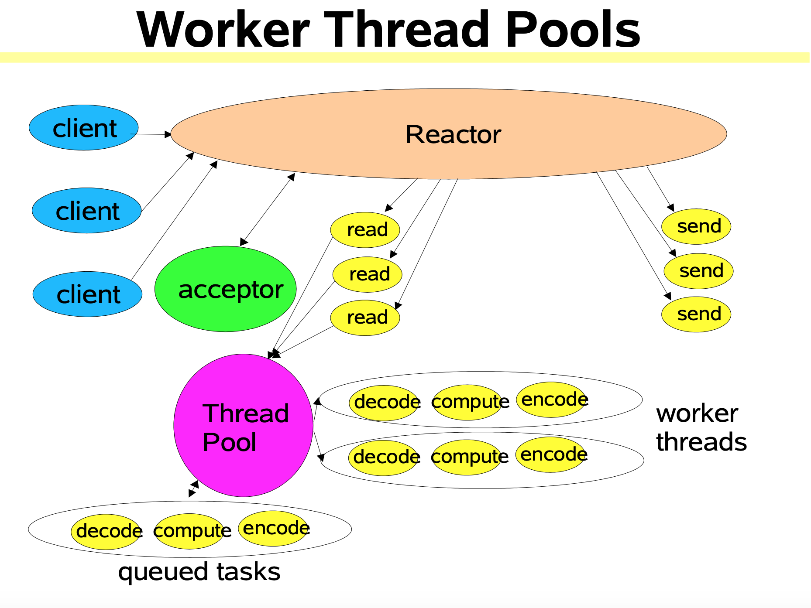


```java

class Handler implements Runnable {
    // uses util.concurrent thread pool
    static PooledExecutor pool = new PooledExecutor(...);
    static final int PROCESSING = 3;
    // ...
    synchronized void read() { // ...
        socket.read(input);
        if (inputIsComplete()) {
            state = PROCESSING;
            pool.execute(new Processer()); //Using thread pool aync execute 
        }
    }
    
    synchronized void processAndHandOff() {
        process();
        state = SENDING; // or rebind attachment
        sk.interest(SelectionKey.OP_WRITE); 
    }
    
    class Processer implements Runnable {
        public void run() { processAndHandOff(); }
    }
}
```

#### Multiple reactor


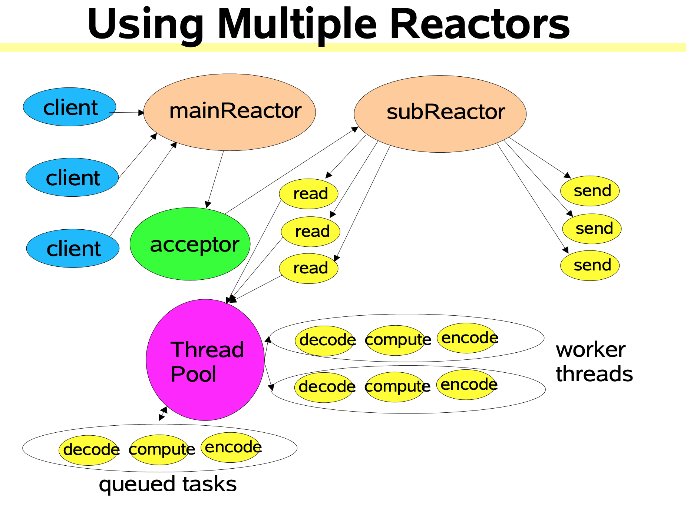

```java
Selector[] selectors; //a collection of subReactors
int next = 0;
class Acceptor { // ...
    public synchronized void run() { ...
        Socket connection = serverSocket.accept(); // master selector response for accept
        if (connection != null)
            new Handler(selectors[next], connection); //Pick one subReactor responsible for connection
        if (++next == selectors.length) next = 0;
    }
}
```


## OS support for I/O multiplexing 
Under Unix/Linux system, I/O multiplexing be abstract as select/poll/epoll funcitons.

### select
from: http://man7.org/linux/man-pages/man2/select.2.html
```
select() and pselect() allow a program to monitor multiple file
       descriptors, waiting until one or more of the file descriptors become
       "ready" for some class of I/O operation (e.g., input possible).  A
       file descriptor is considered ready if it is possible to perform a
       corresponding I/O operation (e.g., read(2), or a sufficiently small
       write(2)) without blocking.

       select() can monitor only file descriptors numbers that are less than
       FD_SETSIZE; poll(2) does not have this limitation.  See BUGS.

```

[Example](https://www.gnu.org/software/libc/manual/html_node/Server-Example.html)
```C
while (1)
    {
      /* Block until input arrives on one or more active sockets. */
      read_fd_set = active_fd_set;
      if (select (FD_SETSIZE, &read_fd_set, NULL, NULL, NULL) < 0)
        {
          perror ("select");
          exit (EXIT_FAILURE);
        }

      /* Service all the sockets with input pending. */
      for (i = 0; i < FD_SETSIZE; ++i)
        if (FD_ISSET (i, &read_fd_set))
          {
            if (i == sock)
              {
                /* Connection request on original socket. */
                int new;
                size = sizeof (clientname);
                new = accept (sock,
                              (struct sockaddr *) &clientname,
                              &size);

                FD_SET (new, &active_fd_set);
              }

          }
    }
// Each time when calling select(), OS need to add current process to the waiting list
// of all sockets he want to liston to
// And when the process be waked up, it need a loop to check which sockets has data
```

### poll
http://man7.org/linux/man-pages/man2/poll.2.html

### epoll

from: http://man7.org/linux/man-pages/man7/epoll.7.html

```
       The epoll API performs a similar task to poll(2): monitoring multiple
       file descriptors to see if I/O is possible on any of them.  The epoll
       API can be used either as an edge-triggered or a level-triggered
       interface and scales well to large numbers of watched file
       descriptors.

       The central concept of the epoll API is the epoll instance, an in-
       kernel data structure which, from a user-space perspective, can be
       considered as a container for two lists:

       *   The interest list (sometimes also called the epoll set): the set
           of file descriptors that the process has registered an interest
           in monitoring.

       *   The ready list: the set of file descriptors that are "ready" for
           I/O.  The ready list is a subset of (or, more precisely, a set of
           references to) the file descriptors in the interest list that is
           dynamically populated by the kernel as a result of I/O activity
           on those file descriptors.
```

One place need pay special attention to is the difference between the following two:

```
   Level-triggered and edge-triggered
       The epoll event distribution interface is able to behave both as
       edge-triggered (ET) and as level-triggered (LT).  The difference
       between the two mechanisms can be described as follows.  Suppose that
       this scenario happens:

       1. The file descriptor that represents the read side of a pipe (rfd)
          is registered on the epoll instance.

       2. A pipe writer writes 2 kB of data on the write side of the pipe.

       3. A call to epoll_wait(2) is done that will return rfd as a ready
          file descriptor.

       4. The pipe reader reads 1 kB of data from rfd.

       5. A call to epoll_wait(2) is done.

       If the rfd file descriptor has been added to the epoll interface
       using the EPOLLET (edge-triggered) flag, the call to epoll_wait(2)
       done in step 5 will probably hang despite the available data still
       present in the file input buffer; meanwhile the remote peer might be
       expecting a response based on the data it already sent.  The reason
       for this is that edge-triggered mode delivers events only when
       changes occur on the monitored file descriptor.  So, in step 5 the
       caller might end up waiting for some data that is already present
       inside the input buffer.  In the above example, an event on rfd will
       be generated because of the write done in 2 and the event is consumed
       in 3.  Since the read operation done in 4 does not consume the whole
       buffer data, the call to epoll_wait(2) done in step 5 might block
       indefinitely.

       An application that employs the EPOLLET flag should use nonblocking
       file descriptors to avoid having a blocking read or write starve a
       task that is handling multiple file descriptors.  The suggested way
       to use epoll as an edge-triggered (EPOLLET) interface is as follows:

              i   with nonblocking file descriptors; and

              ii  by waiting for an event only after read(2) or write(2)
                  return EAGAIN.

```

Example

```c
int s = socket(AF_INET, SOCK_STREAM, 0);   
bind(s, ...)
listen(s, ...)
int epfd = epoll_create(...);
epoll_ctl(epfd, ...); //Add all the sockets that need to be monitored to epfd

while(1){
    int n = epoll_wait(...)
    for(socket received data){  // rdlist
        //processing
    }
}

```

#### Why epoll is fast

- Separation of functionality
   - `Select` need to manage "maintaining waiting list" and "blocking process".  Each time when you call `select` you need do both thing.
   - `Epoll` separate this two operations, use `epoll_ctl` to manage waiting list, and then `epoll_wait` to block process
- Ready list
  - When `select` has been triggered, application didn't know which port exactly recevied data but only iterate all of them
  - `epoll` manages a `rdlist` in the kernel.  For example, let's say `epoll` monitors `sock1`, `sock2` and `sock3`, and then `sock2` and `sock3` received data, if they be referenced by `rdlist`, then we just need to iterate content in `rdlist` to receive all the data
- Inside epoll

```c
// let's assume in process A we write these code
int epfd = epoll_create(...);
```


```c
epoll_ctl(epfd, ...); //Add all the sockets that need to be monitored to epfd
// let's say it will monitor sock1 and sock2
```


```c
// After calling
int n = epoll_wait(...)
```


```c
// when data comes
// schedule process back
```


Data structure inside `epoll`


### Difference


A typical server might be dealing with, say, 200 connections. It will service every connection that needs to have data written or read and then it will need to wait until there's more work to do. While it's waiting, it needs to be interrupted if data is received on any of those 200 connections.
With select, the kernel has to add the process to 200 wait lists, one for each connection. To do this, it needs a "thunk" to attach the process to the wait list. When the process finally does wake up, it needs to be removed from all 200 wait lists and all those thunks need to be freed.
By contrast, with epoll, the epoll socket itself has a wait list. The process needs to be put on only that one wait list using only one thunk. When the process wakes up, it needs to be removed from only one wait list and only one thunk needs to be freed.
To be clear, with epoll, the epoll socket itself has to be attached to each of those 200 connections. But this is done once, for each connection, when it is accepted in the first place. And this is torn down once, for each connection, when it is removed. By contrast, each call to select that blocks must add the process to every wait queue for every socket being monitored.
Ironically, with select, the largest cost comes from checking if sockets that have had no activity have had any activity. With epoll, there is no need to check sockets that have had no activity because if they did have activity, they would have informed the epoll socket when that activity happened. In a sense, select polls each socket each time you call select to see if there's any activity while epoll rigs it so that the socket activity itself notifies the process.


select() and poll() provide basically the same functionality. They only differ in the details:

select() overwrites the fd_set variables whose pointers are passed in as arguments 2-4, telling it what to wait for. This makes a typical loop having to either have a backup copy of the variables, or even worse, do the loop to populate the bitmasks every time select() is to be called. poll() doesn't destroy the input data, so the same input array can be used over and over.
poll() handles many file handles, like more than 1024 by default and without any particular work-arounds. Since select() uses bitmasks for file descriptor info with fixed size bitmasks it is much less convenient. On some operating systems like Solaris, you can compile for support with > 1024 file descriptors by changing the FD_SETSIZE define.
poll offers somewhat more flavours of events to wait for, and to receive, although for most common networked cases they don't add a lot of value
Different timeout values. poll takes milliseonds, select takes a struct timeval pointer that offers microsecond resolution. In practice however, there probably isn't any difference that will matter.

select and poll both handle file descriptors in a linear way. The more descriptors you ask them to check, the slower they get. As soon as you go beyond perhaps a hundred file descriptors or so - of course depending on your CPU and hardware - you will start noticing that the mere waiting for file descriptor activity and the following checking which file descriptor that it was, takes a significant time and becomes a bottle neck.
The select() API with a "max fds" as first argument of course forces a scan over the bitmasks to find the exact file descriptors to check for, which the poll() API avoids. A small win for poll().
select() only uses (at maximum) three bits of data per file descriptor, while poll() typically uses 64 bits per file descriptor. In each syscall invoke poll() thus needs to copy a lot more over to kernel space. A small win for select().


