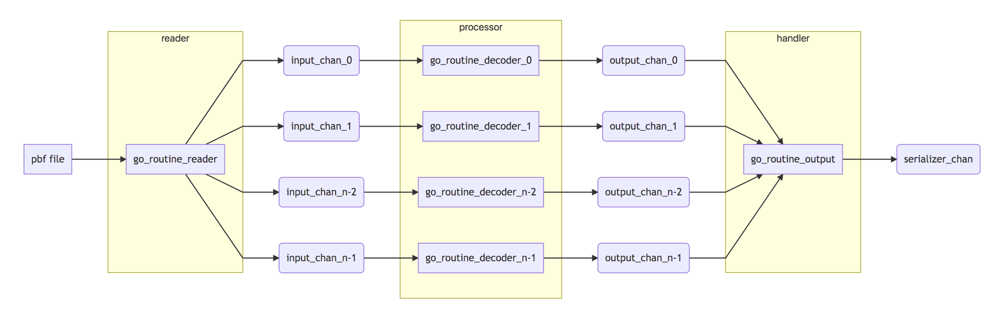

<!-- TOC -->
- [PBF decoder in golang](#PBF-decoder-in-golang)
	- [qedus/osmpbf](#qedusosmpbf)
		- [How to use](#How-to-use)
		- [Internal](#Internal)
			- [Reader](#Reader)
			- [Processor](#Processor)
			- [Handler](#Handler)
		- [Difference with OSMIUM](#Difference-with-OSMIUM)
	- [Reference](#Reference)


# PBF decoder in golang

## [qedus/osmpbf](https://github.com/qedus/osmpbf)

### How to use
You could follow the example [here](https://github.com/qedus/osmpbf/blob/f9408716cb01c9a60d2929bf510d9b9b4d893f58/example_test.go#L1) with following changes:
```go
    // [Perry] Use your own pbf
    f, err := os.Open("nv.osm.pbf")

    // ...

    // [Perry]Write your own paser to handle osm object
    for {
		if v, err := d.Decode(); err == io.EOF {
			break
		} else if err != nil {
			log.Fatal(err)
		} else {
			switch v := v.(type) {
			case *osmpbf.Node:
				// Process Node v.
				nc++
				
			case *osmpbf.Way:
				// Process Way v.
				wc++
				// [Perry] Print wayid, nodeids
				fmt.Printf("WayID: %d, ", v.ID)
				for _, node := range v.NodeIDs {
					fmt.Printf("%d,", node)
				}
				fmt.Printf("\n")
			case *osmpbf.Relation:
				// Process Relation v.
				rc++
			default:
				log.Fatalf("unknown type %T\n", v)
			}
		}

```

### Internal
Before I use go version of OSM decoder, I am the believer of OSMIUM, its elegant design of reader->processor->handler really influenced me a lot, I feel it might be the only pbf decoder you should use.  But after have a try with go version, I was surprised by its high performance and simple implementation based on the power of go concurrency.    



Decoding PBF works like a simple ETL job, add proper partitioner we could make this model executed distributable.  But most of road graph processing is concurrent program running on single machine, I think may be its due to the scale of road network is not that big and the complexity of distribution is not worth to solve most of current problem.

#### Reader
Reader is the one deal with source file, please do pay attention to the design of File Block in OSM PBF schema, which is the one really empowers the ability of concurrency.  Each file block contains several primitive blobs, and each primitive blob contains a group of osm element like way/node/relation.  The idea of primitiveblob is similar to the idea parquet in column database, it groups data together and provide metadata to describe the group.  OSM data is simple, use only one column represent all elements in way/node/relation.  
Reader part act as round robin, put file blocks into each channel.  

Here is the logic related with [reader](https://github.com/qedus/osmpbf/blob/f9408716cb01c9a60d2929bf510d9b9b4d893f58/decode.go#L179)
```go
	go func() {
		var inputIndex int
		for {
			input := dec.inputs[inputIndex]
			inputIndex = (inputIndex + 1) % n

			blobHeader, blob, err := dec.readFileBlock()
			if err == nil && blobHeader.GetType() != "OSMData" {
				err = fmt.Errorf("unexpected fileblock of type %s", blobHeader.GetType())
			}
			if err == nil {
				// send blob for decoding
				// [Perry] Send to input channel of inputIndex
				input <- pair{blob, nil}
			} else {
				// send input error as is
				input <- pair{nil, err}
				for _, input := range dec.inputs {
					close(input)
				}
				return
			}
		}
```

#### Processor
[Processor](https://github.com/qedus/osmpbf/blob/f9408716cb01c9a60d2929bf510d9b9b4d893f58/decode.go#L156) will init several go routine to decode osm blob, the number of go routine depends on your target machine's capacity.  This part reminds me the classic speech given by Rob Pike, [Concurrency Is Not Parallelism](https://www.youtube.com/watch?v=cN_DpYBzKso), concurrency means the ability to deal with multiple things and parallelism means doing several things at the same time.  Design concurrency algorithm means your algorithm should have the ability to scale when handware changes.  

```go
	for i := 0; i < n; i++ {
		input := make(chan pair)
		output := make(chan pair)
		go func() {
			dd := new(dataDecoder)
			// [Perry] Receive message from input channel
			for p := range input {
				if p.e == nil {
					// send decoded objects or decoding error
					// [Perry] Decode blob to a list of osm objects and send to output channel
					objects, err := dd.Decode(p.i.(*OSMPBF.Blob))
					output <- pair{objects, err}
				} else {
					// send input error as is
					output <- pair{nil, p.e}
				}
			}
			close(output)
		}()

```

#### Handler
[Handler](https://github.com/qedus/osmpbf/blob/f9408716cb01c9a60d2929bf510d9b9b4d893f58/decode.go#L203) is the module helps external component to implement call back function

```go
	go func() {
		var outputIndex int
		for {
			output := dec.outputs[outputIndex]
			outputIndex = (outputIndex + 1) % n
			
			//[Perry] Get osm objects from output channel
			p := <-output
			if p.i != nil {
				// send decoded objects one by one
				for _, o := range p.i.([]interface{}) {
					dec.serializer <- pair{o, nil}
					//[Perry] Client code will retrieve elements from this channel
					// p, ok := <-dec.serializer
				}
			}
			if p.e != nil {
				// send input or decoding error
				dec.serializer <- pair{nil, p.e}
				close(dec.serializer)
				return
			}
		}
	}()

```


### Difference with OSMIUM
- For more information of OSMIUM, you could go to the PPT [here](https://github.com/Telenav/open-source-spec/blob/master/osmium/resource/slides/osmium_20181201.pptx)
- OSMIUM using buffer act as memory pool to minimize memory allocation
- OSMIUM using std::future to gurantee the sequence of output.  Assume in PBF the sequence of element is node1, node2, way1, way2, the use of std::future gurantee in client side handling sequence is still be node1, node2, way1, way2.  I don't feel this feature matters much for my scenario, but its a good design which is very useful in many fields.


## Reference
- [Golang's scheduler - code review and discussion](https://github.com/Telenav/osrm-backend/pull/259#discussion_r403046506)
- [Merging Huuuge CSV Files Using Golang Channels](https://danrl.com/blog/2018/merging-huuuge-csv-files-using-golang-channels/)
