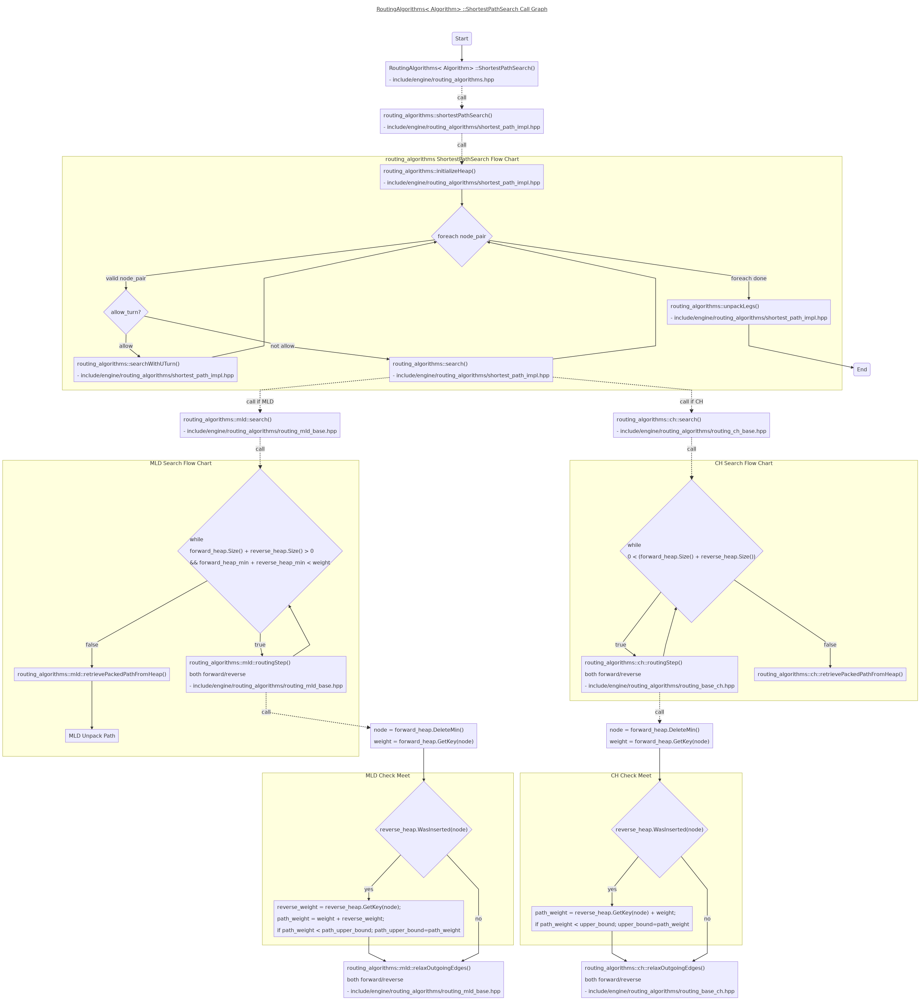

# Bidirectional Dijkstra In OSRM
There're two algorithms of route planning available in [OSRM](https://github.com/Project-OSRM/osrm-backend):    
- CH: Contraction Hierarchies     
- MLD: Multi-Level Dijkstra     

Both of them will query shortest path by Bidirectional Dijkstra. Below we'll discuss about several details for of the bidirectional dijkstra algorithm in [OSRM](https://github.com/Project-OSRM/osrm-backend).      

- Prerequisites     
    - [Understanding OSRM Graph Representation](./understanding_osrm_graph_representation.md)    
    - [QueryHeap - PriorityQueue and VisitedTable In OSRM](./queryheap_in_osrm.md)    

## Bidirectional Dijkstra Shortest Path Search Call Graph


## Check Meet
Please refer to above call graph for MLD/CH check meet logic flow.    
Details can be found at:    
- [CH Source Code of Check Meet](https://github.com/Project-OSRM/osrm-backend/blob/72e03f9af9824cbb1d26cba878f242eb0feae584/include/engine/routing_algorithms/routing_base_ch.hpp#L128)    
- [MLD Source Code of Check Meet](https://github.com/Project-OSRM/osrm-backend/blob/72e03f9af9824cbb1d26cba878f242eb0feae584/include/engine/routing_algorithms/routing_base_mld.hpp#L355)    
    
The basic logic are very similar between MLD and CH:(`[Jay] Note 1,2,3` in below code block are the most important things)    
```c++
    // [Jay] Enter routingStep() ...

    const auto node = forward_heap.DeleteMin();
    const auto weight = forward_heap.GetKey(node);

    // Upper bound for the path source -> target with
    // weight(source -> node) = weight weight(to -> target) ≤ reverse_weight
    // is weight + reverse_weight
    // More tighter upper bound requires additional condition reverse_heap.WasRemoved(to)
    // with weight(to -> target) = reverse_weight and all weights ≥ 0
    // [Jay] NOTE: 
    //  1. `weight(to -> target) ≤ reverse_weight`: it's possible if the node from reverse heap is not popped, 
    //      so the var name is `path_upper_bound` instead of `path_weight`.    
    //  2. Even the current meet only `upper_bound`(i.e. `weight(to -> target) < reverse_weight`), 
    //      it's not necessary to improve it by `reverse_heap.WasRemoved(to)`,
    //      because the accurate one will be found by meet from reverse.   
    if (reverse_heap.WasInserted(node))
    {

        // [Jay] NOTE:
        //  3. There's no double plus weight here, 
        //      since the weight plus rule more likes a "left closed right open", i.e. "[start, end)".
        //      Which means just one of the `forward_weight` and `reverse_weight` will include current node weight.
        auto reverse_weight = reverse_heap.GetKey(node);
        auto path_weight = weight + reverse_weight;

        // [Jay] TODO: force_loop logic, different between MLD and CH ...

        // [Jay] Record the path if with smaller weight.
        if (path_weight >= 0) && (path_weight < path_upper_bound))
        {
            middle_node = node;
            path_upper_bound = path_weight;
        }
    }

    // [Jay] relax logic ...
```

### TODO
- Why need `force_loop`? And what's the differences between CH and MLD of the `force_loop`?
    - To fix the issue Meet on Same Edge(i.e. GraphNode)?
    - To check whether a loop present at a GraphNode?    

Below are some comments from [OSRM](https://github.com/Project-OSRM/osrm-backend) source code, FYI:    
```c++
        //  MLD uses loops forcing only to prune single node paths in forward and/or backward direction. 
        //  (there is no need to force loops in MLD but in CH)
        //
        //  CH check whether there is a loop present at the node. 
        // in this case we are looking at a bi-directional way where the source
        // and target phantom are on the same edge based node
```

## End Condition
### MLD
`[Jay] Note` in below code block is the most important End Condition of MLD.    
- [MLD End Condition Related Code In Search](https://github.com/Project-OSRM/osrm-backend/blob/72e03f9af9824cbb1d26cba878f242eb0feae584/include/engine/routing_algorithms/routing_base_mld.hpp#L409)    
```c++    
    EdgeWeight forward_heap_min = forward_heap.MinKey();
    EdgeWeight reverse_heap_min = reverse_heap.MinKey();

    // [Jay] NOTE: Here's the end condition of bidirectional dijkstra of MLD, 
    //  Which is a very standard end condition of bidirectional dijkstra, strongly enough.
    while (forward_heap.Size() + reverse_heap.Size() > 0 &&
           forward_heap_min + reverse_heap_min < weight)
    {
        // [Jay] call `routingStep()`...
    }

```
### CH    
`[Jay] Note` in below code block is the most important End Condition of CH.    
- [CH End Condition Related Code In Search](https://github.com/Project-OSRM/osrm-backend/blob/72e03f9af9824cbb1d26cba878f242eb0feae584/src/engine/routing_algorithms/routing_base_ch.cpp#L119)    
```c++
    // get offset to account for offsets on phantom nodes on compressed edges
    const auto min_edge_offset = std::min(0, forward_heap.MinKey());

    // [Jay] Loop until both forward_heap and reverse_heap are empty.   
    while (0 < (forward_heap.Size() + reverse_heap.Size()))
    {
        // [Jay] call `routingStep()`...
    }
```    
- [CH End Condition Related Code In routingStep](https://github.com/Project-OSRM/osrm-backend/blob/72e03f9af9824cbb1d26cba878f242eb0feae584/include/engine/routing_algorithms/routing_base_ch.hpp#L172)    
```c++
    // [Jay] Below are comments of `ch::routingStep()`...
    /*
    min_edge_offset is needed in case we use multiple
    nodes as start/target nodes with different (even negative) offsets.
    In that case the termination criterion is not correct
    anymore.

    Example:
    forward heap: a(-100), b(0),
    reverse heap: c(0), d(100)

    a --- d
    \ /
    / \
    b --- c

    This is equivalent to running a bi-directional Dijkstra on the following graph:

        a --- d
    /  \ /  \
    y    x    z
    \  / \  /
        b --- c

    The graph is constructed by inserting nodes y and z that are connected to the initial nodes
    using edges (y, a) with weight -100, (y, b) with weight 0 and,
    (d, z) with weight 100, (c, z) with weight 0 corresponding.
    Since we are dealing with a graph that contains _negative_ edges,
    we need to add an offset to the termination criterion.
    */


    // [Jay] Below codes in `routingStep()`, after CH Check Meet...

    // make sure we don't terminate too early if we initialize the weight
    // for the nodes in the forward heap with the forward/reverse offset
    // [Jay] NOTE: This is the most important condition for exit. 
    //      Mostly is `weight > upper_bound`, then remain items of this heap can be ignored.
    //      The `min_edge_offset` is only used to handle negative weights of source/target.
    //      Very similar with `forward_heap.MinKey() > upper_bound && reverse_heap.MinKey() > upper_bound`.    
    BOOST_ASSERT(min_edge_offset <= 0);
    if (weight + min_edge_offset > upper_bound)
    {
        forward_heap.DeleteAll();
        return;
    }

    // Stalling
    // [Jay] STALLING is only a constexpr, always true here.    
    //      This step will only used to ignore some Min nodes, and will not affect End Condition.
    //      TODO: why is this necessary?   
    if (STALLING && stallAtNode<DIRECTION>(facade, node, weight, forward_heap))
    {
        return;
    }

```
- [CH stallAtNode](https://github.com/Project-OSRM/osrm-backend/blob/72e03f9af9824cbb1d26cba878f242eb0feae584/include/engine/routing_algorithms/routing_base_ch.hpp#L26)    
```c++
    // Stalling
    template <bool DIRECTION, typename HeapT>
    bool stallAtNode(const DataFacade<Algorithm> &facade,
                    const NodeID node,
                    const EdgeWeight weight,
                    const HeapT &query_heap)
    {
        for (auto edge : facade.GetAdjacentEdgeRange(node))
        {
            const auto &data = facade.GetEdgeData(edge);
            if (DIRECTION == REVERSE_DIRECTION ? data.forward : data.backward)
            {
                const NodeID to = facade.GetTarget(edge);
                const EdgeWeight edge_weight = data.weight;
                BOOST_ASSERT_MSG(edge_weight > 0, "edge_weight invalid");
                if (query_heap.WasInserted(to))
                {
                    if (query_heap.GetKey(to) + edge_weight < weight)
                    {
                        return true;
                    }
                }
            }
        }
        return false;
    }
```
#### TODO
- Why `stallAtNode` is necessary here?    
