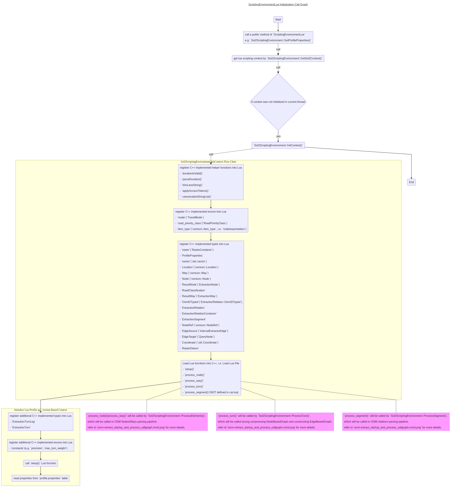

- [Interaction Between C++ and Lua In OSRM](#interaction-between-c-and-lua-in-osrm)
  - [Lua Functions Brief](#lua-functions-brief)
  - [Lua Scripting Environment Initialization](#lua-scripting-environment-initialization)
  - [Invoke Lua Functions In osrm-extract](#invoke-lua-functions-in-osrm-extract)

# Interaction Between C++ and Lua In OSRM
This document will describe how do `C++` and `Lua` work together in [OSRM](https://github.com/Project-OSRM/osrm-backend).     
Please read [OSRM Profiles](https://github.com/Project-OSRM/osrm-backend/blob/master/docs/profiles.md) to get understanding of why need `Lua` profiles and how does it work.     
In practice, the `Lua` profiles actually will be integrated by `C++` codes. I.e. it will be loaded by `C++`, and the main functions(`setup()/process_node()/process_way()/process_turn()/process_segment()`) also will be called by `C++`(`osrm-extract`).     

## Lua Functions Brief
Terminologies(e.g. OSM node, OSM way, Segment, etc.) can refer to [Understanding OSRM Graph Representation - Terminology](https://github.com/Telenav/open-source-spec/blob/master/osrm/doc/understanding_osrm_graph_representation.md#terminology).    

| `Lua` Functions    | Link to OSRM Profiles | Description |
|--------------------|-----------------------|-------------|
|`setup()`           |[OSRM profiles - setup](https://github.com/Project-OSRM/osrm-backend/blob/master/docs/profiles.md#setup)|The `setup` function is called once when the profile is loaded and must return a table of configurations. <br>Note that processing of data is parallelized and several unconnected LUA interpreters will be running at the same time. The `setup` function will be called once for each. Each `LUA` interpreter will have its own set of globals.|
|`process_node()`    |[OSRM profiles - process_node](https://github.com/Project-OSRM/osrm-backend/blob/master/docs/profiles.md#process_nodeprofile-node-result-relations)|Process an OSM node to determine whether this node is a unable-to-pass barrier or can be passed and whether passing it incurs a delay. <br> More specifically, it will return two booleans:<br>- `barrier`: indicate a unable-to-pass barrier <br>- `traffic_lights`: indicate more delay while passing|
|`process_way()`     |[OSRM profiles - process_way](https://github.com/Project-OSRM/osrm-backend/blob/master/docs/profiles.md#process_wayprofile-way-result-relations)|Given an OSM way, the `process_way` function will either return nothing (meaning we are not going to route over this way at all), or it will set up a result hash. <br> More specifically, <br>- return `false`: the whole way can not be passed. <br>- otherwise: set some attributes in `result` to indicate whether routable and the routable `speed`/`rate` for each direction, e.g. `forward_mode`, `backward_mode`, `forward_speed`, `backward_speed`, `forward_rate`, `backward_rate`, `weight`, `duration`, etc. |
|`process_turn()`    |[OSRM profiles - process_turn](https://github.com/Project-OSRM/osrm-backend/blob/master/docs/profiles.md#process_turnprofile-turn)|The `process_turn` function is called for every possible turn in the network. Based on the angle and type of turn you assign the weight and duration of the movement.|
|`process_segment()` |[OSRM profiles - process_segment](https://github.com/Project-OSRM/osrm-backend/blob/master/docs/profiles.md#process_segmentprofile-segment)|The `process_segment` function is called for every segment of OSM ways. A segment is a straight line between two OSM nodes. <br>As you can see, this is NOT currently used in the `car.lua` profile.|


## Lua Scripting Environment Initialization
`Lua` profile will be loaded and referenced by `C++` object `ScriptingEnvironmentLua`.     
Below describes flow chart of the method `Sol2ScriptingEnvironment::InitContext()`.     


## Invoke Lua Functions In osrm-extract
The most important methods provided by `Lua` profiles are `process_node()/process_way()/process_turn()/process_segment()`. All of these functions will be Invoked in `osrm-extract` processing.     
Please refer to below call graph for `osrm-extract` processing, **purple** comments in the graph describes where the `Lua` functions be Invoked.      


## API Version
API Version is the one designed for compatibility, what if parameters have been changed? Would mapping be hide in this function. Like ProcessNode is the old api, let’s say it support 2 parameters but new api restrictions support 3:    
- [LuaScriptingContext::ProcessNode](https://github.com/Project-OSRM/osrm-backend/blob/e86d93760f51304940d55d62c0d47f15094d6712/src/extractor/scripting_environment_lua.cpp#L1155)
```lua
void LuaScriptingContext::ProcessNode(const osmium::Node &node,
                                      ExtractionNode &result,
                                      const ExtractionRelationContainer &relations)
{
    BOOST_ASSERT(state.lua_state() != nullptr);

    switch (api_version)
    {
    case 4:
    case 3:
        node_function(profile_table, node, result, relations);
        break;
    case 2:
        node_function(profile_table, node, result);
        break;
    case 1:
    case 0:
        node_function(node, result);
        break;
    }
}
```

