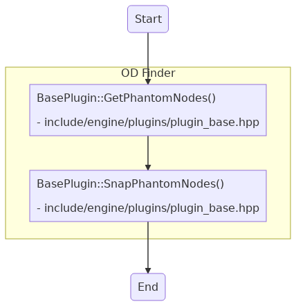
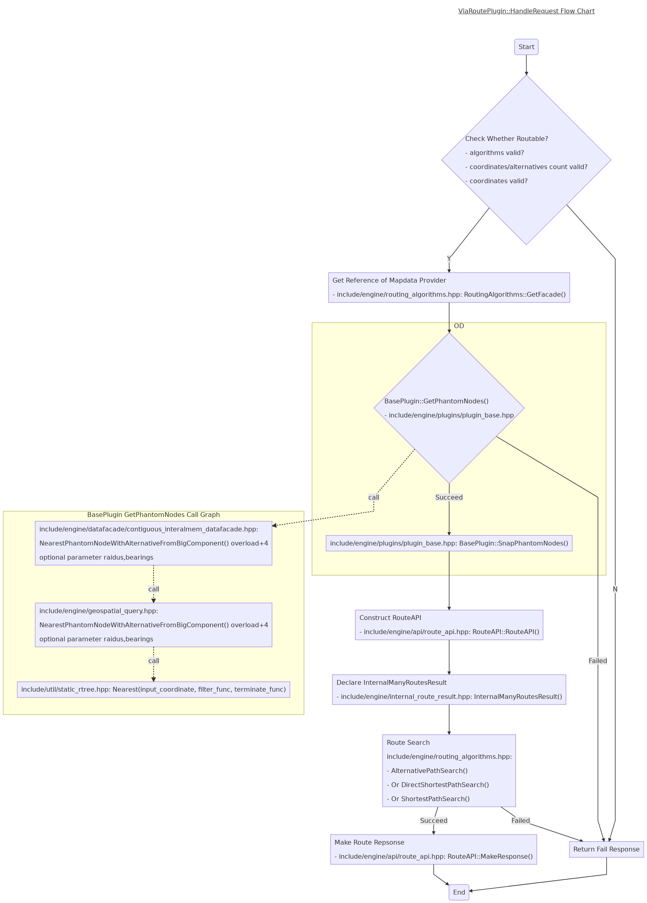
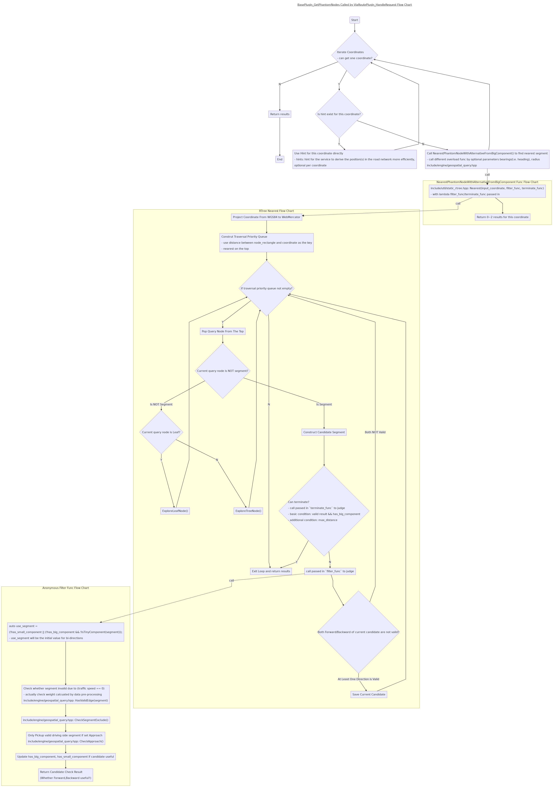

# OD In OSRM
This document will explain how **OD(Origin-Destination)** works in [OSRM](../).      
We almost can say it's same as the separate service `nearest`. Only a little small different between them, e.g. `nearest` service support parameter `number`, etc.    

## Basic Concepts
### Strongly Connected Component
In the mathematical theory of directed graphs, a graph is said to be **strongly connected** or **diconnected** if every vertex is reachable from every other vertex. The **strongly connected components** or **diconnected components** of an arbitrary directed graph form a partition into subgraphs that are themselves **strongly connected**.     
In another word, a **strongly connected component** of a directed graph G is a subgraph that is **strongly connected**, and is maximal with this property: no additional edges or vertices from G can be included in the subgraph without breaking its property of being **strongly connected**.    
Please refer to wiki for more details:     
- [Strongly Connected Component](https://en.wikipedia.org/wiki/Strongly_connected_component)    

In below sample directed graph, we have two **Strongly Connected Component**.    



### Big/Small Component
They're defined by OSRM: 
- Big Component: A **Strongly Connected Component** with >= 1000 nodes
- Small Component: A **Stronglly Connected Component** with < 1000 nodes

### RTree
R-trees are tree data structures used for spatial access methods, i.e., for indexing multi-dimensional information such as geographical coordinates, rectangles or polygons.     
The key idea of the data structure is to group nearby objects and represent them with their minimum bounding rectangle in the next higher level of the tree; the "R" in R-tree is for rectangle.    

Please refer to wiki/document for more details:     
- [RTree](https://en.wikipedia.org/wiki/R-tree)
- [lecture3-rtree](../references/lecture3-rtree.pdf)

#### RTree in OSRM
Below comments refers from comment for `include/util/static_rtree.hpp(81): class StaticRTree`, which is an excellent explain for how `OSRM` use `Rtree`.    
```
    /**********************************************************
     * Example RTree construction:
     *
     * 30 elements (EdgeDataT objects)
     * LEAF_NODE_SIZE = 3
     * BRANCHING_FACTOR = 2
     *
     * 012 345 678 901 234 567 890 123 456 789  <- EdgeDataT objects in .fileIndex data, sorted by
     * \|/ \|/ \|/ \|/ \|/ \|/ \|/ \|/ \|/ \|/     Hilbert Code of the centroid coordinate
     * A   B   C   D   E   F   G   H   I   J   <- Everything from here down is a Rectangle in
     * \ /     \ /     \ /     \ /     \ /        .ramIndex
     *  K       L       M       N       O
     *   \     /         \     /       /
     *    \   /           \   /       /
     *     \ /             \ /       /
     *      P               Q       R
     *       \             /       /
     *        \           /       /
     *         \         /       /
     *          \       /       /
     *           \     /       /
     *            \   /       /
     *             \ /       /
     *              U       V
     *               \     /
     *                \   /
     *                 \ /
     *                  W
     *
     * Step 1 - objects 01234567... are sorted by Hilbert code (these are the line
     *          segments of the OSM roads)
     * Step 2 - we grab LEAF_NODE_SIZE of them at a time and create TreeNode A with a
     *          bounding-box that surrounds the first LEAF_NODE_SIZE objects
     * Step 2a- continue grabbing LEAF_NODE_SIZE objects, creating TreeNodes B,C,D,E...J
     *          until we run out of objects.  The last TreeNode J may not have
     *          LEAF_NODE_SIZE entries.  Our math later on caters for this.
     * Step 3 - Now start grabbing nodes from A..J in groups of BRANCHING_FACTOR,
     *          and create K..O with bounding boxes surrounding the groups of
     *          BRANCHING_FACTOR.  Again, O, the last entry, may have fewer than
     *          BRANCHING_FACTOR entries.
     * Step 3a- Repeat this process for each level, until you only create 1 TreeNode
     *          to contain its children (in this case, W).
     *
     * As we create TreeNodes, we append them to the m_search_tree vector.
     *
     * After this part of the building process, m_search_tree will contain TreeNode
     * objects in this order:
     *
     * ABCDEFGHIJ KLMNO PQR UV W
     * 10         5     3   2  1  <- number of nodes in the level
     *
     * In order to make our math easy later on, we reverse the whole array,
     * then reverse the nodes within each level:
     *
     *   Reversed:        W VU RQP ONMKL JIHGFEDCBA
     *   Levels reversed: W UV PQR KLMNO ABCDEFGHIJ
     *
     * We also now have the following information:
     *
     *   level sizes = {1,2,3,5,10}
     *
     * and we can calculate the array position the nodes for each level
     * start (based on the sum of the previous level sizes):
     *
     *   level starts = {0,1,3,6,11}
     *
     * Now, some basic math can be used to navigate around the tree.  See
     * the body of the `child_indexes` function for the details.
     *
     ***********************************************/
```

## Implementation In Source Code
Ideas of `OD` in `OSRM` is deeply based on `RTree` and `Strongly Connected Component`.    

### Entrance
Two functions (`BasePlugin::GetPhantomNodes()` and `BasePlugin::SnapPhantomNodes()` in file `include/engine/plugins/plugin_base.hpp`) combined as the `OD` in `OSRM`.    
    
- `BasePlugin::GetPhantomNodes()`: Get PhantomNodes(represent Segments) from Coordinates    
- `BasePlugin::SnapPhantomNodes()`: Decides whether to use the phantom node from a big or small component if both are found. The only case we don't snap to the big component if all phantoms are in the same small component.    

#### OD in Route Service Workflow



### Process Flow
- Part 1: Data Preprocessing, generate the `RTree` structure
    - `osrm-extract` will produce many files, two of them will be consumed by `osrm-routed` for `OD`.    
        - `.fileIndex`: store `EdgeDataT` objects, sorted by Hilbert Code of the centroid coordinate.     
        - `.ramIndex`: store `RTree` structure (rectangle, leaf/node).    
- Part 2: Query by Route Service
    - Step 1: Get candidate by Coordinate (`BasePlugin::GetPhantomNodes()`)
        - Basic exit condition for each coordinate: `result > 0 && has_big_component`
     
    - Step 2: Decide big/small component candidate if both are found. (`BasePlugin::SnapPhantomNodes()`)
        - The only case we don't snap to the big component if all phantoms are in the same small component.    
        - A sample case: [Mapbox Blog Post: Robust navigation with smart nearest neighbor search](https://blog.mapbox.com/robust-navigation-with-smart-nearest-neighbor-search-dbc1f6218be8)    

### Misc.
- Must Parameters: `coordinates`
- Optional Parameters: `hints`, `bearings`, `radius`, `approaches`, `exclude`
    - Refer to [osrm-routed HTTP API documentation](https://github.com/Project-OSRM/osrm-backend/blob/master/docs/http.md), [osrm Hosted Documentation](http://project-osrm.org/docs/v5.15.2/api) and [libosrm API Documentation](https://github.com/Project-OSRM/osrm-backend/blob/master/docs/libosrm.md) for details.     
- At most 2 candidates will be got for each coordinate. At least 1 of them is big component candidate.     
    - Remain Question: it seems only 1 small + 1 big component candidate case can output 2 candidates? won't return 2 big component candidates?     

## Summary
|             | OD In OSRM         |
|-------------|--------------------|
|Data Structure| RTree |
|Search Efficiency | search in a tree, from root to leaf, O(log(n)) |
|Work in Preprocessing or Route Service|most of work done in data preprocessing, simple work in service	|
|Exit Condition Idea| `has_big_component` |
|Candidate Count | Only 0~2 candidate per coordiate |


## TODO from data side
- Research how OSRM preprocess data for `OD`:    
    - How `osrm-extract` generate `.fileIndex` and `.ramIndex` files?    
    - What exactly structures in `.fileIndex` and `.ramIndex`, e.g. the exactly `RTree` structure of real map data.    
    - How exactly OSRM calculate and save whether `big/small component`?  

## References
- [osrm-routed HTTP API documentation](https://github.com/Project-OSRM/osrm-backend/blob/master/docs/http.md)
- [osrm Hosted Documentation](http://project-osrm.org/docs/v5.15.2/api)
- [libosrm API Documentation](https://github.com/Project-OSRM/osrm-backend/blob/master/docs/libosrm.md)
- [osrm Toolchain File Overview](https://github.com/Project-OSRM/osrm-backend/wiki/Toolchain-file-overview)
- [Mapbox Blog Post: Robust navigation with smart nearest neighbor search](https://blog.mapbox.com/robust-navigation-with-smart-nearest-neighbor-search-dbc1f6218be8)