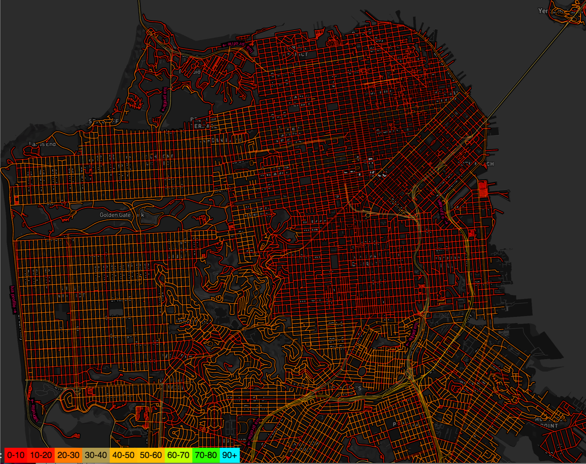

# OSRM tile service

## API
[OSRM tile doc](http://project-osrm.org/docs/v5.6.0/api/#tile-service)

### Example
```bash
# tile({x},{y},{zoom}).mvt
http://router.project-osrm.org/tile/v1/car/tile(1310,3166,13).mvt
```

## Notes
- x, y, z in the URL follow the rule defined in [slippy_map_tilenames](https://wiki.openstreetmap.org/wiki/Slippy_map_tilenames)
- OSRM tiles mainly for debug purpose and is not designed for **tile rendering**.  It contains two layers, speeds layer mainly for checking weight and turns layer is for guidance.  You could get more information from the discussion in [initial pull request](https://github.com/Project-OSRM/osrm-backend/pull/2000).


- For osrm-tile-viewer, both open segments will use two lines to represent, while oneway just one line


