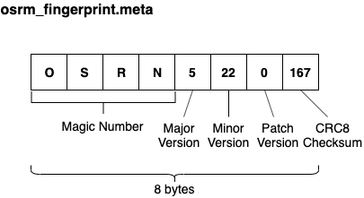

# osrm_fingerprint.meta 
`osrm_fingerprint.meta` is metadata which stores in every OSRM toolchain file for compatibility check.           

E.g. in [`.osrm` file](map.osrm.md)'s list, we can find it by     
```bash
tar tvf nevada-latest.osrm 
-rw-rw-r--  0 0      0           8 Jan  1  1970 osrm_fingerprint.meta
-rw-rw-r--  0 0      0           8 Jan  1  1970 /extractor/nodes.meta
-rw-rw-r--  0 0      0    18275776 Jan  1  1970 /extractor/nodes
-rw-rw-r--  0 0      0           8 Jan  1  1970 /extractor/barriers.meta
-rw-rw-r--  0 0      0         608 Jan  1  1970 /extractor/barriers
-rw-rw-r--  0 0      0           8 Jan  1  1970 /extractor/traffic_lights.meta
-rw-rw-r--  0 0      0       16144 Jan  1  1970 /extractor/traffic_lights
-rw-rw-r--  0 0      0           8 Jan  1  1970 /extractor/edges.meta
-rw-rw-r--  0 0      0    39504672 Jan  1  1970 /extractor/edges
-rw-rw-r--  0 0      0           8 Jan  1  1970 /extractor/annotations.meta
-rw-rw-r--  0 0      0     1355088 Jan  1  1970 /extractor/annotations
```

## Layout



## Implementation

- [FingerPrint structure](https://github.com/Telenav/osrm-backend/blob/6283c6074066f98e6d4a9f774f21ea45407c0d52/include/util/fingerprint.hpp#L15)

```c++
struct FingerPrint
{
    //[Jay] ...

    // Here using std::array so that == can be used to conveniently compare contents
    std::array<std::uint8_t, 4> magic_number;
    std::uint8_t major_version;
    std::uint8_t minor_version;
    std::uint8_t patch_version;
    std::uint8_t checksum; // CRC8 of the previous bytes to ensure the fingerprint is not damaged
}
```

- Write to file    
A [`storage::tar::FileWriter`](https://github.com/Telenav/osrm-backend/blob/6283c6074066f98e6d4a9f774f21ea45407c0d52/include/storage/tar.hpp#L214) will be constructed before each actual write to file action. The `osrm_fingerprint.meta` will be write to file first in the [`storage::tar::FileWriter`](https://github.com/Telenav/osrm-backend/blob/6283c6074066f98e6d4a9f774f21ea45407c0d52/include/storage/tar.hpp#L214)'s [Constructor](https://github.com/Telenav/osrm-backend/blob/6283c6074066f98e6d4a9f774f21ea45407c0d52/include/storage/tar.hpp#L230).    

```c++
    FileWriter(const boost::filesystem::path &path, FingerprintFlag flag) : path(path)
    {
        auto ret = mtar_open(&handle, path.string().c_str(), "w");
        detail::checkMTarError(ret, path, "");

        if (flag == GenerateFingerprint)
        {
            WriteFingerprint();
        }
    }

    //[Jay] ...

    void WriteFingerprint()
    {
        // [Jay] write fingerprint contents into 'osrm_fingerprint.meta' entry in tar
        const auto fingerprint = util::FingerPrint::GetValid();
        WriteFrom("osrm_fingerprint.meta", fingerprint);    
    }

```
