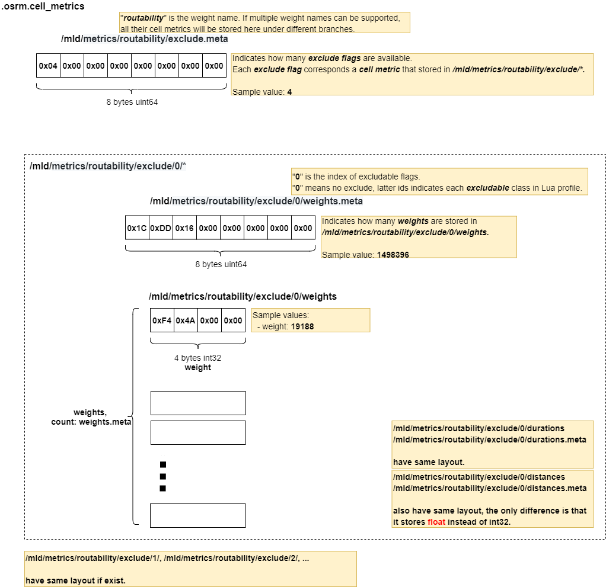

# .osrm.cell_metrics
Contains MLD cell metrics.     
Firstly it contains the default(no exclude) metric(`weights/durations/distances`). Then it includes metric(`weights/durations/distances`) for each [excludable class](https://github.com/Telenav/osrm-backend/blob/40015847054011efbd61c2912e7ff4c135b6a570/profiles/car.lua#L123).            

## List

```bash
tar -tvf nevada-latest.osrm.cell_metrics
-rw-rw-r-- 0/0               8 1970-01-01 00:00 osrm_fingerprint.meta
-rw-rw-r-- 0/0               8 1970-01-01 00:00 /mld/metrics/routability/exclude.meta
-rw-rw-r-- 0/0               8 1970-01-01 00:00 /mld/metrics/routability/exclude/0/weights.meta
-rw-rw-r-- 0/0         5993584 1970-01-01 00:00 /mld/metrics/routability/exclude/0/weights
-rw-rw-r-- 0/0               8 1970-01-01 00:00 /mld/metrics/routability/exclude/0/durations.meta
-rw-rw-r-- 0/0         5993584 1970-01-01 00:00 /mld/metrics/routability/exclude/0/durations
-rw-rw-r-- 0/0               8 1970-01-01 00:00 /mld/metrics/routability/exclude/0/distances.meta
-rw-rw-r-- 0/0         5993584 1970-01-01 00:00 /mld/metrics/routability/exclude/0/distances
-rw-rw-r-- 0/0               8 1970-01-01 00:00 /mld/metrics/routability/exclude/1/weights.meta
-rw-rw-r-- 0/0         5993584 1970-01-01 00:00 /mld/metrics/routability/exclude/1/weights
-rw-rw-r-- 0/0               8 1970-01-01 00:00 /mld/metrics/routability/exclude/1/durations.meta
-rw-rw-r-- 0/0         5993584 1970-01-01 00:00 /mld/metrics/routability/exclude/1/durations
-rw-rw-r-- 0/0               8 1970-01-01 00:00 /mld/metrics/routability/exclude/1/distances.meta
-rw-rw-r-- 0/0         5993584 1970-01-01 00:00 /mld/metrics/routability/exclude/1/distances
-rw-rw-r-- 0/0               8 1970-01-01 00:00 /mld/metrics/routability/exclude/2/weights.meta
-rw-rw-r-- 0/0         5993584 1970-01-01 00:00 /mld/metrics/routability/exclude/2/weights
-rw-rw-r-- 0/0               8 1970-01-01 00:00 /mld/metrics/routability/exclude/2/durations.meta
-rw-rw-r-- 0/0         5993584 1970-01-01 00:00 /mld/metrics/routability/exclude/2/durations
-rw-rw-r-- 0/0               8 1970-01-01 00:00 /mld/metrics/routability/exclude/2/distances.meta
-rw-rw-r-- 0/0         5993584 1970-01-01 00:00 /mld/metrics/routability/exclude/2/distances
-rw-rw-r-- 0/0               8 1970-01-01 00:00 /mld/metrics/routability/exclude/3/weights.meta
-rw-rw-r-- 0/0         5993584 1970-01-01 00:00 /mld/metrics/routability/exclude/3/weights
-rw-rw-r-- 0/0               8 1970-01-01 00:00 /mld/metrics/routability/exclude/3/durations.meta
-rw-rw-r-- 0/0         5993584 1970-01-01 00:00 /mld/metrics/routability/exclude/3/durations
-rw-rw-r-- 0/0               8 1970-01-01 00:00 /mld/metrics/routability/exclude/3/distances.meta
-rw-rw-r-- 0/0         5993584 1970-01-01 00:00 /mld/metrics/routability/exclude/3/distances
```

## osrm_fingerprint.meta
- [osrm_fingerprint.meta](./fingerprint.md)

## /mld/metrics/routability/*
Contains MLD cell metrics for specified [weight_name `routability`](https://github.com/Telenav/osrm-backend/blob/40015847054011efbd61c2912e7ff4c135b6a570/profiles/car.lua#L19).       
Currently OSRM only supports one metric, but here keeps possbility to support multiple metrics, e.g., `/mld/metrics/duration/*`. See more discussion in [#372](https://github.com/Telenav/osrm-backend/issues/372#issue-694752812).          
Surprisingly, the `exclude` flag was supported by store extra metric for every [excludable class](https://github.com/Telenav/osrm-backend/blob/40015847054011efbd61c2912e7ff4c135b6a570/profiles/car.lua#L123), which seems wasting.      

### Layout


### Implementation

Cell metric includes `weights/duration/distances`.        
```c++
// Encapsulated one metric to make it easily replacable in CelLStorage
template <storage::Ownership Ownership> struct CellMetricImpl
{
    template <typename T> using Vector = util::ViewOrVector<T, Ownership>;

    Vector<EdgeWeight> weights;
    Vector<EdgeDuration> durations;
    Vector<EdgeDistance> distances;
};
``` 
Cell metrics was calculated by [customizeFilteredMetrics()](https://github.com/Telenav/osrm-backend/blob/40015847054011efbd61c2912e7ff4c135b6a570/src/customize/customizer.cpp#L106), which [loops](https://github.com/Telenav/osrm-backend/blob/40015847054011efbd61c2912e7ff4c135b6a570/src/customize/customizer.cpp#L123) the `customize` processing for each `excludable flags`. It signicantly affects the customize processing performance.       
After calculation, it was constructed as [mapping `weight_name->metrics`](https://github.com/Telenav/osrm-backend/blob/40015847054011efbd61c2912e7ff4c135b6a570/src/customize/customizer.cpp#L262-L265) then dump to file by [files::writeCellMetrics()](https://github.com/Telenav/osrm-backend/blob/40015847054011efbd61c2912e7ff4c135b6a570/src/customize/customizer.cpp#L265).     
