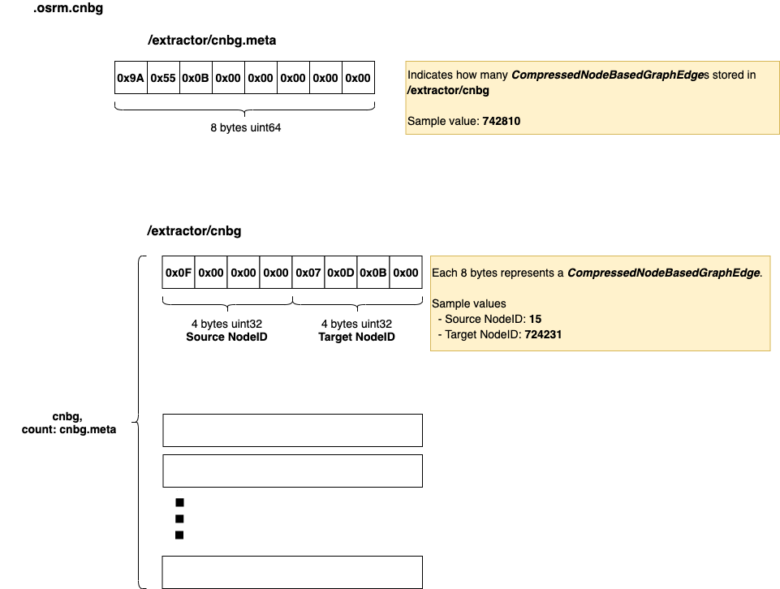

# .osrm.cnbg
Contains compressed node based graph edges.     


## List

```bash
tar -tvf nevada-latest.osrm.cnbg
-rw-rw-r-- 0/0               8 1970-01-01 00:00 osrm_fingerprint.meta
-rw-rw-r-- 0/0               8 1970-01-01 00:00 /extractor/cnbg.meta
-rw-rw-r-- 0/0         5942480 1970-01-01 00:00 /extractor/cnbg
```

## osrm_fingerprint.meta
- [osrm_fingerprint.meta](./fingerprint.md)

## /extractor/cnbg, /extractor/cnbg.meta
Stores [CompressedNodeBasedGraphEdges](https://github.com/Telenav/osrm-backend/blob/6462a1132d7840e2e1769ded0aa35d39bf06ec33/include/extractor/compressed_node_based_graph_edge.hpp#L12).     
Refer to [Understanding OSRM Graph Representation - Basic Changes of Convert OSM to OSRM Edge-expanded Graph](https://github.com/Telenav/open-source-spec/blob/master/osrm/doc/understanding_osrm_graph_representation.md#basic-changes-of-convert-osm-to-osrm-edge-expanded-graph) to understand how the **compressed** works.          

### Layout


### Implementation
The node based graph will be compressed when construct it in  [NodeBasedGraphFactory::NodeBasedGraphFactory()](https://github.com/Telenav/osrm-backend/blob/6462a1132d7840e2e1769ded0aa35d39bf06ec33/src/extractor/node_based_graph_factory.cpp#L26). Then the [CompressedNodeBasedGraphEdges](https://github.com/Telenav/osrm-backend/blob/6462a1132d7840e2e1769ded0aa35d39bf06ec33/include/extractor/compressed_node_based_graph_edge.hpp#L12) will be written to file by [files::writeCompressedNodeBasedGraph()](https://github.com/Telenav/osrm-backend/blob/6462a1132d7840e2e1769ded0aa35d39bf06ec33/src/extractor/extractor.cpp#L292), which will simply write the `std::vector<CompressedNodeBasedGraphEdge>` to file generated by [toEdgeList()](https://github.com/Telenav/osrm-backend/blob/6462a1132d7840e2e1769ded0aa35d39bf06ec33/src/extractor/extractor.cpp#L174:43).     

```c++
// We encode the cnbg graph only using its topology as edge list
struct CompressedNodeBasedGraphEdge
{
    NodeID source;
    NodeID target;
};
```

The actual write will happen in [writeCompressedNodeBasedGraph()](https://github.com/Telenav/osrm-backend/blob/6462a1132d7840e2e1769ded0aa35d39bf06ec33/include/extractor/files.hpp#L556) that writes the `std::vector<CompressedNodeBasedGraphEdge>` to `/extractor/cnbg` directly.     
