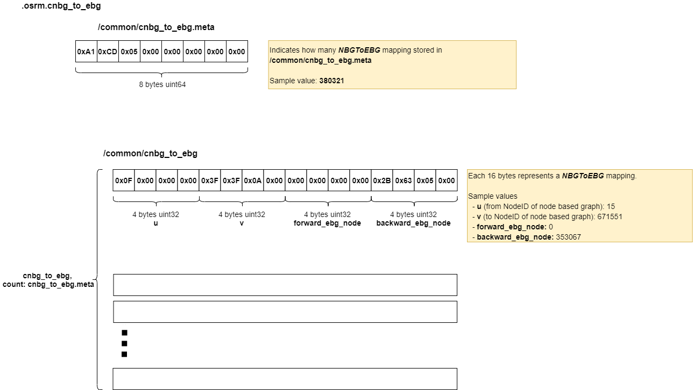

# .osrm.cnbg_to_ebg
Maps node based graph to edge based graph.     

## List

```bash
tar -tvf nevada-latest.osrm.cnbg_to_ebg
-rw-rw-r-- 0/0               8 1970-01-01 00:00 osrm_fingerprint.meta
-rw-rw-r-- 0/0               8 1970-01-01 00:00 /common/cnbg_to_ebg.meta
-rw-rw-r-- 0/0         6085136 1970-01-01 00:00 /common/cnbg_to_ebg
```

## osrm_fingerprint.meta
- [osrm_fingerprint.meta](./fingerprint.md)

## /common/cnbg_to_ebg, /common/cnbg_to_ebg.meta

### Layout


### Implementation
