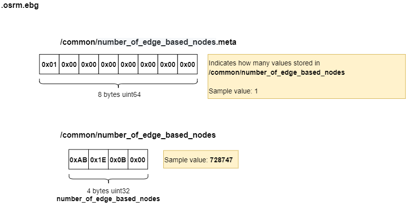
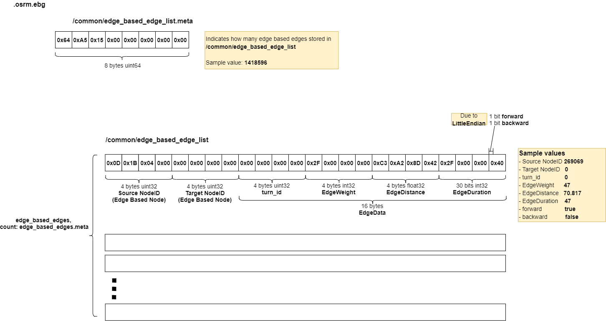
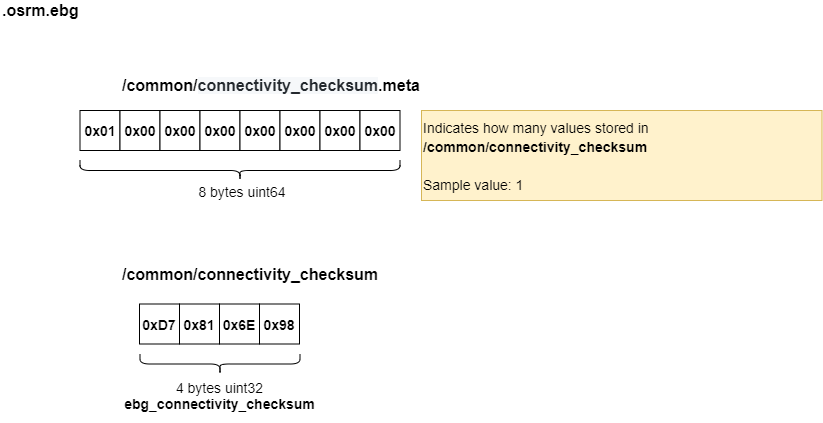

# .osrm.ebg
Contains Edge-expanded Graph Edges.     

## List

```bash
tar -tvf nevada-latest.osrm.ebg
-rw-rw-r-- 0/0               8 1970-01-01 00:00 osrm_fingerprint.meta
-rw-rw-r-- 0/0               8 1970-01-01 00:00 /common/number_of_edge_based_nodes.meta
-rw-rw-r-- 0/0               4 1970-01-01 00:00 /common/number_of_edge_based_nodes
-rw-rw-r-- 0/0               8 1970-01-01 00:00 /common/edge_based_edge_list.meta
-rw-rw-r-- 0/0        34046304 1970-01-01 00:00 /common/edge_based_edge_list
-rw-rw-r-- 0/0               8 1970-01-01 00:00 /common/connectivity_checksum.meta
-rw-rw-r-- 0/0               4 1970-01-01 00:00 /common/connectivity_checksum
```

## osrm_fingerprint.meta
- [osrm_fingerprint.meta](./fingerprint.md)

## /common/number_of_edge_based_nodes, /common/number_of_edge_based_nodes.meta

### Layout


### Implementation
The `number_of_edge_based_nodes` duplicates the [`nodes.meta` of `.osrm.ebg_nodes`](https://github.com/Telenav/open-source-spec/blob/master/osrm/doc/osrm-toolchain-files/map.osrm.ebg_nodes.md#commonebg_node_datanodes-commonebg_node_datanodesmeta).            


## /common/edge_based_edge_list, /common/edge_based_edge_list.meta

### Layout


### Implementation
OSRM defines [`struct EdgeBasedEdge`](https://github.com/Telenav/osrm-backend/blob/3906e34f2079617702a966b317c6431412852dfc/include/extractor/edge_based_edge.hpp#L13) to represent [edge-expanded graph edge](https://github.com/Telenav/open-source-spec/blob/master/osrm/doc/understanding_osrm_graph_representation.md#terminology).      

```c++
struct EdgeBasedEdge
{
  public:
    struct EdgeData
    {
        // ... 

        NodeID turn_id; // ID of the edge based node (node based edge)
        EdgeWeight weight;
        EdgeDistance distance;
        EdgeWeight duration : 30;
        std::uint32_t forward : 1;
        std::uint32_t backward : 1;
    };

    // ... 

    NodeID source;
    NodeID target;
    EdgeData data;
};

```
The **EdgeBasedEdges** will be generated via [generate_edge](https://github.com/Telenav/osrm-backend/blob/3906e34f2079617702a966b317c6431412852dfc/src/extractor/edge_based_graph_factory.cpp#L561) in [EdgeBasedGraphFactory::GenerateEdgeExpandedEdges](https://github.com/Telenav/osrm-backend/blob/3906e34f2079617702a966b317c6431412852dfc/src/extractor/edge_based_graph_factory.cpp#L436).      
The `weigt/duration/distance` are [calculated](https://github.com/Telenav/osrm-backend/blob/3906e34f2079617702a966b317c6431412852dfc/src/extractor/edge_based_graph_factory.cpp#L660-L662) after [process turn](https://github.com/Telenav/osrm-backend/blob/3906e34f2079617702a966b317c6431412852dfc/src/extractor/edge_based_graph_factory.cpp#L612) to get `turn weight/duration`.    
```c++
            auto weight = boost::numeric_cast<EdgeWeight>(edge_data1.weight + weight_penalty);
            auto duration = boost::numeric_cast<EdgeWeight>(edge_data1.duration + duration_penalty);
            auto distance = boost::numeric_cast<EdgeDistance>(edge_data1.distance);
```
A little more specially, the `turn_id` is the same index to identify the [TurnIndexBlocks in .osrm.turn_penalities_inex](https://github.com/Telenav/open-source-spec/blob/master/osrm/doc/osrm-toolchain-files/map.osrm.turn_penalties_index.md#extractorturn_index), [TurnWeights in .osrm.turn_weight_penalties](https://github.com/Telenav/open-source-spec/blob/master/osrm/doc/osrm-toolchain-files/map.osrm.turn_weight_penalties.md#commonturn_penalty) and [TurnDurations in .osrm.turn_duration_penalties](.osrm.turn_duration_penalties), since it simply [loops the **EdgeBasedEdges** to set the value](https://github.com/Telenav/osrm-backend/blob/3906e34f2079617702a966b317c6431412852dfc/src/extractor/edge_based_graph_factory.cpp#L1146-L1155). The [order of **EdgeBasedEdges** and **TurnIndexBlocks** are the same](https://github.com/Telenav/osrm-backend/blob/3906e34f2079617702a966b317c6431412852dfc/src/extractor/edge_based_graph_factory.cpp#L509).   
```c++
        // [Jay] same order 
        auto const transfer_data = [&](const EdgeWithData &edge_with_data) {
            m_edge_based_edge_list.push_back(edge_with_data.edge);
            turn_weight_penalties.push_back(edge_with_data.turn_weight_penalty);
            turn_duration_penalties.push_back(edge_with_data.turn_duration_penalty);
            turn_indexes_write_buffer.push_back(edge_with_data.turn_index);
        };
```


## /common/connectivity_checksum, /common/connectivity_checksum.meta

### Layout


### Implementation
The `connectivity_checksum` is a checksum value that calculated in [EdgeBasedGraphFactory::GenerateEdgeExpandedEdges](https://github.com/Telenav/osrm-backend/blob/3906e34f2079617702a966b317c6431412852dfc/src/extractor/edge_based_graph_factory.cpp#L1046) when everything have been processed.      
