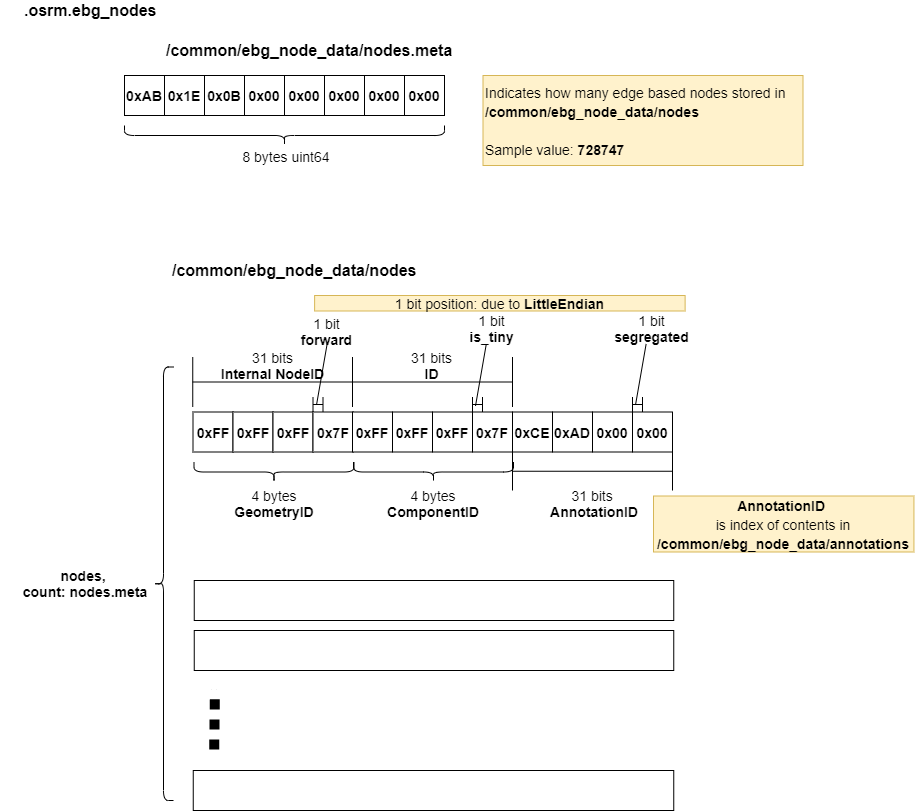

# .osrm.ebg_nodes
Contains edge-based graph nodes and annotations.      


## List

```bash
tar -tvf nevada-latest.osrm.ebg_nodes
-rw-rw-r-- 0/0               8 1970-01-01 00:00 osrm_fingerprint.meta
-rw-rw-r-- 0/0               8 1970-01-01 00:00 /common/ebg_node_data/nodes.meta
-rw-rw-r-- 0/0         8744964 1970-01-01 00:00 /common/ebg_node_data/nodes
-rw-rw-r-- 0/0               8 1970-01-01 00:00 /common/ebg_node_data/annotations.meta
-rw-rw-r-- 0/0          421296 1970-01-01 00:00 /common/ebg_node_data/annotations
```

## osrm_fingerprint.meta
- [osrm_fingerprint.meta](./fingerprint.md)

## /common/ebg_node_data/nodes, /common/ebg_node_data/nodes.meta
Contains edge based nodes.      

### Layout


### Implementation

```c++
struct EdgeBasedNode
{
    GeometryID geometry_id;
    ComponentID component_id;
    std::uint32_t annotation_id : 31;
    std::uint32_t segregated : 1;
};
```    

As above, an [EdgeBasedNode](https://github.com/Telenav/osrm-backend/blob/038ddf0f72df7c55aa51f3d1d201289347007c36/include/extractor/edge_based_node.hpp#L11-L17) has 4 main parts:     
- `geometry_id`: is the segment data index of [`.osrm.geometry`](https://github.com/Telenav/open-source-spec/blob/master/osrm/doc/osrm-toolchain-files/map.osrm.geometry.md#commonsegment_data).     
- `component_id`: remember which [Strongly Connected Component](https://github.com/Telenav/open-source-spec/blob/master/osrm/doc/od_in_osrm.md#strongly-connected-component) it belongs to.   
- `annotation_id`: index of annotation data in below `/common/ebg_node_data/annotations`.     
- `segregated`: remember whether it can be skipped in turn instructions. See more in [findSegregatedNodes()](https://github.com/Telenav/osrm-backend/blob/038ddf0f72df7c55aa51f3d1d201289347007c36/include/guidance/segregated_intersection_classification.hpp#L16-L21).          

Edge based nodes will be generated in [EdgeBasedGraphFactory::GenerateEdgeExpandedNodes](https://github.com/Telenav/osrm-backend/blob/038ddf0f72df7c55aa51f3d1d201289347007c36/src/extractor/edge_based_graph_factory.cpp#L328-L330), which creates the nodes in the edge expanded graph from edges in the node-based graph.        


## /common/ebg_node_data/annotations, /common/ebg_node_data/annotations.meta
Stores annotation data that will be referenced by `edge_based_node`.      
It's almost the same with the annotation data for `node_based_edge`. The only difference is that the data here have been compressed(remove unused and duplicated) by [NodeBasedGraphFactory::CompressAnnotationData()](https://github.com/Telenav/osrm-backend/blob/038ddf0f72df7c55aa51f3d1d201289347007c36/src/extractor/node_based_graph_factory.cpp#L146).      

### Layout & Implementation
See more in [/extractor/annotations in .osrm](https://github.com/Telenav/open-source-spec/blob/master/osrm/doc/osrm-toolchain-files/map.osrm.md#extractorannotations-extractorannotationsmeta).     


