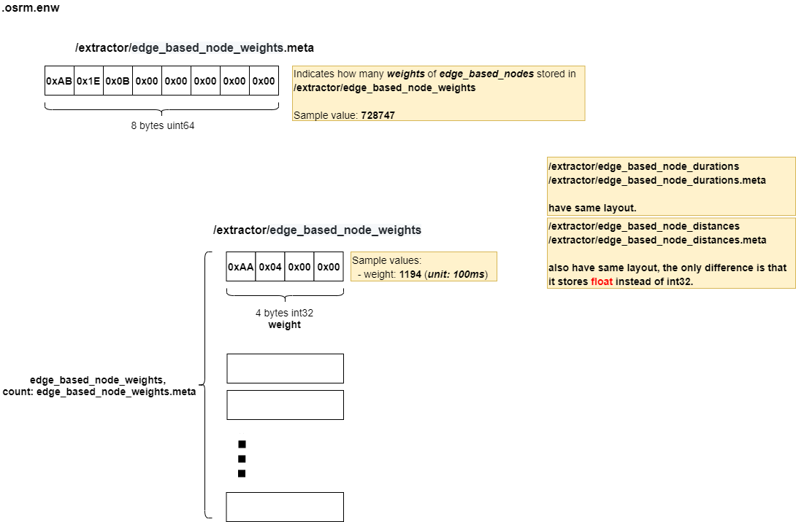

# .osrm.enw
Contains the weights,durations,distances of EdgeBasedNodes.    

## List

```bash
tar -tvf nevada-latest.osrm.enw
-rw-rw-r-- 0/0               8 1970-01-01 00:00 osrm_fingerprint.meta
-rw-rw-r-- 0/0               8 1970-01-01 00:00 /extractor/edge_based_node_weights.meta
-rw-rw-r-- 0/0         2914988 1970-01-01 00:00 /extractor/edge_based_node_weights
-rw-rw-r-- 0/0               8 1970-01-01 00:00 /extractor/edge_based_node_durations.meta
-rw-rw-r-- 0/0         2914988 1970-01-01 00:00 /extractor/edge_based_node_durations
-rw-rw-r-- 0/0               8 1970-01-01 00:00 /extractor/edge_based_node_distances.meta
-rw-rw-r-- 0/0         2914988 1970-01-01 00:00 /extractor/edge_based_node_distances
```

## osrm_fingerprint.meta
- [osrm_fingerprint.meta](./fingerprint.md)

## /extractor/edge_based_node_*

### Layout


### Implementation

Edge based node weights/durations/distances data will be constructed and write into `.osrm.enw` file during extracting. As below processing in [Extractor::run()](https://github.com/Telenav/osrm-backend/blob/6900e30070a4ed3f1ca59004d57010a344cc7c9b/src/extractor/extractor.cpp#L243-L246), the data will be generated when build edge expanded graph.    

```c++
int Extractor::run(ScriptingEnvironment &scripting_environment)
{
    // ... 

    // [Jay] the data write to .osrm.enw file
    std::vector<EdgeWeight> edge_based_node_weights;
    std::vector<EdgeDuration> edge_based_node_durations;
    std::vector<EdgeDistance> edge_based_node_distances;

    // ...

    // [Jay] construct the data when build edge expanded graph
    const auto number_of_edge_based_nodes =
    BuildEdgeExpandedGraph(node_based_graph,
                            coordinates,
                            node_based_graph_factory.GetCompressedEdges(),
                            barrier_nodes,
                            traffic_signals,
                            turn_restrictions,
                            conditional_turn_restrictions,
                            segregated_edges,
                            name_table,
                            unresolved_maneuver_overrides,
                            turn_lane_map,
                            scripting_environment,
                            edge_based_nodes_container,
                            edge_based_node_segments,
                            edge_based_node_weights,
                            edge_based_node_durations,
                            edge_based_node_distances,
                            edge_based_edge_list,
                            ebg_connectivity_checksum);

    // ...

    // [Jay] Write the data to .osrm.enw file
    util::Log() << "Saving edge-based node weights to file.";
    TIMER_START(timer_write_node_weights);
    extractor::files::writeEdgeBasedNodeWeightsDurationsDistances(config.GetPath(".osrm.enw"),
                                                                  edge_based_node_weights,
                                                                  edge_based_node_durations,
                                                                  edge_based_node_distances);

    // ...

```

More specificly, the data will be constructed from compressed node based graph but renumberred, see [EdgeBasedGraphFactory::LabelEdgeBasedNodes()](https://github.com/Telenav/osrm-backend/blob/6900e30070a4ed3f1ca59004d57010a344cc7c9b/src/extractor/edge_based_graph_factory.cpp#L287-L291). The mapping bewteen `compressed_node_based_edge` and `edge_based_node` will be generated in [EdgeBasedGraphFactory::InsertEdgeBasedNode](https://github.com/Telenav/osrm-backend/blob/6900e30070a4ed3f1ca59004d57010a344cc7c9b/src/extractor/edge_based_graph_factory.cpp#L128), which will be written in to [.osrm.cnbg_to_ebg](./map.osrm.cnbg_to_ebg.md) eventually.     

One more special thing in `.osrm.enw` is that the `weight` value might be negative, which is a little counter-intuitive. It becauses the [MSB - Most significant bit](https://en.wikipedia.org/wiki/Bit_numbering#Most_significant_bit) of weight will be used to distinguish oneway street in [implementation](https://github.com/Telenav/osrm-backend/blob/6900e30070a4ed3f1ca59004d57010a344cc7c9b/src/extractor/edge_based_graph_factory.cpp#L149-L158).       

```c++
    // ⚠ Use the sign bit of node weights to distinguish oneway streets:
    //  * MSB is set - a node corresponds to a one-way street
    //  * MSB is clear - a node corresponds to a bidirectional street
    // Before using node weights data values must be adjusted:
    //  * in contraction if MSB is set the node weight is INVALID_EDGE_WEIGHT.
    //    This adjustment is needed to enforce loop creation for oneways.
    //  * in other cases node weights must be masked with 0x7fffffff to clear MSB
    if (nbe_to_ebn_mapping[edge_id_1] != SPECIAL_NODEID &&
        nbe_to_ebn_mapping[edge_id_2] == SPECIAL_NODEID)
        m_edge_based_node_weights[nbe_to_ebn_mapping[edge_id_1]] |= 0x80000000;

```