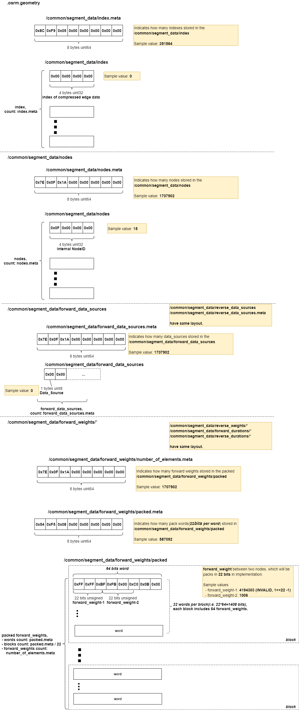
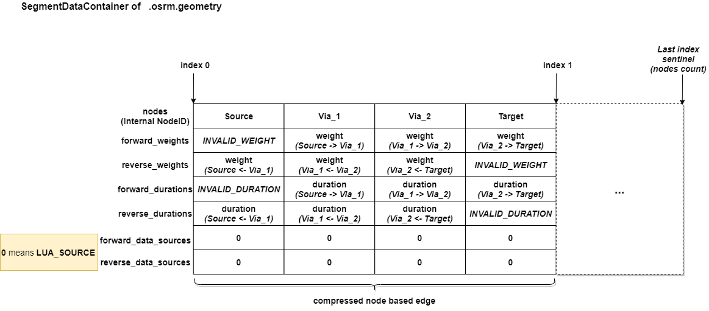

<!-- TOC -->

- [.osrm.geometry](#osrmgeometry)
    - [List](#list)
    - [osrm_fingerprint.meta](#osrm_fingerprintmeta)
    - [/common/segment_data/*](#commonsegment_data)
        - [Layout](#layout)
        - [Implementation](#implementation)

<!-- /TOC -->

# .osrm.geometry
It contains geometry that was removed from the original graph. Used for returned API response.    

## List

```bash
tar -tvf nevada-latest.osrm.geometry
-rw-rw-r-- 0/0               8 1970-01-01 00:00 osrm_fingerprint.meta
-rw-rw-r-- 0/0               8 1970-01-01 00:00 /common/segment_data/index.meta
-rw-rw-r-- 0/0         1566256 1970-01-01 00:00 /common/segment_data/index
-rw-rw-r-- 0/0               8 1970-01-01 00:00 /common/segment_data/nodes.meta
-rw-rw-r-- 0/0         6831608 1970-01-01 00:00 /common/segment_data/nodes
-rw-rw-r-- 0/0               8 1970-01-01 00:00 /common/segment_data/forward_weights/number_of_elements.meta
-rw-rw-r-- 0/0               8 1970-01-01 00:00 /common/segment_data/forward_weights/packed.meta
-rw-rw-r-- 0/0         4696736 1970-01-01 00:00 /common/segment_data/forward_weights/packed
-rw-rw-r-- 0/0               8 1970-01-01 00:00 /common/segment_data/reverse_weights/number_of_elements.meta
-rw-rw-r-- 0/0               8 1970-01-01 00:00 /common/segment_data/reverse_weights/packed.meta
-rw-rw-r-- 0/0         4696736 1970-01-01 00:00 /common/segment_data/reverse_weights/packed
-rw-rw-r-- 0/0               8 1970-01-01 00:00 /common/segment_data/forward_durations/number_of_elements.meta
-rw-rw-r-- 0/0               8 1970-01-01 00:00 /common/segment_data/forward_durations/packed.meta
-rw-rw-r-- 0/0         4696736 1970-01-01 00:00 /common/segment_data/forward_durations/packed
-rw-rw-r-- 0/0               8 1970-01-01 00:00 /common/segment_data/reverse_durations/number_of_elements.meta
-rw-rw-r-- 0/0               8 1970-01-01 00:00 /common/segment_data/reverse_durations/packed.meta
-rw-rw-r-- 0/0         4696736 1970-01-01 00:00 /common/segment_data/reverse_durations/packed
-rw-rw-r-- 0/0               8 1970-01-01 00:00 /common/segment_data/forward_data_sources.meta
-rw-rw-r-- 0/0         1707902 1970-01-01 00:00 /common/segment_data/forward_data_sources
-rw-rw-r-- 0/0               8 1970-01-01 00:00 /common/segment_data/reverse_data_sources.meta
-rw-rw-r-- 0/0         1707902 1970-01-01 00:00 /common/segment_data/reverse_data_sources
```

## osrm_fingerprint.meta
- [osrm_fingerprint.meta](./fingerprint.md)

## /common/segment_data/*

### Layout


### Implementation
The contents stored in `/common/segment_data` of `.osrm.geometry` is [segment_data](https://github.com/Telenav/osrm-backend/blob/6900e30070a4ed3f1ca59004d57010a344cc7c9b/include/extractor/compressed_edge_container.hpp#L83) that stored in [SegmentDataContainer](https://github.com/Telenav/osrm-backend/blob/6900e30070a4ed3f1ca59004d57010a344cc7c9b/include/extractor/segment_data_container.hpp#L46). Each `segment` here means raw OSM node based edge(see **Segment** in [Terminology](https://github.com/Telenav/open-source-spec/blob/master/osrm/doc/understanding_osrm_graph_representation.md#terminology)), which stores all uncompressed nodes and weight/duration/data_source between them for `annotations=xxx`. The data will be generated in [compressing of node based graph](https://github.com/Telenav/osrm-backend/blob/6900e30070a4ed3f1ca59004d57010a344cc7c9b/src/extractor/node_based_graph_factory.cpp#L26-L30), then [finalized](https://github.com/Telenav/osrm-backend/blob/6900e30070a4ed3f1ca59004d57010a344cc7c9b/src/extractor/extractor.cpp#L342-L345) before write to file.        
 
- [SegmentDataContainer](https://github.com/Telenav/osrm-backend/blob/6900e30070a4ed3f1ca59004d57010a344cc7c9b/include/extractor/segment_data_container.hpp#L46)      
```c++

template <storage::Ownership Ownership> class SegmentDataContainerImpl
{
    // ... 
    
private:
    Vector<std::uint32_t> index;
    SegmentNodeVector nodes;
    SegmentWeightVector fwd_weights;
    SegmentWeightVector rev_weights;
    SegmentDurationVector fwd_durations;
    SegmentDurationVector rev_durations;
    SegmentDatasourceVector fwd_datasources;
    SegmentDatasourceVector rev_datasources;
};
```

It'll be built by [CompressedEdgeContainer::ZipEdges](https://github.com/Telenav/osrm-backend/blob/6900e30070a4ed3f1ca59004d57010a344cc7c9b/src/extractor/compressed_edge_container.cpp#L265) as below structure:        


