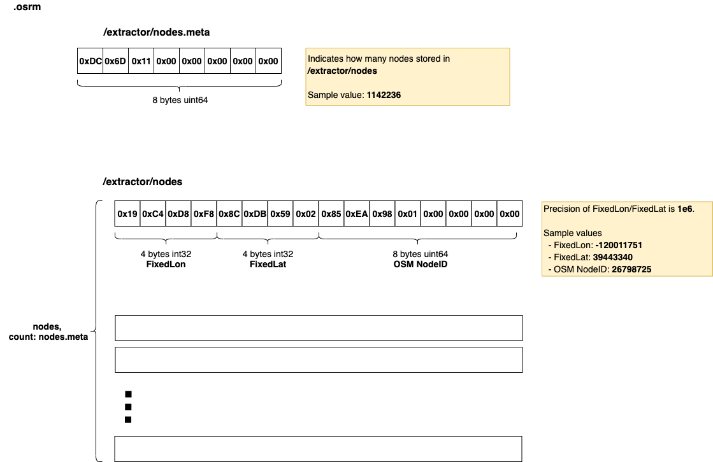
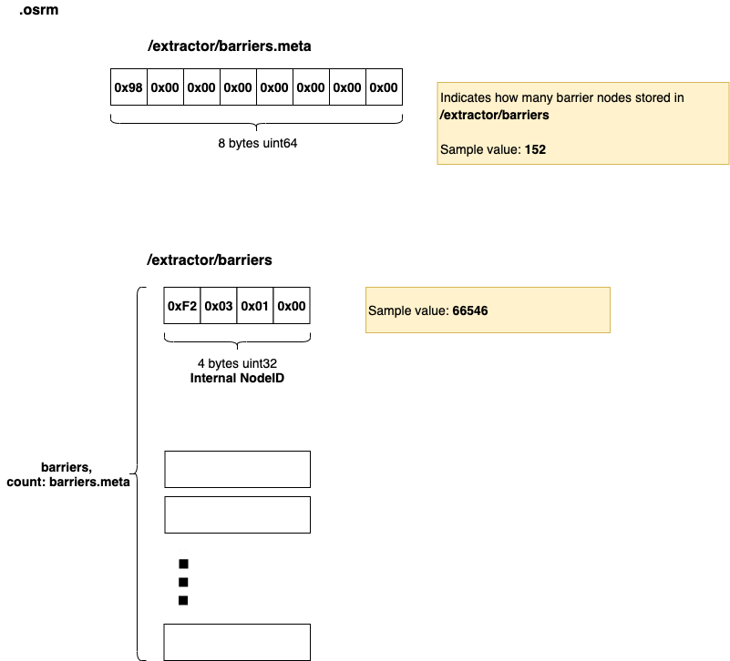
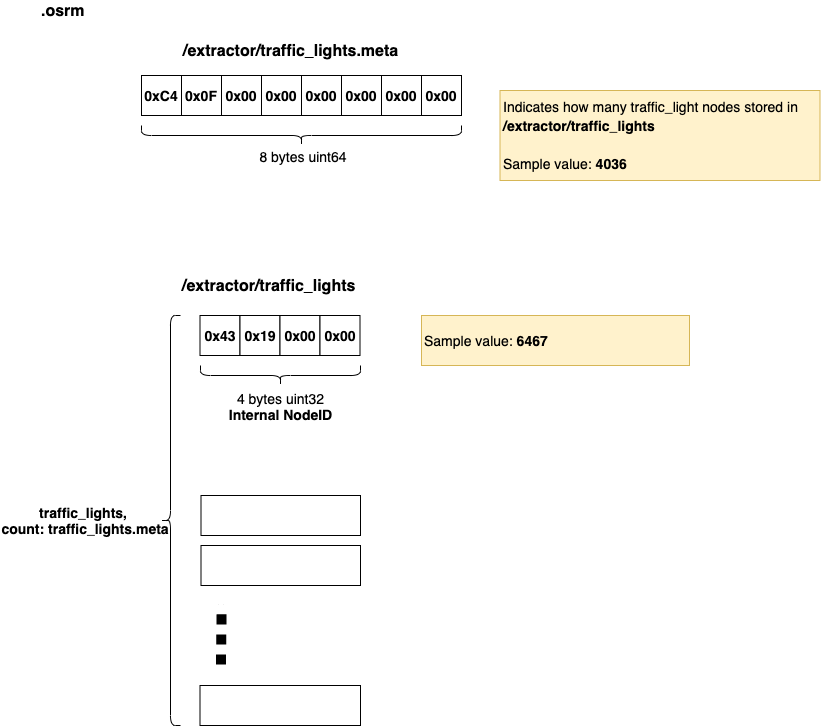
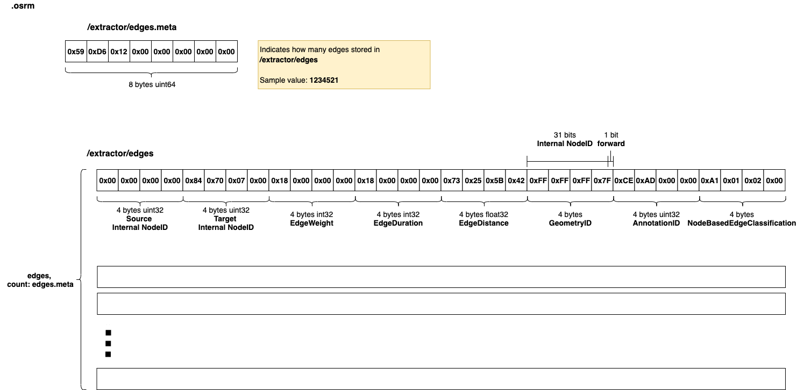

- [.osrm](#osrm)
  - [List](#list)
  - [osrm_fingerprint.meta](#osrmfingerprintmeta)
  - [/extractor/nodes, /extractor/nodes.meta](#extractornodes-extractornodesmeta)
    - [Layout](#layout)
    - [Implementation](#implementation)
  - [/extractor/barriers, /extractor/barriers.meta](#extractorbarriers-extractorbarriersmeta)
    - [Layout](#layout-1)
    - [Implementation](#implementation-1)
      - [Internal NodeID](#internal-nodeid)
  - [/extractor/traffic_lights, /extractor/traffic_lights.meta](#extractortrafficlights-extractortrafficlightsmeta)
    - [Layout](#layout-2)
    - [Implementation](#implementation-2)
  - [/extractor/edges, /extractor/edges.meta](#extractoredges-extractoredgesmeta)
    - [Layout](#layout-3)
    - [Implementation](#implementation-3)
  - [/extractor/annotations, /extractor/annotations.meta](#extractorannotations-extractorannotationsmeta)
    - [Layout](#layout-4)
    - [Implementation](#implementation-4)


# .osrm
This is temporary file generated by `osrm-extract`, which contains original filtered graph data (nodes and edges).     

## List

```bash
tar tvf nevada-latest.osrm 
-rw-rw-r--  0 0      0           8 Jan  1  1970 osrm_fingerprint.meta
-rw-rw-r--  0 0      0           8 Jan  1  1970 /extractor/nodes.meta
-rw-rw-r--  0 0      0    18275776 Jan  1  1970 /extractor/nodes
-rw-rw-r--  0 0      0           8 Jan  1  1970 /extractor/barriers.meta
-rw-rw-r--  0 0      0         608 Jan  1  1970 /extractor/barriers
-rw-rw-r--  0 0      0           8 Jan  1  1970 /extractor/traffic_lights.meta
-rw-rw-r--  0 0      0       16144 Jan  1  1970 /extractor/traffic_lights
-rw-rw-r--  0 0      0           8 Jan  1  1970 /extractor/edges.meta
-rw-rw-r--  0 0      0    39504672 Jan  1  1970 /extractor/edges
-rw-rw-r--  0 0      0           8 Jan  1  1970 /extractor/annotations.meta
-rw-rw-r--  0 0      0     1355088 Jan  1  1970 /extractor/annotations
```

## osrm_fingerprint.meta
- [osrm_fingerprint.meta](./fingerprint.md)

## /extractor/nodes, /extractor/nodes.meta
Stores all used **OSM Nodes**(Coordinate and OSM NodeID).      

### Layout


### Implementation

OSM Nodes will be written into `.osrm` once OSM parsed by [`Extractor::ParseOSMData()`](https://github.com/Telenav/osrm-backend/blob/master-telenav/src/extractor/extractor.cpp#L398) in `osrm-extract`. They'll be written by [`ExtractionContainers::WriteNodes()`](https://github.com/Telenav/osrm-backend/blob/6283c6074066f98e6d4a9f774f21ea45407c0d52/src/extractor/extraction_containers.cpp#L586:28) which will be called by [`ExtractionContainers::PrepareData()`](https://github.com/Telenav/osrm-backend/blob/6283c6074066f98e6d4a9f774f21ea45407c0d52/src/extractor/extraction_containers.cpp#L131:28).    Every `Node` written into `/extractor/nodes` is a [`QueryNode` structure](https://github.com/Telenav/osrm-backend/blob/6283c6074066f98e6d4a9f774f21ea45407c0d52/include/extractor/query_node.hpp#L16).    

```c++
struct QueryNode
{
    using key_type = OSMNodeID;      // type of NodeID
    using value_type = std::int32_t; // type of lat,lons

    util::FixedLongitude lon;   // [Jay] int32 lon, e.g. -120011751 (i.e. -120.011751)
    util::FixedLatitude lat;    // [Jay] int32 lat, e.g. 39443340 (i.e. 39.443340)
    key_type node_id;           // [Jay] uint64 Node ID from OSM PBF, e.g. 26798725

    // [Jay] ...
}
```

## /extractor/barriers, /extractor/barriers.meta
Stores all **OSM Nodes**([`Internal NodeID`](#internal-nodeid)) which has barrier.      

### Layout


### Implementation
The `/extractor/barriers` stores [`Internal NodeID`](#internal-nodeid) inside. It represents an `OSM Node` which contains `barrier` on it.     
Same with `/extractor/nodes`, the `/extractor/barriers` will be written by  [`ExtractionContainers::WriteNodes()`](https://github.com/Telenav/osrm-backend/blob/6283c6074066f98e6d4a9f774f21ea45407c0d52/src/extractor/extraction_containers.cpp#L586:28) which will be called by [`ExtractionContainers::PrepareData()`](https://github.com/Telenav/osrm-backend/blob/6283c6074066f98e6d4a9f774f21ea45407c0d52/src/extractor/extraction_containers.cpp#L131:28).     

See [Writing barrier nodes](https://github.com/Telenav/osrm-backend/blob/6283c6074066f98e6d4a9f774f21ea45407c0d52/src/extractor/extraction_containers.cpp#L629) in detail.    
```c++
    {
        util::UnbufferedLog log;
        log << "Writing barrier nodes     ... ";
        TIMER_START(write_nodes);
        std::vector<NodeID> internal_barrier_nodes;
        for (const auto osm_id : barrier_nodes)
        {
            // [Jay] OSM Node -> Internal NodeID
            const auto node_id = mapExternalToInternalNodeID(
                used_node_id_list.begin(), used_node_id_list.end(), osm_id);
            if (node_id != SPECIAL_NODEID)
            {
                internal_barrier_nodes.push_back(node_id);
            }
        }
        storage::serialization::write(writer, "/extractor/barriers", internal_barrier_nodes);
        log << "ok, after " << TIMER_SEC(write_nodes) << "s";
    }

```

#### Internal NodeID     
Its base type is `uint32`, and use max `uint32` as invalid(i.e. `SPECIAL_NODEID`).     
See definition in https://github.com/Telenav/osrm-backend/blob/6283c6074066f98e6d4a9f774f21ea45407c0d52/include/util/typedefs.hpp#L72.    

```c++
using NodeID = std::uint32_t;

static const NodeID SPECIAL_NODEID = std::numeric_limits<NodeID>::max();
```

The `Internal NodeID` is index of the `OSM Node` in `/extractor/nodes`(calculated by `std::distance` between the `OSM Node`'s iterator and the first iterator of the `std::vector<OSM Node>`). Note that **the `Internal NodeID` will overflow if use more than `2^32` OSM Nodes**, otherwise [exception happens](https://github.com/Telenav/osrm-backend/blob/6283c6074066f98e6d4a9f774f21ea45407c0d52/src/extractor/extraction_containers.cpp#L243).      
See [mapExternalToInternalNodeID()](https://github.com/Telenav/osrm-backend/blob/6283c6074066f98e6d4a9f774f21ea45407c0d52/src/extractor/extraction_containers.cpp#L96)    

```c++
    template <typename Iter>
    inline NodeID mapExternalToInternalNodeID(Iter first, Iter last, const OSMNodeID value)
    {
        const auto it = std::lower_bound(first, last, value);
        return (it == last || value < *it) ? SPECIAL_NODEID
                                           : static_cast<NodeID>(std::distance(first, it));
    }

```

## /extractor/traffic_lights, /extractor/traffic_lights.meta
Stores all **OSM Nodes**([`Internal NodeID`](#internal-nodeid)) which has traffic lights.      

### Layout 


### Implementation

The `/extractor/traffic_lights` stores [`Internal NodeID`](#internal-nodeid) inside. It represents an `OSM Node` which contains `traffic_lights` on it.     
Same with `/extractor/nodes`, the `/extractor/traffic_lights` will be written by  [`ExtractionContainers::WriteNodes()`](https://github.com/Telenav/osrm-backend/blob/6283c6074066f98e6d4a9f774f21ea45407c0d52/src/extractor/extraction_containers.cpp#L586:28) which will be called by [`ExtractionContainers::PrepareData()`](https://github.com/Telenav/osrm-backend/blob/6283c6074066f98e6d4a9f774f21ea45407c0d52/src/extractor/extraction_containers.cpp#L131:28).     

See [Writing traffic light nodes](https://github.com/Telenav/osrm-backend/blob/6283c6074066f98e6d4a9f774f21ea45407c0d52/src/extractor/extraction_containers.cpp#L647) in detail.    
```c++
    {
        util::UnbufferedLog log;
        log << "Writing traffic light nodes     ... ";
        TIMER_START(write_nodes);
        std::vector<NodeID> internal_traffic_signals;
        for (const auto osm_id : traffic_signals)
        {
            // [Jay] OSM Node -> Internal NodeID
            const auto node_id = mapExternalToInternalNodeID(
                used_node_id_list.begin(), used_node_id_list.end(), osm_id);
            if (node_id != SPECIAL_NODEID)
            {
                internal_traffic_signals.push_back(node_id);
            }
        }
        storage::serialization::write(
            writer, "/extractor/traffic_lights", internal_traffic_signals);
        log << "ok, after " << TIMER_SEC(write_nodes) << "s";
    }

```

## /extractor/edges, /extractor/edges.meta
Stores all [**Node Based Edges**](https://github.com/Telenav/open-source-spec/blob/master/osrm/doc/understanding_osrm_graph_representation.md#terminology).    

### Layout 


### Implementation

The `/extractor/edges` stores [`struct NodeBasedEdge`](https://github.com/Telenav/osrm-backend/blob/6283c6074066f98e6d4a9f774f21ea45407c0d52/include/extractor/node_based_edge.hpp#L92). It represents an [NodeBasedEdge](https://github.com/Telenav/open-source-spec/blob/master/osrm/doc/understanding_osrm_graph_representation.md#terminology) which defines by OSRM.     
In [`ExtractionContainers::PrepareData()`](https://github.com/Telenav/osrm-backend/blob/6283c6074066f98e6d4a9f774f21ea45407c0d52/src/extractor/extraction_containers.cpp#L131:28), the `edges` will be prepared by [ExtractionContainers::PrepareEdges()](https://github.com/Telenav/osrm-backend/blob/6283c6074066f98e6d4a9f774f21ea45407c0d52/src/extractor/extraction_containers.cpp#L253) and then wrote by [ExtractionContainers::WriteEdges()](https://github.com/Telenav/osrm-backend/blob/6283c6074066f98e6d4a9f774f21ea45407c0d52/src/extractor/extraction_containers.cpp#L538). Both `source` and `target` are [`Internal NodeID`](#internal-nodeid). The stored `edges` will be sorted by `source` before write.    

```c++

// [Jay] NodeBasedEdge structure
struct NodeBasedEdge
{
    NodeID source;                     // 32 4
    NodeID target;                     // 32 4
    EdgeWeight weight;                 // 32 4
    EdgeDuration duration;             // 32 4
    EdgeDistance distance;             // 32 4
    GeometryID geometry_id;            // 32 4
    AnnotationID annotation_data;      // 32 4
    NodeBasedEdgeClassification flags; // 32 4
};

// [Jay] Write edges
void ExtractionContainers::WriteEdges(storage::tar::FileWriter &writer) const
{
    std::vector<NodeBasedEdge> normal_edges;    // [Jay] each edge structure is NodeBasedEdge
    normal_edges.reserve(all_edges_list.size());
    {
        util::UnbufferedLog log;
        log << "Writing used edges       ... " << std::flush;

        // [Jay] ...

        // [Jay] write edges
        storage::serialization::write(writer, "/extractor/edges", normal_edges);

    }
}


```

## /extractor/annotations, /extractor/annotations.meta

### Layout 

### Implementation

