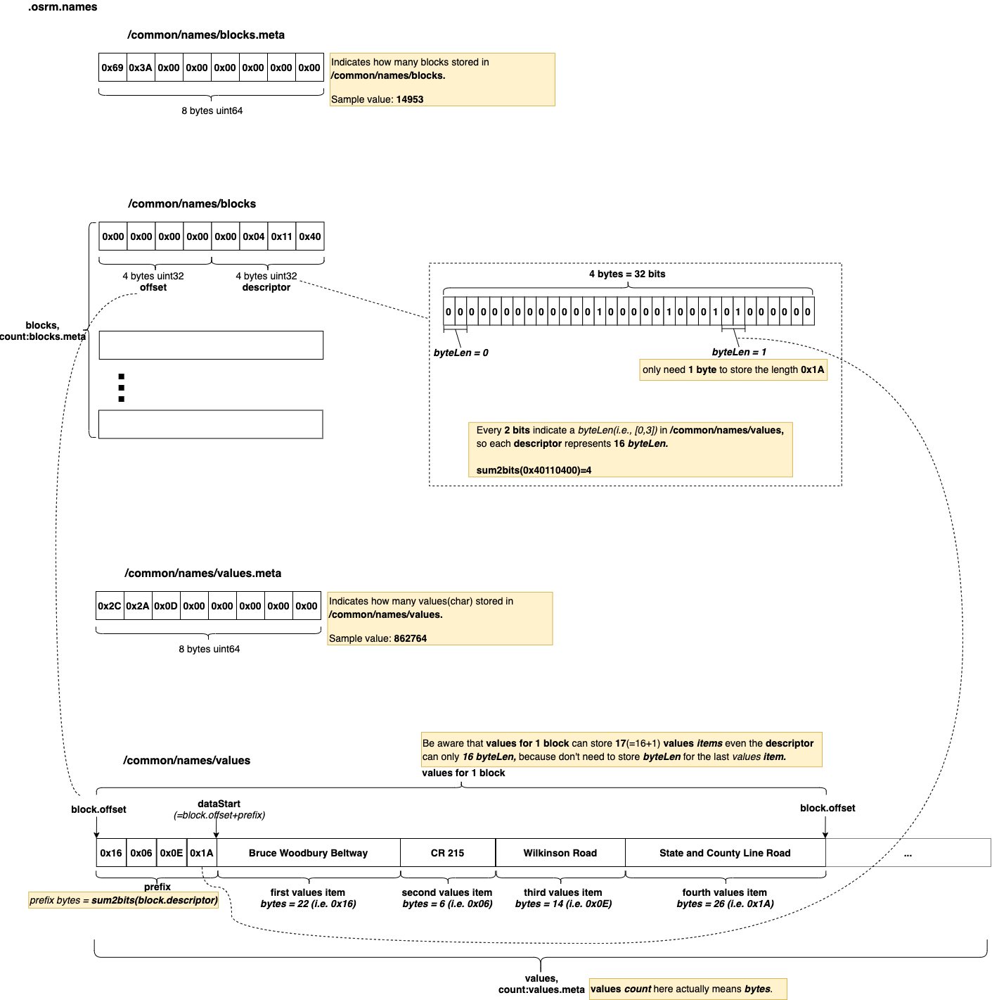

# .osrm.names 
Contains Street names and index.           

## List 

```bash
tar -tvf nevada-latest.osrm.names
-rw-rw-r--  0 0      0           8 Jan  1  1970 osrm_fingerprint.meta
-rw-rw-r--  0 0      0           8 Jan  1  1970 /common/names/blocks.meta
-rw-rw-r--  0 0      0      119624 Jan  1  1970 /common/names/blocks
-rw-rw-r--  0 0      0           8 Jan  1  1970 /common/names/values.meta
-rw-rw-r--  0 0      0      862764 Jan  1  1970 /common/names/values
```

## osrm_fingerprint.meta
- [osrm_fingerprint.meta](./fingerprint.md)

## /common/names
All the sub files under `/common/names` are dumped from the `C++` structure [IndexedData](https://github.com/Telenav/osrm-backend/blob/b24b8a085dc10bea279ffb352049330beae23791/include/util/indexed_data.hpp#L262), which is the implementation of [NameTable](https://github.com/Telenav/osrm-backend/blob/b24b8a085dc10bea279ffb352049330beae23791/include/extractor/name_table.hpp#L116).    

### Layout


### Implementation

#### Parse names from OSM    
Names will be retrieved in the callback [ExtractorCallbacks::ProcessWay()](https://github.com/Telenav/osrm-backend/blob/b24b8a085dc10bea279ffb352049330beae23791/src/extractor/extractor_callbacks.cpp#L92) during way's parsing. The real functional codes are in the [GetNameID()](https://github.com/Telenav/osrm-backend/blob/b24b8a085dc10bea279ffb352049330beae23791/src/extractor/extractor_callbacks.cpp#L323) function, which is going to load names, filter duplicates and return `NameID`.     
From the [GetNameID()](https://github.com/Telenav/osrm-backend/blob/b24b8a085dc10bea279ffb352049330beae23791/src/extractor/extractor_callbacks.cpp#L323)'s implementation, we can see that the **five name items**(`name`,`destination`,`pronunciation`,`ref`,`exits`) will be stored together, and uses only the `name`'s index as `NameID`, so the `NameID % 5 == 0` will always true.    

```c++
    const auto GetNameID = [this, &parsed_way](bool is_forward) -> NameID {
        const std::string &ref = is_forward ? parsed_way.forward_ref : parsed_way.backward_ref;
        // Get the unique identifier for the street name, destination, and ref
        const auto name_iterator = string_map.find(MapKey(parsed_way.name,
                                                          parsed_way.destinations,
                                                          ref,
                                                          parsed_way.pronunciation,
                                                          parsed_way.exits));

        NameID name_id = EMPTY_NAMEID;
        if (string_map.end() == name_iterator)
        {
            // name_offsets has a sentinel element with the total name data size
            // take the sentinels index as the name id of the new name data pack
            // (name [name_id], destination [+1], pronunciation [+2], ref [+3], exits [+4])
            name_id = external_memory.name_offsets.size() - 1;

            std::copy(parsed_way.name.begin(),
                      parsed_way.name.end(),
                      std::back_inserter(external_memory.name_char_data));
            external_memory.name_offsets.push_back(external_memory.name_char_data.size());

            std::copy(parsed_way.destinations.begin(),
                      parsed_way.destinations.end(),
                      std::back_inserter(external_memory.name_char_data));
            external_memory.name_offsets.push_back(external_memory.name_char_data.size());

            std::copy(parsed_way.pronunciation.begin(),
                      parsed_way.pronunciation.end(),
                      std::back_inserter(external_memory.name_char_data));
            external_memory.name_offsets.push_back(external_memory.name_char_data.size());

            std::copy(ref.begin(), ref.end(), std::back_inserter(external_memory.name_char_data));
            external_memory.name_offsets.push_back(external_memory.name_char_data.size());

            std::copy(parsed_way.exits.begin(),
                      parsed_way.exits.end(),
                      std::back_inserter(external_memory.name_char_data));
            external_memory.name_offsets.push_back(external_memory.name_char_data.size());

            auto k = MapKey{parsed_way.name,
                            parsed_way.destinations,
                            ref,
                            parsed_way.pronunciation,
                            parsed_way.exits};
            auto v = MapVal{name_id};
            string_map.emplace(std::move(k), std::move(v));
        }
        else
        {
            name_id = name_iterator->second;
        }

        return name_id;
    };
```

The **five name items**(`name`,`destination`,`pronunciation`,`ref`,`exits`) are collected in `Lua` codes [WayHandlers.names()](https://github.com/Telenav/osrm-backend/blob/b24b8a085dc10bea279ffb352049330beae23791/profiles/lib/way_handlers.lua#L32) and [WayHandlers.destinations()](https://github.com/Telenav/osrm-backend/blob/b24b8a085dc10bea279ffb352049330beae23791/profiles/lib/way_handlers.lua#L112), which come from OSM tags:     

- [Key:name](https://wiki.openstreetmap.org/wiki/Key:name)
- [Key:ref](https://wiki.openstreetmap.org/wiki/Key:ref)
- [Key:junction:ref](https://wiki.openstreetmap.org/wiki/Key:junction:ref)
- [Key:name:pronunciation](https://wiki.openstreetmap.org/wiki/Key:name:pronunciation)
- [Key:destination](https://wiki.openstreetmap.org/wiki/Key:destination)


#### Store names in NameTable    
All the names will be stored in [NameTable](https://github.com/Telenav/osrm-backend/blob/b24b8a085dc10bea279ffb352049330beae23791/include/extractor/name_table.hpp#L116) once collect done.     
The [NameTable](https://github.com/Telenav/osrm-backend/blob/b24b8a085dc10bea279ffb352049330beae23791/include/extractor/name_table.hpp#L116) implements based on the [IndexedData](https://github.com/Telenav/osrm-backend/blob/b24b8a085dc10bea279ffb352049330beae23791/include/util/indexed_data.hpp#L262) structure, which stores all the name `char`s in a continuous storage(`vector<char>`) and index them by block. Here's its [constructor](https://github.com/Telenav/osrm-backend/blob/b24b8a085dc10bea279ffb352049330beae23791/include/util/indexed_data.hpp#L284), and the [Layout](#layout) shows its design.         

#### Dump to file
The 
[NameTable](https://github.com/Telenav/osrm-backend/blob/b24b8a085dc10bea279ffb352049330beae23791/include/extractor/name_table.hpp#L116) will be written to file by [files::writeNames()](https://github.com/Telenav/osrm-backend/blob/b24b8a085dc10bea279ffb352049330beae23791/include/extractor/files.hpp#L468:6) in [ExtractionContainers::WriteCharData()](https://github.com/Telenav/osrm-backend/blob/b24b8a085dc10bea279ffb352049330beae23791/src/extractor/extraction_containers.cpp#L168). It simply calls [serialization::write()](https://github.com/Telenav/osrm-backend/blob/b24b8a085dc10bea279ffb352049330beae23791/include/util/serialization.hpp#L117) that writes both `vector<block>` and `vector<char>` into `.osrm.names` directly.     


## References
- [sum2bits - variable-precision SWAR algorithm](../sum2bits-swar.md)
- [Names](https://wiki.openstreetmap.org/wiki/Names)