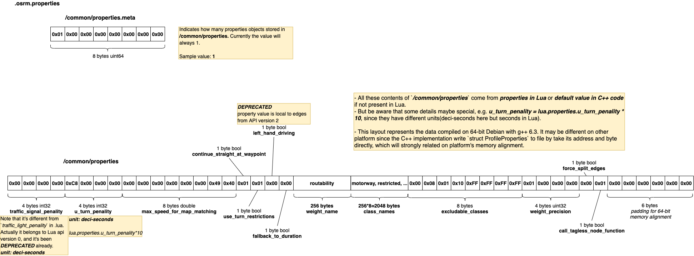

# .osrm.properties 
Contains Lua profile properties that affect run time queries.           

## List 

```bash
tar -tvf nevada-latest.osrm.properties
-rw-rw-r-- 0/0               8 1970-01-01 00:00 osrm_fingerprint.meta
-rw-rw-r-- 0/0               8 1970-01-01 00:00 /common/properties.meta
-rw-rw-r-- 0/0            2344 1970-01-01 00:00 /common/properties
```

## osrm_fingerprint.meta
- [osrm_fingerprint.meta](./fingerprint.md)

## /common/properties, /common/properties.meta

### Layout


### Implementation
