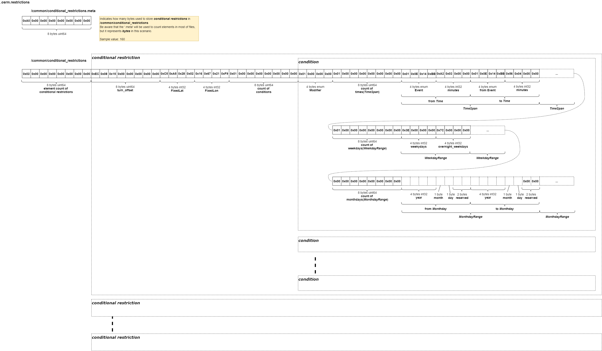

# .osrm.restrictions
Conditional restrictions are saved to disk, later to be parsed by `osrm-contract` or `osrm-customize` for validity and application to a given processing time.
 

## List

```bash
$ tar -xvf nevada-latest.osrm.restrictions
osrm_fingerprint.meta
/common/conditional_restrictions.meta
/common/conditional_restrictions
```

## osrm_fingerprint.meta
- [osrm_fingerprint.meta](./fingerprint.md)

## /common/conditional_restrictions, /common/conditional_restrictions.meta

### Layout


### Implementation

