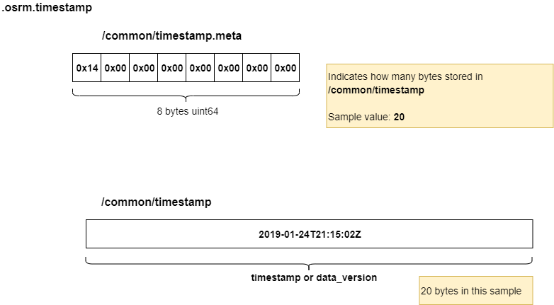

# .osrm.timestamp 
Contains the timestamps(a.k.a `data_version`) of the OSM extract if the header is set.           

## List 

```bash
tar tvf nevada-latest.osrm.timestamp
-rw-rw-r-- 0/0               8 1970-01-01 08:00 osrm_fingerprint.meta
-rw-rw-r-- 0/0               8 1970-01-01 08:00 /common/timestamp.meta
-rw-rw-r-- 0/0              20 1970-01-01 08:00 /common/timestamp
```

## osrm_fingerprint.meta
- [osrm_fingerprint.meta](./fingerprint.md)

## /common/timestamp, /common/timestamp.meta
Stores `timestamp`(a.k.a `data_version`) depends on `osrm-extract -d xxx`. This information will be returned in [`data_version` of route response](https://github.com/Telenav/osrm-backend/blob/master-telenav/docs/http.md#data-version).          

- No `-d` when run `osrm-extract`: will be empty, nothing will be stored.    
- `osrm-extract -d osmosis`: stores the `timestamp` get from `.osm.pbf` file, e.g. `2019-01-24T21:15:02Z`.     
- `osrm-extract -d "user defined data version"`: stores the user defined data version string.    


### Layout


### Implementation

The `timestamp` is a `std::string` comes from `osmosis`(get when parsing OSM headers in function [ParseOSMData](https://github.com/Telenav/osrm-backend/blob/1fce7e55823c59f239bef5a92d6bd69803edcd36/src/extractor/extractor.cpp#L427)) or command line parameter `-d xxx` directly, then simply write into `.osrm.timestamp` file. Check codes in [ParseOSMData](https://github.com/Telenav/osrm-backend/blob/1fce7e55823c59f239bef5a92d6bd69803edcd36/src/extractor/extractor.cpp#L427).        

```c++
        // write .timestamp data file
        std::string timestamp = header.get("osmosis_replication_timestamp");
        if (config.data_version == "osmosis")
        {
            files::writeTimestamp(config.GetPath(".osrm.timestamp").string(), timestamp);
        }
        else
        {
            files::writeTimestamp(config.GetPath(".osrm.timestamp").string(), config.data_version);
        }
```
