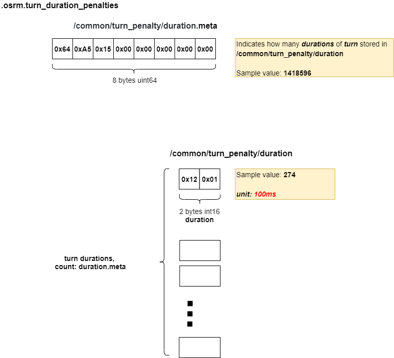

# .osrm.turn_duration_penalties
Contains duration of turns, the corresponding turn can be find by [.osrm.turn_penalties_index](map.osrm.turn_penalties_index.md).          

## List

```bash
tar -tvf nevada-latest.osrm.turn_duration_penalties
-rw-rw-r-- 0/0               8 1970-01-01 00:00 osrm_fingerprint.meta
-rw-rw-r-- 0/0               8 1970-01-01 00:00 /common/turn_penalty/duration.meta
-rw-rw-r-- 0/0         2837192 1970-01-01 00:00 /common/turn_penalty/duration
```

## osrm_fingerprint.meta
- [osrm_fingerprint.meta](./fingerprint.md)

## /common/turn_penalty

### Layout


### Implementation
Refer to [.osrm.turn_penalties_index - implementation](https://github.com/Telenav/open-source-spec/blob/master/osrm/doc/osrm-toolchain-files/map.osrm.turn_penalties_index.md#implementation).     
