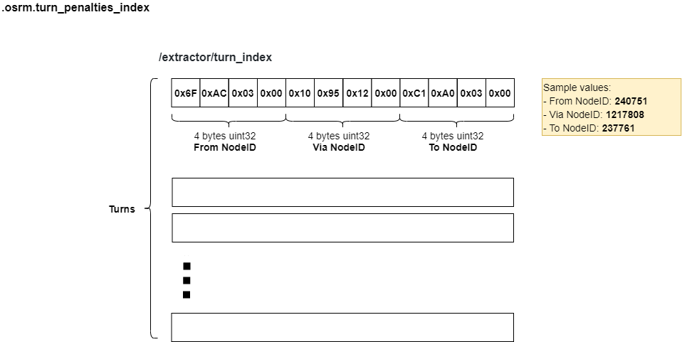

# .osrm.turn_penalties_index
Contains turns, each turn represents by `FromNodeID,ViaNodeID,ToNodeID`.      

## List

```bash
tar -tvf nevada-latest.osrm.turn_penalties_index
-rw-rw-r-- 0/0               8 1970-01-01 00:00 osrm_fingerprint.meta
-rw-rw-r-- 0/0        17023152 1970-01-01 00:00 /extractor/turn_index
```

## osrm_fingerprint.meta
- [osrm_fingerprint.meta](./fingerprint.md)

## /extractor/turn_index

### Layout


### Implementation
OSRM defines [TurnIndexBlock](https://github.com/Telenav/osrm-backend/blob/6900e30070a4ed3f1ca59004d57010a344cc7c9b/include/extractor/edge_based_graph_factory.hpp#L48-L53) to represent each turn. The `NodeID` inside is OSRM defined **Internal NodeID**, see more in [.osrm - Internal NodeID](https://github.com/Telenav/open-source-spec/blob/master/osrm/doc/osrm-toolchain-files/map.osrm.md#internal-nodeid).             

```c++
    struct TurnIndexBlock
    {
        NodeID from_id;
        NodeID via_id;
        NodeID to_id;
    };
```

The turns will be generated in [EdgeBasedGraphFactory::GenerateEdgeExpandedEdges](https://github.com/Telenav/osrm-backend/blob/6900e30070a4ed3f1ca59004d57010a344cc7c9b/src/extractor/edge_based_graph_factory.cpp#L436), which builds edge-expanded edges.      
All the `index/weight/duration` of turns will be calculated in this step and stores in `vector`. More concretely, turn `weight` and `duration` are calcualted by [scripting_environment.ProcessTurn](https://github.com/Telenav/osrm-backend/blob/6900e30070a4ed3f1ca59004d57010a344cc7c9b/src/extractor/edge_based_graph_factory.cpp#L648) of the [generate_edge ](https://github.com/Telenav/osrm-backend/blob/6900e30070a4ed3f1ca59004d57010a344cc7c9b/src/extractor/edge_based_graph_factory.cpp#L561) phase, be aware that the values will be `*= 10` that has been discussed in [Issue-5400 Why unit of weight/duration is 100ms?](https://github.com/Project-OSRM/osrm-backend/issues/5400). Turn indexes will be generated in [generate_edge ](https://github.com/Telenav/osrm-backend/blob/6900e30070a4ed3f1ca59004d57010a344cc7c9b/src/extractor/edge_based_graph_factory.cpp#L561) phase either.               

```c++
void EdgeBasedGraphFactory::GenerateEdgeExpandedEdges(
    // ... 

    // [Jay] weight/duration of turns that will be written into .osrm.turn_weight_penalties and .osrm.turn_duration_penalties
    std::vector<TurnPenalty> turn_weight_penalties;
    std::vector<TurnPenalty> turn_duration_penalties;

    // ...

    // [Jay] indexes of turn
    std::vector<lookup::TurnIndexBlock> turn_indexes_write_buffer;

    // ...

    // Generate edges for either artificial nodes or the main graph
    const auto generate_edge = [this,
                                    &scripting_environment,
                                    weight_multiplier,
                                    &conditional_restriction_map]( /* ... */ ) {

                                        // ...


                                        // [Jay] process turn to calculate turn weight/duration
                                        scripting_environment.ProcessTurn(extracted_turn);

                                        // turn penalties are limited to [-2^15, 2^15) which roughly translates to 54 minutes
                                        // and fits signed 16bit deci-seconds
                                        auto weight_penalty =
                                            boost::numeric_cast<TurnPenalty>(extracted_turn.weight * weight_multiplier);
                                        auto duration_penalty = boost::numeric_cast<TurnPenalty>(extracted_turn.duration * 10.);

                                        // ... 

                                        // We write out the mapping between the edge-expanded edges and the original nodes.
                                        // Since each edge represents a possible maneuver, external programs can use this to
                                        // quickly perform updates to edge weights in order to penalize certain turns.

                                        // If this edge is 'trivial' -- where the compressed edge corresponds exactly to an
                                        // original OSM segment -- we can pull the turn's preceding node ID directly with
                                        // `node_along_road_entering`;
                                        // otherwise, we need to look up the node immediately preceding the turn from the
                                        // compressed edge container.
                                        const bool isTrivial = m_compressed_edge_container.IsTrivial(node_based_edge_from);

                                        const auto &from_node =
                                            isTrivial ? node_along_road_entering
                                                    : m_compressed_edge_container.GetLastEdgeSourceID(node_based_edge_from);
                                        const auto &to_node =
                                            m_compressed_edge_container.GetFirstEdgeTargetID(node_based_edge_to);

                                        // [Jay] generate TurnIndexBlock
                                        lookup::TurnIndexBlock turn_index_block = {from_node, intersection_node, to_node};

                                        // ... 
                                    }

    // ...

    // write weight penalties per turn
    BOOST_ASSERT(turn_weight_penalties.size() == turn_duration_penalties.size());
    files::writeTurnWeightPenalty(turn_weight_penalties_filename, turn_weight_penalties);
    files::writeTurnDurationPenalty(turn_duration_penalties_filename, turn_duration_penalties);

```

Be aware that the written to file process of `turn indexes` is a little bit different with `turn_weight_penalties/turn_duration_penalties`. Refer to https://github.com/Project-OSRM/osrm-backend/issues/5862 for further discussion.   


