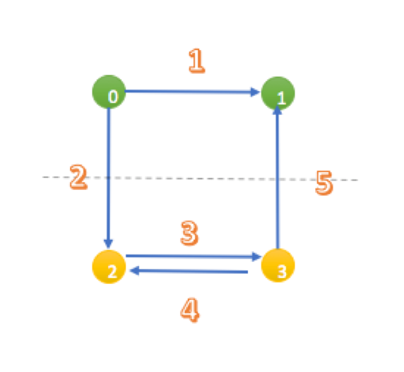

- [OSRM Customization](#osrm-customization)
    - [Case 1](#case-1)
        - [Case description](#case-description)
        - [Graph construction](#graph-construction)
        - [Metric](#metric)
    - [Case 2](#case-2)
        - [Case description](#case-description-1)
        - [Graph construction](#graph-construction-1)
        - [Metric](#metric-1)

# OSRM Customization

Customize is the step to apply real time cost for the graph.  In OSRM, customization means update live traffic to each of graph partitions and then calculate cost between each of entry/exists node pairs.  Real time route query will dramatically be speed up due to those processing.  For more backgrounds, you could go to [CRP](../../routing_basic/doc/crp.md) page.

I will use two case from [OSRM's unit test](https://github.com/Project-OSRM/osrm-backend/blob/v5.20.0/unit_tests/customizer/cell_customization.cpp) to describe the terms and how customize works.


### [Case 1](https://github.com/Project-OSRM/osrm-backend/blob/9234b2ae76bdbbb91cbb51142bfc0ee1252c4abd/unit_tests/customizer/cell_customization.cpp#L65)

##### Case description
The directed graph contains 4 nodes and 5 edges.  
A simulate partition to divide them into two groups: green {0, 1} and yellow {2, 3}




##### Graph construction
OSRM::MultiLevelGraph is construct by partition rules and sorted edges. 
```C++
auto graph = makeGraph(mlp, edges);
```
Partition rule is an array to identify the partition group of each node
```C++
    // There are two partitions 0 and 1
    // node 0 and 1 belonging to partition 0, node 2 and 3 belonging to partition 1
    // node:                0  1  2  3
    std::vector<CellID> l1{{0, 0, 1, 1}}

    // Here 2 means 2 level of map, level 0 is the original map
    // level 1 is the partition map
    MultiLevelPartition mlp{{l1}, {2}};
```
Mockedge is the structure to define the simplest edges, like {fromnode, tonode, cost}
```C++
    // The cost has be modified compare to original case in OSRM
    // Expectation also need to be updated and you will see below
    std::vector<MockEdge> edges = {{0, 1, 1}, {0, 2, 2}, {2, 3, 3}, {3, 1, 5}, {3, 2, 4}};
```
Then generate Construct CellStorage based on partition and graph(nodes, edges)
```C++
    CellStorage storage(mlp, graph);
```
There are 3 important terms inside OSRM's cell definition

Name|Description|Code|
--- | --- | ---
boundary_node|As long as there are in edge or out edge from differernt cell this node is boundary node| ```is_boundary_node |= partition.GetCell(level, other) != cell_id;```
source_node|There exists forward edges point to node in the same cell with current boarder node|```is_source_node |= partition.GetCell(level, other) == cell_id && data.forward;``` 
destination_node|There exists backward edges from node in the same cell with current boarder node| ```is_destination_node |= partition.GetCell(level, other) == cell_id && data.backward;```

For more background code could go to [here](https://github.com/Project-OSRM/osrm-backend/blob/b3eb8970f1cde37cc165ee84fbd67a8f6d982bd2/include/partitioner/cell_storage.hpp#L274)

Take the upper case as an example, for cell_1_0 (1 means level 1, 0 means partition 0 which is defined in parameter l1)  
0 is source node and 1 is destination node.  
For cell_1_1, both 2 and 3 are source nodes and destination nodes  

Comments:
1. source_node and destination_node only apply to boarder node
2. A boarder node could be both source_node and destination node, like 2 and 3 in the upper case
3. A node could be boarder node for lower partition level and then change to internal node at higher level
4. The definition of source_node and destination_node don't care the direction of links from different cell, they try to identify the ability of explore into the cell or exists from the cell.  
5. source_node and destination_node is used for record cost_tabel for given cell

##### Metric
Metric like cost table for each of source_node and destination_node pairs.  At beginning just initialize it with default value, the real value will be assigned after calling Customize function
```C++
    customizer.Customize(graph, heap, storage, node_filter, metric, 1, 0);
    customizer.Customize(graph, heap, storage, node_filter, metric, 1, 1);
```
Inside cell_1_0, for node 0, it is source_node, its outweight is 1(smallest cost to the destination_node 1 in the same cell), there is no inweight  
For node 1, it is destination_node, its inweight is 1(smallest cost from the source_node 0 in the same cell), there is no outweight  

Inside cell_1_1, for node 2, it is both source node and destination node, so do node 3.  
So for node 2, outweight is 0(to himself) and 3(to destination_node 3), inweight is 0(from himself) and 4(from source node 3)  
So for node 3, outweight is 4(to destination_node 2) and 0(to himself), inweight is 3(from source node 3) and 0(from himself)  

```C++
    CHECK_EQUAL_RANGE(cell_1_0.GetOutWeight(0), 1);
    CHECK_EQUAL_RANGE(cell_1_0.GetInWeight(1), 1);
    CHECK_EQUAL_RANGE(cell_1_1.GetOutWeight(2), 0, 3);
    CHECK_EQUAL_RANGE(cell_1_1.GetOutWeight(3), 4, 0);
    CHECK_EQUAL_RANGE(cell_1_1.GetInWeight(2), 0, 4);
    CHECK_EQUAL_RANGE(cell_1_1.GetInWeight(3), 3, 0);
```


### [Case 2](https://github.com/Project-OSRM/osrm-backend/blob/9234b2ae76bdbbb91cbb51142bfc0ee1252c4abd/unit_tests/customizer/cell_customization.cpp#L125)

##### Case description
The directed graph contains 16 nodes and 4 level of partition  


##### Graph construction
Let's take a look at node 0, 1, 2, 3 as an example  
At level 1, for cell_1_0, node 2 is source node and node 3 is destination node.  
At level 2, for cell_2_0, node 3 is source node, because there are links point to him from different cell which makes it as boarder node, and it only has links goes inside of the cell.  
At level 3, there is no source node nor destination node.  

##### Metric
```C++
    // custmization, from low level to top level
    customizer.Customize(graph, heap, storage, node_filter, metric, 1, 0);
    customizer.Customize(graph, heap, storage, node_filter, metric, 1, 1);
    customizer.Customize(graph, heap, storage, node_filter, metric, 1, 2);
    customizer.Customize(graph, heap, storage, node_filter, metric, 1, 3);

    customizer.Customize(graph, heap, storage, node_filter, metric, 2, 0);
    customizer.Customize(graph, heap, storage, node_filter, metric, 2, 1);
```
or you could call code below which is equal to the upper one
```C++
    customizer.Customize(graph, storage_rec, node_filter, metric_rec);
```

At level 1, for cell_1_0, there is just 1 source node and 1 destination node
```C++
    // cost 1 means shortest path between 3->2 is 1
    CHECK_EQUAL_RANGE(cell_1_0.GetOutWeight(3), 1);
    // cost 1 means shortest path betweenb 3->2 is 1
    CHECK_EQUAL_RANGE(cell_1_0.GetInWeight(2), 1);
```
At level 2, for cell_2_0, there are two destination nodes 5 and 7
```C++
    // 2 means there are two cost from 3, to 5 and 7 respectively
    // the value is 3(3->2->4_5) and 3(3->2->4->7)
    REQUIRE_SIZE_RANGE(cell_2_0.GetOutWeight(3), 2);
    CHECK_EQUAL_RANGE(cell_2_0.GetOutWeight(3), 3, 3);
```
No result for level 3.
