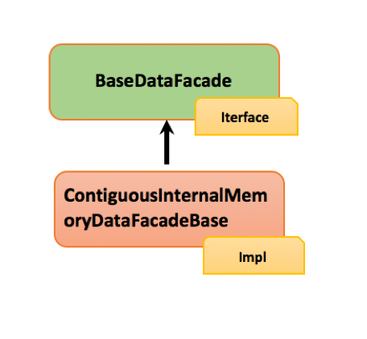
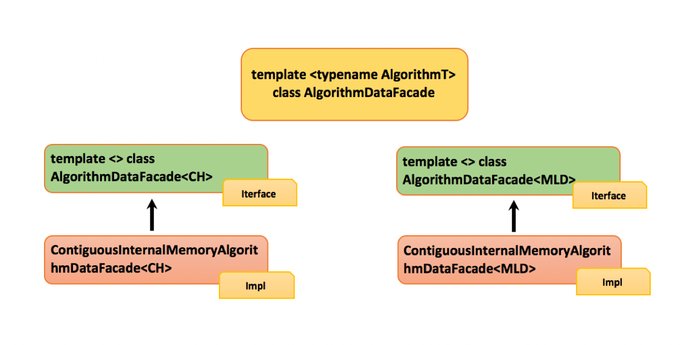
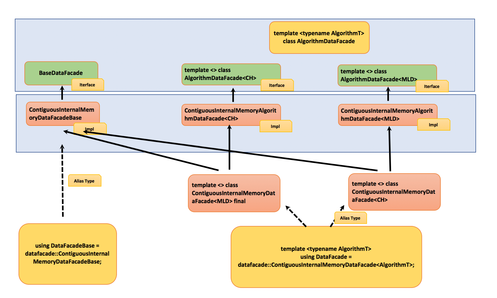
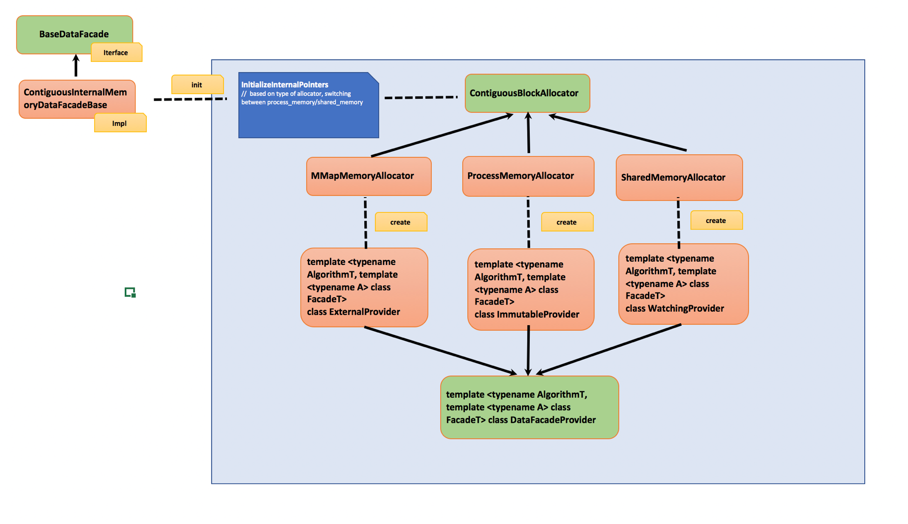
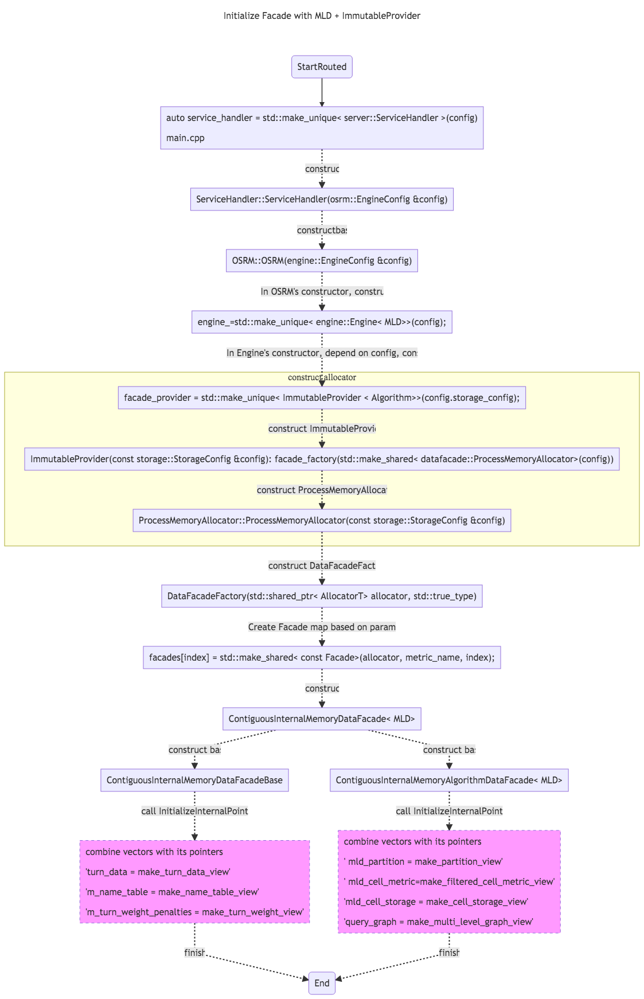

# OSRM facade

A [Facade](https://www.tutorialspoint.com/design_pattern/facade_pattern.htm) is an object that provides a simplified interface to a larger body to use.  In OSRM, facade provide interfaces to upper layer and hide implementation details of data.  

There are two major purpose for facade layer:
- Support different routing algorithm to calculate route, like CH, CRP
- Support different strategy to load data, such as load all data into memory, use mmap to load, use shared memory to load  

You could read [an abstract version of OSRM facade's design](./osrm_facade_simple_case.md).  Here is the notes related with [facade interface](./osrm_facade_interface.md).


## Purpose


Facade provides the interface to retrieve data, for example, here is the code in routing_base_mld.hpp for how to use it:

```C++
template <bool DIRECTION, typename Algorithm, typename... Args>
void relaxOutgoingEdges(const DataFacade<Algorithm> &facade,
                        typename SearchEngineData<Algorithm>::QueryHeap &forward_heap,
                        const NodeID node,
                        const EdgeWeight weight,
                        Args... args)
{
    const auto &partition = facade.GetMultiLevelPartition();
    const auto &cells = facade.GetCellStorage();
    const auto &metric = facade.GetCellMetric();

    //...

    // Boundary edges
    for (const auto edge : facade.GetBorderEdgeRange(level, node))
    {
        const auto &edge_data = facade.GetEdgeData(edge);

        if ((DIRECTION == FORWARD_DIRECTION) ? facade.IsForwardEdge(edge)
                                             : facade.IsBackwardEdge(edge))
        {
            const NodeID to = facade.GetTarget(edge);


   	//...

}

```

## Interfaces

BaseDataFacade defines the interface to retrieve basic information, and ContiguousInternalMemoryDataFacadeBase implements the interfaces.  




For algorithm part, OSRM choose template specialization for the implementation.  AlgorithmDataFacade defines the basic type, AlgorithmDataFacade<CH> and template <> class AlgorithmDataFacade<MLD> is two specialization defines interfaces for different functions,  ContiguousInternalMemoryAlgorithmDataFacade<CH> and ContiguousInternalMemoryAlgorithmDataFacade<MLD> implements those two template separately.  



In datafacade.hpp, you could find how they provide types for external usage:  




For more information of interfaces' usage, you could come to this page:  


## Initialization 

Facade is the layer based on pre-processed OSRM data(extraction, contraction, partition, customization), to enable Facade's functionality it must load related data.  

OSRM provides 3 ways to load data [code link](https://github.com/Telenav/osrm-backend/blob/7677b8513bf8cdbadb575c745acf4f9124887764/include/engine/engine.hpp#L51):
```C++

		// method #1: Use shared memory to load data
		//            Shared memory is a way for inter process communication
		//            Which could used for multiple process visiting the same data
        if (config.use_shared_memory)
        {
            util::Log(logDEBUG) << "Using shared memory with name \"" << config.dataset_name
                                << "\" with algorithm " << routing_algorithms::name<Algorithm>();
            facade_provider = std::make_unique<WatchingProvider<Algorithm>>(config.dataset_name);
        }
       // method #2: Use mmap to load data
       //            MMap loading is a efficient way to speed up initialization, actual data will be loaded
       //            only when needed. 
        else if (!config.memory_file.empty() || config.use_mmap)
        {
            if (!config.memory_file.empty())
            {
                util::Log(logWARNING)
                    << "The 'memory_file' option is DEPRECATED - using direct mmaping instead";
            }
            util::Log(logDEBUG) << "Using direct memory mapping with algorithm "
                                << routing_algorithms::name<Algorithm>();
            facade_provider = std::make_unique<ExternalProvider<Algorithm>>(config.storage_config);
        }
        // method #3: Use process-local memory to load data
        else
        {
            util::Log(logDEBUG) << "Using internal memory with algorithm "
                                << routing_algorithms::name<Algorithm>();
            facade_provider = std::make_unique<ImmutableProvider<Algorithm>>(config.storage_config);
        }

``` 

Inside [class Engine](https://github.com/Telenav/osrm-backend/blob/7677b8513bf8cdbadb575c745acf4f9124887764/include/engine/engine.hpp#L48), there is a member variable [facade_provider](https://github.com/Telenav/osrm-backend/blob/7677b8513bf8cdbadb575c745acf4f9124887764/include/engine/engine.hpp#L131), depend on different config it will init facade_provider with different Provider.  And different provider instancelized different memory allocator, so during engine's initialization it would use different strategy to init pointer point to different data.  

Class diagram




Sequence diagram




