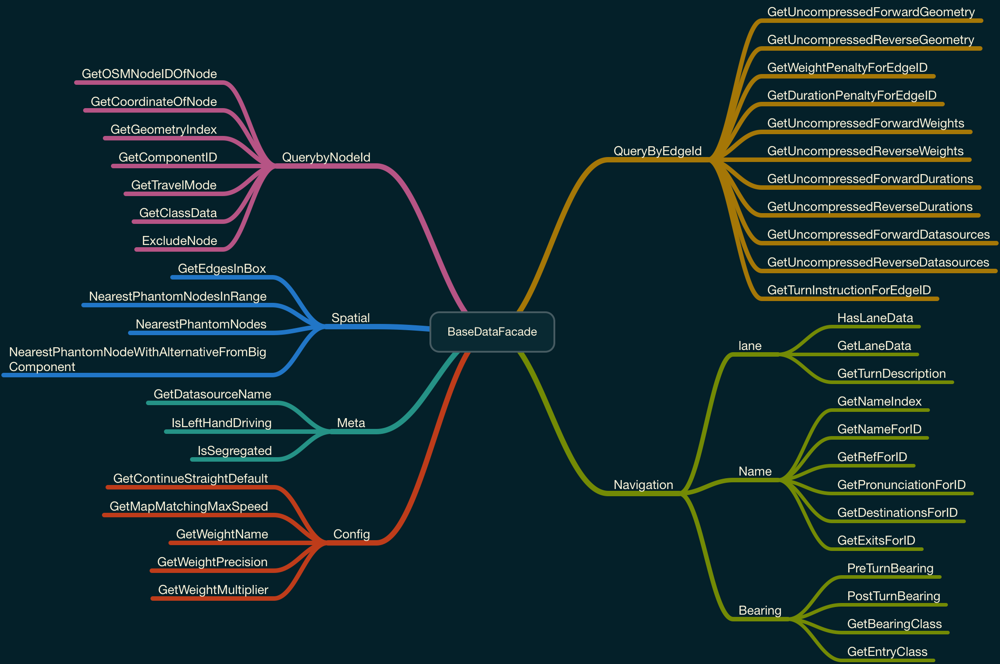

<!-- TOC -->
- [OSRM facade interface](#osrm-facade-interface)
  - [BaseDataFacade](#basedatafacade)
  - [AlgorithmDataFacade<MLD>](#algorithmdatafacademld)
  - [AlgorithmDataFacade<CH>](#algorithmdatafacadech)

# OSRM facade interface

## BaseDataFacade

[Code link](https://github.com/Telenav/osrm-backend/blob/7677b8513bf8cdbadb575c745acf4f9124887764/include/engine/datafacade/datafacade_base.hpp#L80)

Categories

Descriptions

## AlgorithmDataFacade<MLD>

[Code link](https://github.com/Telenav/osrm-backend/blob/7677b8513bf8cdbadb575c745acf4f9124887764/include/engine/datafacade/algorithm_datafacade.hpp#L67)

Categories

.png" alt="osrm_BaseDataFacademld_ocean" width="800"/>

Descriptions

## AlgorithmDataFacade<CH>

[Code link](https://github.com/Telenav/osrm-backend/blob/7677b8513bf8cdbadb575c745acf4f9124887764/include/engine/datafacade/algorithm_datafacade.hpp#L35)

Categories

.png" alt="osrm_BaseDataFacadech_ocean" width="800"/>

Descriptions  

More information please go to [osrm facade](https://github.com/Telenav/open-source-spec/blob/master/osrm/doc/osrm_facade.md)
