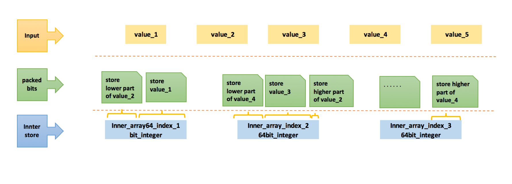

<!-- TOC -->
- [class packed_vector](#class-packedvector)
  - [Purpose](#purpose)
  - [Interface](#interface)
  - [Notes](#notes)
    - [How to set value](#how-to-set-value)
    - [How to retrieve value](#how-to-retrieve-value)
    - [How to get random index](#how-to-get-random-index)
    - [Implementation of set_value](#implementation-of-setvalue)
    - [Implementation of get_value](#implementation-of-getvalue)
    - [Others](#others)
  - [UnitTest](#unittest)
  - [Reference](#reference)


# [class packed_vector](https://github.com/Project-OSRM/osrm-backend/blob/a1e5061799f1980c64be5afb8a9071d6c68d7164/include/util/packed_vector.hpp)

## Purpose
osrm::packed_array privdes similar interface and time complexity with std::vector, but it would convert given input value into binary stream to save space.  
<br/>

<br/>
Say that you have an array contains value in the range of uint16_t, osrm::packed_array *compact* multiple value together and record them into lower level storage unit.  In [this version's implementation](https://github.com/Project-OSRM/osrm-backend/blob/v5.20.0/include/util/packed_vector.hpp), osrm::packed_array use array[uint_64] as low level storage.

## Interface
[push_back](https://github.com/Project-OSRM/osrm-backend/blob/a1e5061799f1980c64be5afb8a9071d6c68d7164/include/util/packed_vector.hpp#L420) will put given value into packed_vector and return an index which could used for futher logic and retrieve .  
[operator \[\] ](https://github.com/Project-OSRM/osrm-backend/blob/a1e5061799f1980c64be5afb8a9071d6c68d7164/include/util/packed_vector.hpp#L366)could be used to retrieve original value.

## Notes
- Its easy to design a packed_array for certain value bits range like 8, 16, 32，64.  They could fit in 64 bits entirely and no boundary case need to be handled.  As a utility class for wider usage, osrm::packed_array generalize compact strategy to handle any bit range in [1, 64].<br/>
By profiling, node ids from OSM's data are in the range of [0, pow(2,33)].
<br/>

### How to set value

Use 33 bits as an example, let's say input is {1597322404, 1432114613, 1939964443, 2112255763}  
The binary for `1597322404` is `001011111001101010011010010100100` in 33 bits, if we use inner array's 64bit value to record which then result is `0000000000000000000000000000000001011111001101010011010010100100`.  <br/><br/>
The binary for `1432114613` is `001010101010111000101010110110101` in 33 bits, for previous 64bit value there are still 31 left, so `1010101010111000101010110110101` will be recorded in the first 64 bit value and `00` will be recorded in the second 64bit value.  The final result for inner array's first 64bit value is `1010101010111000101010110110101001011111001101010011010010100100` and second 64bit is still all 0.  <br/><br/>
The binary for `1939964443` is `001110011101000011000001000011011` in 33 bits, we could merge the value as a whole part into second 64bit value, so **35 bits**(2 bits from first input, 33 bits from second input) has taken and result is `0000000000000000000000000000000111001110100001100000100001101100`  <br/><br/>
The binary for `2112255763` is `001111101111001100111011100010011` in 33 bits, we could merge the lower 19 bits into the free space of second 64bit value and merge remaining part into third 64 bit vlaue.  The result of inner array's second 64bit value is `1110111100110011101110001001100111001110100001100000100001101100` and third 64bit value is `0000000000000000000000000000000000000000000000000000000000000011`.  For information recorded in `1110111100110011101110001001100111001110100001100000100001101100`, `00` is from `1432114613`, `001110011101000011000001000011011` is from `1939964443`, `11101111001100111011100010011` is from `2112255763`.  <br/><br/>
By this example you could see that we could use less space to pack more value into it.  <br/>

### How to retrieve value

Next question is, how to **retrieve** result back?  Our expectation is
```
packed_array[index] == original_input_array[index]
```
packed_array retrieve is the reverse way of set.  
For index = 1, we know that it tooks 33 bits from inner array's first value, just use (inner_array[0] & `0000000000000000000000000000000111111111111111111111111111111111`) you could get original result<br/>
For index = 2, we know that it tooks 31 bits from inner array's first value and 2 bits from second, so you could use (inner_array[1] & `0000000000000000000000000000000000000000000000000000000000000011`)<< 31 for the upper part, plus (inner_array[1] & `1111111111111111111111111111111000000000000000000000000000000000`)>>33 for the lower part.

### How to get random index
osrm::packed_array grouped input into 64 elements(BLOCK_ELEMENTS = 64), when reach 64 then start to use new uint_64 to record new value.  
Then OSRM calculate patterns for all 64 situation, for each value's set and get, could find specific pattern by index % 64.  <br/>

I picked first 5 elements from each pattern array here:  
```
lower_mask[0]0000000000000000000000000000000111111111111111111111111111111111
lower_mask[1]1111111111111111111111111111111000000000000000000000000000000000
lower_mask[2]0000000000000000000000000000011111111111111111111111111111111100
lower_mask[3]1111111111111111111111111111100000000000000000000000000000000000
lower_mask[4]0000000000000000000000000001111111111111111111111111111111110000

upper_mask[0]0000000000000000000000000000000000000000000000000000000000000000
upper_mask[1]0000000000000000000000000000000000000000000000000000000000000011
upper_mask[2]0000000000000000000000000000000000000000000000000000000000000000
upper_mask[3]0000000000000000000000000000000000000000000000000000000000001111
upper_mask[4]0000000000000000000000000000000000000000000000000000000000000000

lower_offset[0]0000000000000000000000000000000000000000000000000000000000000000
lower_offset[1]0000000000000000000000000000000000000000000000000000000000100001
lower_offset[2]0000000000000000000000000000000000000000000000000000000000000010
lower_offset[3]0000000000000000000000000000000000000000000000000000000000100011
lower_offset[4]0000000000000000000000000000000000000000000000000000000000000100

upper_offset[0]0000000000000000000000000000000000000000000000000000000000100001
upper_offset[1]0000000000000000000000000000000000000000000000000000000000011111
upper_offset[2]0000000000000000000000000000000000000000000000000000000000100001
upper_offset[3]0000000000000000000000000000000000000000000000000000000000011101
upper_offset[4]0000000000000000000000000000000000000000000000000000000000100001

word_offset[0]0000000000000000000000000000000000000000000000000000000000000000
word_offset[1]0000000000000000000000000000000000000000000000000000000000000000
word_offset[2]0000000000000000000000000000000000000000000000000000000000000001
word_offset[3]0000000000000000000000000000000000000000000000000000000000000001
word_offset[4]0000000000000000000000000000000000000000000000000000000000000010
```
Full dump could be found [here](../references/files/packed_vector_array_dump.txt), the function of [initialize()](https://github.com/Project-OSRM/osrm-backend/blob/a1e5061799f1980c64be5afb8a9071d6c68d7164/include/util/packed_vector.hpp#L208) contains the code to generate the array


### Implementation of set_value

The function of [set_value](https://github.com/Project-OSRM/osrm-backend/blob/a1e5061799f1980c64be5afb8a9071d6c68d7164/include/util/packed_vector.hpp#L512)
```C++
inline void set_value(const InternalIndex internal_index, const T value)
{
    // [Perry] A value could only be recorded into 1 internal value or at most 2 internal value
    //         internal_index indicate which inner index the given value would be record into
    auto &lower_word = vec[internal_index.lower_word];
    auto &upper_word = vec[internal_index.lower_word + 1];
    // ...
    new_lower_word = set_lower_value<WordT, T>(local_lower_word,
                                               lower_mask[internal_index.element],
                                               lower_offset[internal_index.element],
                                               value);
    // ...
    new_upper_word = set_upper_value<WordT, T>(local_upper_word,
                                               upper_mask[internal_index.element],
                                               upper_offset[internal_index.element],
                                               value);
    //...
}

template <typename WordT, typename T>
// [Perry] word is the first inner 64bit value, mask is the one from lower_mask[] and offset is from lower_offset
//         value is the input value in given bit range
inline WordT set_lower_value(WordT word, WordT mask, std::uint8_t offset, T value)
{
    static_assert(std::is_unsigned<WordT>::value, "Only unsigned word types supported for now.");
    // [Perry] Let's say we want to set the first value, we just need record result into first word(inner value)
    //         Nothing need to touch set_upper_value
    // 
    //         For second value it becomes tricky.  
    //         From the examples we know that it would record 31 bits in the first word and 33 bits 
    //         in the second
    //         #1. Each word could record multiple input(say if input value is 1 bit then each word 
    //             could record 64), (word & ~mask) will record original value of the word
    //         #2. ((static_cast<WordT>(value) << offset) & mask) will record lower part 
    //             together with original value will generate new word to be recorded in inner array
    //         #3. set_upper_value is similar, the difference with set_lower_value is input value's 
    //              upper part will record in second word's lower part, that's what '>>' for
    return (word & ~mask) | ((static_cast<WordT>(value) << offset) & mask);
}

template <typename WordT, typename T>
inline WordT set_upper_value(WordT word, WordT mask, std::uint8_t offset, T value)
{
    static_assert(std::is_unsigned<WordT>::value, "Only unsigned word types supported for now.");
    return (word & ~mask) | ((static_cast<WordT>(value) >> offset) & mask);
}

```
<br/>

### Implementation of get_value

The function of [get_value](https://github.com/Project-OSRM/osrm-backend/blob/a1e5061799f1980c64be5afb8a9071d6c68d7164/include/util/packed_vector.hpp#L496)

```C++

inline T get_value(const InternalIndex internal_index) const
{
    // [Perry] internal_index indicate which inner index the given value would be record into
    const auto lower_word = vec[internal_index.lower_word];
    const auto upper_word = vec[internal_index.lower_word + 1];

    const auto value = get_lower_half_value<WordT, T>(lower_word,
                                                      lower_mask[internal_index.element],
                                                      lower_offset[internal_index.element]) |
                       get_upper_half_value<WordT, T>(upper_word,
                                                      upper_mask[internal_index.element],
                                                      upper_offset[internal_index.element]);
    return value;
}

template <typename WordT, typename T>
inline T get_lower_half_value(WordT word,
                              WordT mask,
                              std::uint8_t offset,
                              typename std::enable_if_t<std::is_integral<T>::value> * = 0)
{
    return static_cast<T>((word & mask) >> offset);
}

template <typename WordT, typename T>
inline T get_upper_half_value(WordT word,
                              WordT mask,
                              std::uint8_t offset,
                              typename std::enable_if_t<std::is_integral<T>::value> * = 0)
{
    return static_cast<T>((word & mask) << offset);
}


```
<br>

### Others

- Input value must be **positive** and in certain **bit-range**  
```C++
template <storage::Ownership Ownership>
using PackedOSMIDs = util::detail::PackedVector<OSMNodeID, 33, Ownership>;
```
Definition for OSMIDs indicate that the value for original OSMNodeID should in the range of {0, pow(2, 33) - 1}<br/>
If we change this from 33 to 63, then osrm::packed_array won't help much, it would impact the memory usage of OSRM routing server.<br/> 

- packed_vector will store input value into blocks and fill which based on calling sequences.  Its better to make sure each input of push_back is unique value.
```C++
template <typename BarrierOutIter, typename TrafficSignalsOutIter, typename PackedOSMIDsT>
void readRawNBGraph(const boost::filesystem::path &path,
                    BarrierOutIter barriers,
                    TrafficSignalsOutIter traffic_signals,
                    std::vector<util::Coordinate> &coordinates,
                    PackedOSMIDsT &osm_node_ids,
                    std::vector<extractor::NodeBasedEdge> &edge_list,
                    std::vector<extractor::NodeBasedEdgeAnnotation> &annotations)
                    {
                        // ...
                        auto decode = [&](const auto &current_node) {
                        coordinates[index].lon = current_node.lon;
                        coordinates[index].lat = current_node.lat;
                        // [Perry] During the iteration of osm node id, the value of current_node.node_id is positive and unique
                        osm_node_ids.push_back(current_node.node_id);
                        index++;
                        };
                        // ...
                    }
```
If you use array like {1,1,1,1,2,2,2} to call push_back, you still could get correct result just need spaces inorder to record all the mapping.   


- packed_vector uses CAS spinlocks to prevent **data races** in parallel calls.  You could find more details in the function of [set_value](https://github.com/Project-OSRM/osrm-backend/blob/a1e5061799f1980c64be5afb8a9071d6c68d7164/include/util/packed_vector.hpp#L512)


## [UnitTest](https://github.com/Project-OSRM/osrm-backend/blob/a1e5061799f1980c64be5afb8a9071d6c68d7164/unit_tests/util/packed_vector.cpp#L22)
 - General API(set and get)
 - Functionality test on different bit range(33, 10, etc)
 - Iterator test(begin, end, forward iterator, backward iterator,)
 - Extreme condition test

<br/>

## Reference
- [boost::any](http://cpp.sh/5savy)
- [boost::iterator_range](http://cpp.sh/23msm)
- [boost range for humans](https://greek0.net/boost-range/)
