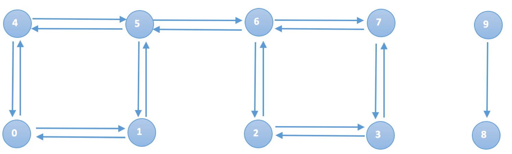
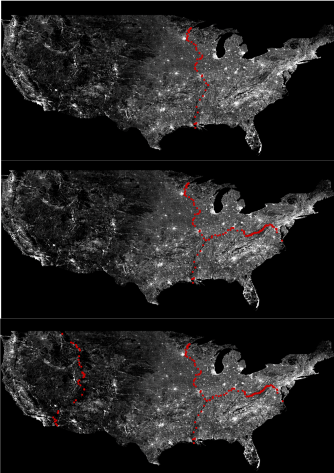

# OSRM Partition Simple Case

## Graph example




<br/>

```
nodes = {0,1,2,3,4,5,6,7,8,9}
edges = {{0, 1},
         {1, 0},
         {0, 4},
         {4, 0},
         {1, 5},
         {5, 1},
         {4, 5},
         {5, 4},
         {5, 6}, // 6 & 5 connects two components
         {6, 5},
         {6, 7},
         {7, 6},
         {6, 2},
         {2, 6},
         {2, 3},
         {3, 2},
         {3, 7},
         {7, 3},
         {9, 8} // 9 & 8 is a separate component
        }
```
<br/>


For more information please go to [detail page](./osrm_partition_detail.md#partition-input) <br/>

## Generate Graph

Based on the input nodes and edges, then will construct BisectionGraph([type](https://github.com/Project-OSRM/osrm-backend/blob/v5.20.0/include/partitioner/bisection_graph.hpp#L56), [interface](https://github.com/Project-OSRM/osrm-backend/blob/v5.20.0/include/partitioner/partition_graph.hpp#L64)).  BisectionGraph could provide connectivity for given nodes.
Internally, it builds adjacent list by sorting edges based on node id, for edges with the same source node will be put together. <br/>

```
edges = {{0, 1},
         {0, 4},
         {1, 0},
         {1, 5},
         {2, 3},
         {2, 6},
         {3, 2},
         {3, 7},
         {4, 0},
         {4, 5},
         {5, 1},
         {5, 4},
         {5, 6}, // 6 & 5 connects two components
         {6, 2},
         {6, 5},
         {6, 7},
         {7, 3},
         {7, 6},
         {9, 8} // 9 & 8 is a separate component
        }
```
If user want to query for connectivity of node 5, then will get edge range {10, 11, 12} which indicates {5, 1}, {5, 4}, {5, 6} <br/>

For more information please go to [detail page](./osrm_partition_detail.md#generate-graph) <br/>

## Bisect Graph
Bisection graph will partition the graph from top down.  First will treat graph as whole piece then try to find best cut to break it as two part, then continue the same logic for these two parts separately.   <br/>

The picture below shows bisection result of US map for first few steps: <br/>


For more information please go to [detail page](./osrm_partition_detail.md#bisect-graph)<br/>


### Find strong connected components
Node 9 and 8 don't have any connectivity with other edges.  For the upper graph we could dived data into two components: <br/>
Component 1: nodes {0, 1, 2, 3, 4, 5, 6, 7} <br/>
Component 2: nodes {8, 9} <br/>
Each component is also a graph and represented by [BisectionGraphView](https://github.com/Project-OSRM/osrm-backend/blob/v5.20.0/include/partitioner/bisection_graph_view.hpp#L23). 

For more information please go to [detail page](./osrm_partition_detail.md#find-strong-connected-components) <br/>

### Find most suitable bisection
Component 2 is very simple, here we take component 1 as an example. <br/>
For first cut, the best partition is cut between node 5 & 6 to break the graph into two parts<br/>
For second cut(if we want to have each sub-partition contains 2 nodes) there could be multiple choices which have the same result, due to that {{4, 0}, {1, 5}} and {{4, 5}, {0, 1}} could generte the same cut, the best partition is the first candidate found by the algorithm.   <br/>
Based on the algorithm of inertial flow, the cut will try with different angles start from 0 degree, the cut result would be {0, 4} and {1, 5} for the left and {2, 6} and {3, 7} for the right.<br/>
The beauty of using bisection is we could use 0 or 1 to identify differernt cut.  Take nodes {0, 1, 2, 3, 4, 5, 6, 7} as an example, after first cut {0, 1, 4, 5} will be assigned with 0, {2, 3, 6, 7} will be assigned with 1.  For the second cut in {0, 1, 4, 5}, {0, 4} will be assigned with 0 and {1, 5 } will be assigned with 1. <br/> 
Bisection result for each steps could be represented as below:
 ```
       0      |      1 
  0   |   1       0   |   1       
0   4   1   5   2   6   3   7   
 ```
 For each node, we could use bit record to represent partition result
 ```
{0b00, 0b01, 0b10, 0b11, 0b00, 0b01, 0b10, 0b11}
 ```
Take node 6 as example, the first cut the value is 1 and second cut the value is 0, so we use binary 0b10 to record partition result.<br/>

For more information please go to [detail page](./osrm_partition_detail.md#find-most-suitable-bisection) <br/>


## Convert bisection result to partition
OSRM use identical number to represent different partitions, previous step's result will be converted to array like this:
```
// node:                0, 1, 2, 3, 4, 5, 6, 7
std::vector<CellID> l1{{0, 1, 2, 3, 0, 1, 2, 3}};
std::vector<CellID> l2{{0, 0, 1, 1, 0, 0, 1, 1}};
std::vector<CellID> l3{{0, 0, 0, 0, 0, 0, 0, 0}};
```
The structure of MultiLevelPartition could be construct based on the those arrays
```
MultiLevelPartition mlp{{l1, l2, l3}, {4, 2, 1}};
```
For more information please go to [detail page](./osrm_partition_detail.md#convert-bisection-result-to-partition) <br/>

## Remove unconnected boundary edges
Remove unconnected boundary edges is the step to adjust partition result.  For the node has no connectivity with the cells it belonging to, then will move which to the cell which it do have connectivity.
There is no such case for the upper graph. <br/>
For more information please go to [detail page](./osrm_partition_detail.md#remove-unconnected-boundary-edges) <br/>

## Renumber graph
Renumber will re-organize the nodes sequence and build a mapping table to its original location.<br/>
It will first move nodes in the same cell together, such as {0, 4} and {3, 7}.
```
{0, 4, 1, 5, 2, 6, 3, 7}
```
Then it will try to make boarder nodes(such as 6) which on the highest level to have a very low ID, nodes that are never boarder nodes are sorted to the end of array<br/>
The boarder level of different node is
```
{1, 1, 1, 1, 1, 2, 2, 1}
```
So the expected order is
```
{5, 6, 0, 4, 1, 2, 3, 7}
```
And the final mapping table is
```
{2, 4, 5, 6, 3, 0, 1, 7}
```
For node 0, its final position is index 2 which means its the 3rd element in the array.  Then nodes and edges in the graph will be arraged follow this sequence.<br/>
For more information please go to [detail page](./osrm_partition_detail.md#renumber-graph) <br/>

## Output


