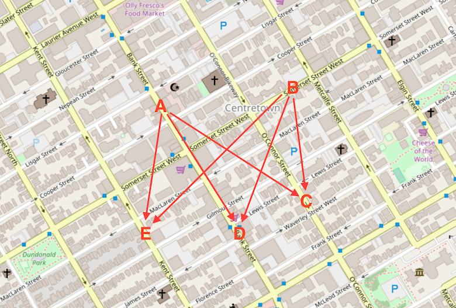
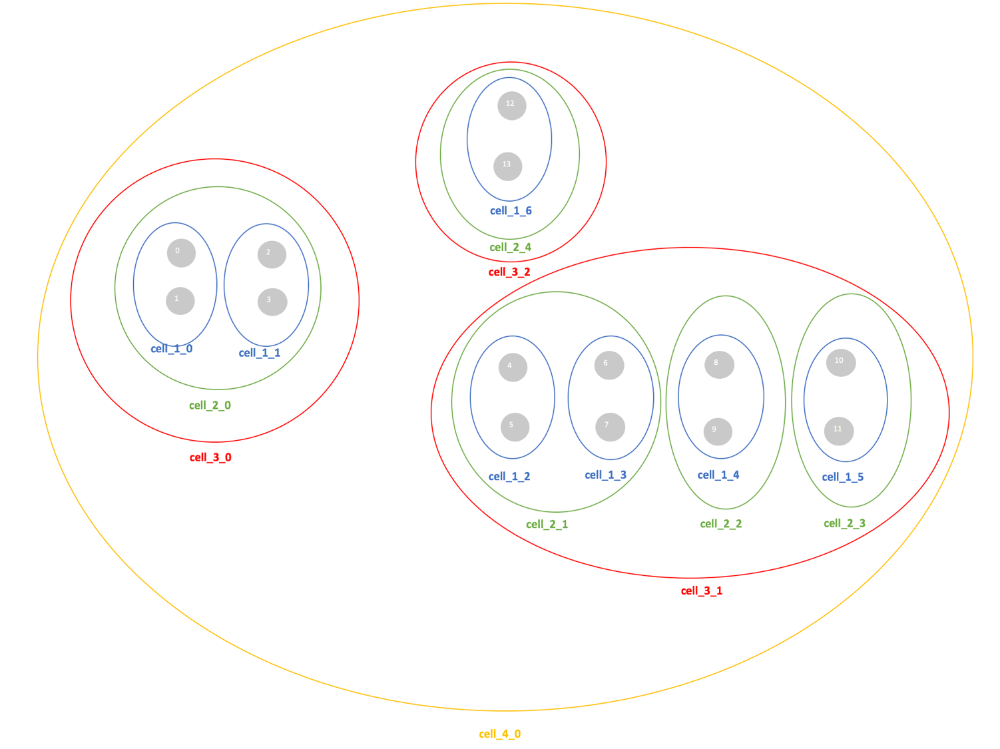
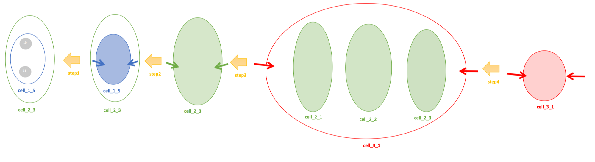
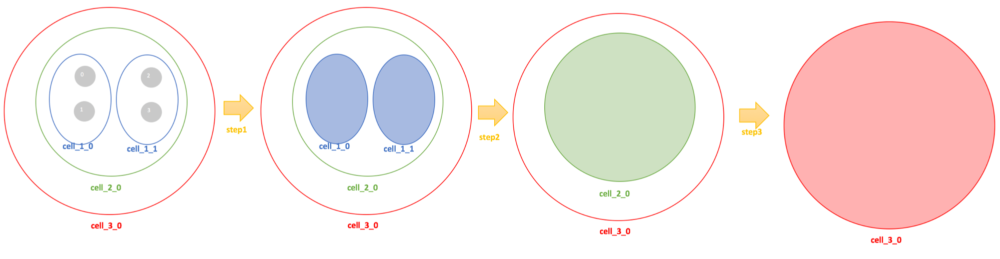
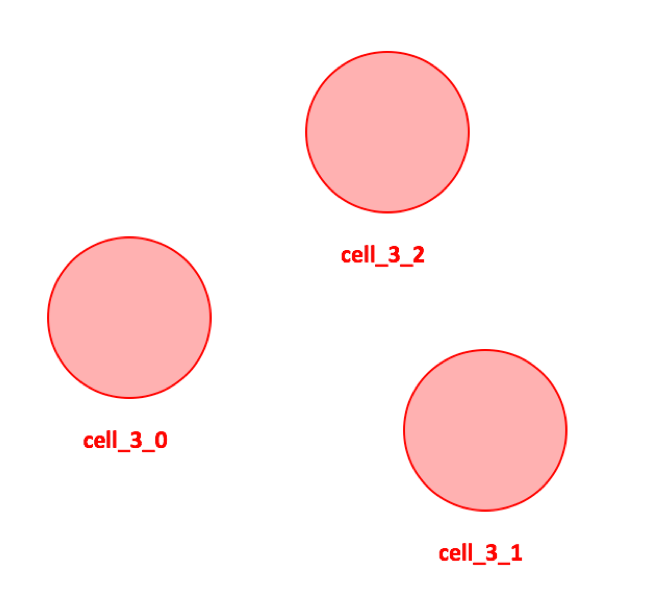

- [Table service](#table-service)
  - [API](#api)
    - [Examples](#examples)
      - [One to many](#one-to-many)
      - [Many to many](#many-to-many)
  - [Internal Logic](#internal-logic)
    - [One to many](#one-to-many-1)
      - [One to many(mld)](#one-to-manymld)
        - [MLD Algorithm](#mld-algorithm)
          - [Graph Example](#graph-example)
          - [Algorithm Description](#algorithm-description)
          - [Code](#code)
    - [Many to many](#many-to-many-1)

# Table service

## API
Table service also be called [Matrix API](https://docs.mapbox.com/help/how-mapbox-works/directions/#mapbox-matrix-api), which is used for calculated travel times/distance between many locations.  

### Examples
Based on the definition in [OSRM's table-service API Documentation](http://project-osrm.org/docs/v5.5.1/api/#table-service), we construct following examples:

#### One to many

```
# Returns a 1x4 matrix:
curl 'http://router.project-osrm.org/table/v1/driving/13.388860,52.517037;13.397634,52.529407;13.428555,52.523219;13.428555,52.523219;13.388860,52.517037?sources=0'
```


One to many always be used if you have a single source(current location) and several potential destinations(gas stations), the result(ETA, distance) plus other information(price, waiting time) could help application do a better ranking.

#### Many to many

```
# Returns a 2x3 matrix:
curl 'http://router.project-osrm.org/table/v1/driving/13.388860,52.517037;13.397634,52.529407;13.428555,52.523219;13.428555,52.523219;13.447496,52.524255?sources=0;1&destinations=2;3;4'
```


The number of sources and destinations are multiplied to create the matrix or timetable.  For example, given location A, B, C, D, E and define A/B as sources and C/D/E as destinations the API will return a matrix of all travel times between {A, B} and {C, D, E}.  

|Table|A    |B    |
|------|-----|-----|
|C     |A → C|B → C|
|D     |A → D|B → D|
|E     |A → E|B → E|

## Internal Logic

### One to many
One to many's logic likes single direction Dijkstra exploration, start from source and then expand out, after all destination candidates has been met then program will stop.

#### One to many(mld)

##### MLD Algorithm
MLD is the magic algorithm could promote to higher levels when two nodes are faraway, and while approaching destination it could also downgrade to lower levels.  
Let's use a simple graph to describe how MLD speed up calculating shortest path for one source to one destination.  

###### Graph Example
Assume we have a graph with 14 nodes.  Based on [graph partition](./osrm_partition.md), we group all nodes in different cells(partition), the connection between cells have optimum minimum cuts.  After [customization](./osrm_customization.md), for each cell at different level, the cost matrix between inner nodes and outer nodes has been built.  
Let's say graph partition result is generated as following:

```C++
    // node:                0  1  2  3  4  5  6  7  8  9 10 11 12 13
    std::vector<CellID> l1{{0, 0, 1, 1, 2, 2, 3, 3, 4, 4, 5, 5, 6, 6}};
    std::vector<CellID> l2{{0, 0, 0, 0, 1, 1, 1, 1, 2, 2, 3, 3, 4, 4}};
    std::vector<CellID> l3{{0, 0, 0, 0, 1, 1, 1, 1, 1, 1, 1, 1, 2, 2}};
    std::vector<CellID> l4{{0, 0, 0, 0, 0, 0, 0, 0, 0, 0, 0, 0, 0, 0}};
    MultiLevelPartition mlp{{l1, l2, l3, l4}, {7, 5, 3, 1}};
```
The upper case could be converted to following picture:



Here we ignore the edges between different nodes because they are not matters for describing the idea of MLD.  But you should know the {nodes, edges connected between nodes} constructs the graph.

Let's say we want to calculate a route form source=node_0 to destination=node_11.

###### Algorithm Description

  

Step 1: Let's assumn node_11 is the one inside node of cell_1_5 with no connection to outside.  If we got all shortest path from node_0 to cell_1_5, then the shortest path from node_0 to node_11 equals min{shortest path from node_0 to cell_1_5 + shortest path from enter point to node_11}.  <br/>
Step 2: Let's assume we got all shortest path from node_0 to cell_2_3, then we could easily got shortest path from node 0 to cell_1_5, because this two cell contains the same informtion.  <br/>
Step 3: Let's assume we got all shortest path from node_0 to cell_3_1, how can we get all shortest path to cell_2_3 quickly?  Actually, we could calculate route at cell_2_* level, treat cell_2_1, cell_2_2, cell_2_3 as a "big node", and put entrance segments at cell_3_* level to the priority_queue and only explore at level_2 level.  By this optimization, we could ignore all inner elements inside of cell_2_1 and cell_2_2 and we won's miss best solution.  The less connection between cells, the faster speed we could get for route calculation.  <br/>
Step 4: Then, find shortest path from node_0 to node_11 convert to find shortest path from node_0 to cell_3_1.  As long as we calculate all cost from node_0 to cell_3_1, we could find shortest path for the final result.  <br/>

We can achieve that with similar strategy:

<br/>
Step 1: We are at level 0 and will calculate all possible shortest path to the boarder of cell_1_0.  Then we could have the view of cell_1_0, everything matters is cell_1_*.  Which means, we don't care what's inside cell_1_1, we treat which as "big node" the only thing matters is its enter edges and exit edges. <br/>
Step 2: After we have all shortest path to the boarder of cell_2_0, we have the view of cell_2_0, everything matters is level 2 now.  <br/>
Step 3: Then we could easily promote to cell_3_0.  <br/>


  
  

In next step, We just need consider cell_3_0, cell_3_2, cell_3_1 and we could guarantee to calculate all shortest path from node_0 to cell_3_1.  This will skip all elements in entire cell_3_2.  


Summary:
- Based on CRP, MLD could calculate the shortest path very quickly.  The result of graph partition(balanced min-cut) is critical to the performance of MLD.  
- MLD has the ability to level up(from node_0->cell_1_0->cell_2_0->cell_3_0) and level down(cell_3_1->cell_2_3->cell_1_5->node_11)  


###### Code
After parsing URI and [finding candidates](./od_in_osrm.md) for each of source and destination nodes, it will come to [oneToManySearch()](https://github.com/Telenav/osrm-backend/blob/016adf6439433929ed5c6fd1272aee00d32f8ec1/src/engine/routing_algorithms/many_to_many_mld.cpp#L192) function in many_to_many_mld.cpp  
```C++
// * one-to-many (many-to-one) tasks use a unidirectional forward (backward) Dijkstra search
//   with the candidate node level `min(GetQueryLevel(phantom_node, node, phantom_nodes)`
//   for all destination (source) phantom nodes

template <bool DIRECTION>
std::pair<std::vector<EdgeDuration>, std::vector<EdgeDistance>>
oneToManySearch(SearchEngineData<Algorithm> &engine_working_data,
                const DataFacade<Algorithm> &facade,
                const std::vector<PhantomNode> &phantom_nodes,
                std::size_t phantom_index,
                const std::vector<std::size_t> &phantom_indices,
                const bool calculate_distance)
{
    // #step1: put all destination candidates in unordered_multimap
    // ...

    // #step2: put start point into d_ary_heap
    // ...

    // #step3: Enter iteration of single direction relaxing
    //         stopcodition is all destination node has been touched
    while (!query_heap.Empty() && !target_nodes_index.empty())
    {
        // ...
        // Extract node from the heap

        // Update values

        // Relax outgoing edges
    }
}
```
The main logic of GetQueryLevel is 
```C++
// Unrestricted search (Args is const PhantomNodes &):
//   * use partition.GetQueryLevel to find the node query level based on source and target phantoms
//   * allow to traverse all cells
template <typename MultiLevelPartition>
inline LevelID getNodeQueryLevel(const MultiLevelPartition &partition,
                                 NodeID node,
                                 const PhantomNodes &phantom_nodes)
{
    auto level = [&partition, node](const SegmentID &source, const SegmentID &target) {
        if (source.enabled && target.enabled)
            return partition.GetQueryLevel(source.id, target.id, node);
        return INVALID_LEVEL_ID;
    };
    return std::min(std::min(level(phantom_nodes.source_phantom.forward_segment_id,
                                   phantom_nodes.target_phantom.forward_segment_id),
                             level(phantom_nodes.source_phantom.forward_segment_id,
                                   phantom_nodes.target_phantom.reverse_segment_id)),
                    std::min(level(phantom_nodes.source_phantom.reverse_segment_id,
                                   phantom_nodes.target_phantom.forward_segment_id),
                             level(phantom_nodes.source_phantom.reverse_segment_id,
                                   phantom_nodes.target_phantom.reverse_segment_id)));
}

LevelID GetQueryLevel(NodeID start, NodeID target, NodeID node) const
{
    return std::min(GetHighestDifferentLevel(start, node),
                    GetHighestDifferentLevel(target, node));
}
/************************************************************
* [Perry] GetHighestDifferentLevel returns highest different level for two nodes.
*         At level 0, all nodes belonging to different cells
*         At highest level, all nodes belonging to the same cell
*         When two nodes not in the same cell, we could try to promote to upper to
*         speed up route calculation.
*         Take upper case as example:
*             GetHighestDifferentLevel(0, 1) == 0
*             GetHighestDifferentLevel(0, 2) == 1
*             GetHighestDifferentLevel(0, 4) == 3
*             GetHighestDifferentLevel(0, 11) == 3
*
*         During exploration, if two nodes and faraway, when we reach boarder we could
*         choose high level to speed up
*         When approaching destination, we will level down and try to evaluate all 
*         candidates lead to destination  
**********************************************************/


```


### Many to many
Many to many is similar to one to many logic, given 2 sources and 3 destinations, many to many will calculate result for first source node with 3 destination nodes and then calculate second source with 3 destination nodes.  

You could find the code [here](https://github.com/Telenav/osrm-backend/blob/016adf6439433929ed5c6fd1272aee00d32f8ec1/src/engine/routing_algorithms/many_to_many_mld.cpp#L536):  
```C++

// * many-to-many search tasks use a bidirectional Dijkstra search
//   with the candidate node level `min(GetHighestDifferentLevel(phantom_node, node))`
//   Due to pruned backward search space it is always better to compute the durations matrix
//   when number of sources is less than targets. If number of targets is less than sources
//   then search is performed on a reversed graph with phantom nodes with flipped roles and
//   returning a transposed matrix.
template <bool DIRECTION>
std::pair<std::vector<EdgeDuration>, std::vector<EdgeDistance>>
manyToManySearch(SearchEngineData<Algorithm> &engine_working_data,
                 const DataFacade<Algorithm> &facade,
                 const std::vector<PhantomNode> &phantom_nodes,
                 const std::vector<std::size_t> &source_indices,
                 const std::vector<std::size_t> &target_indices,
                 const bool calculate_distance)
```
