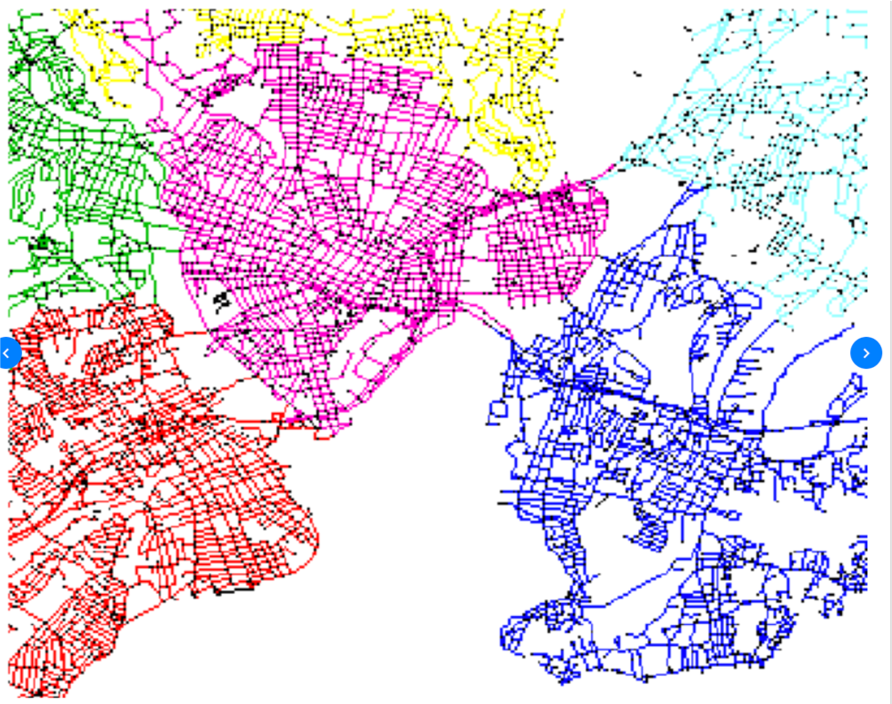
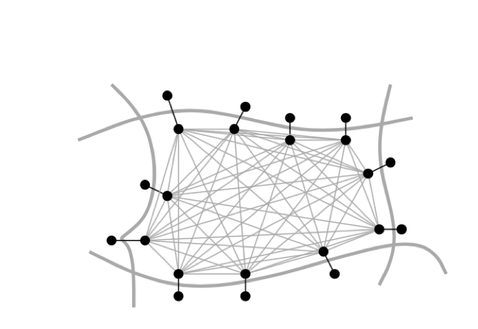
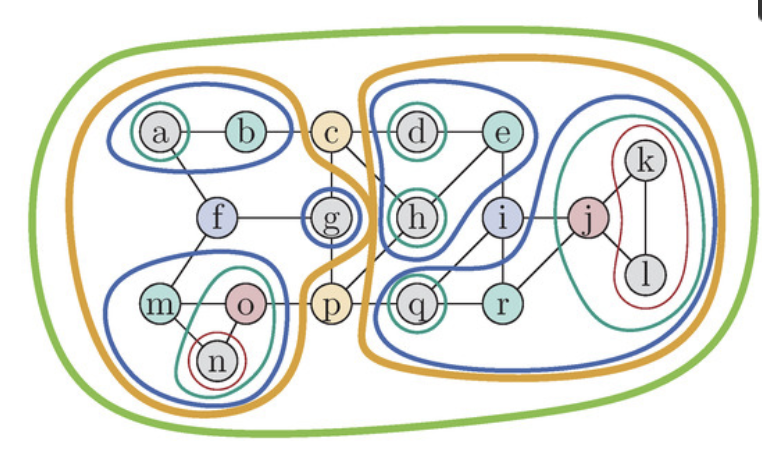
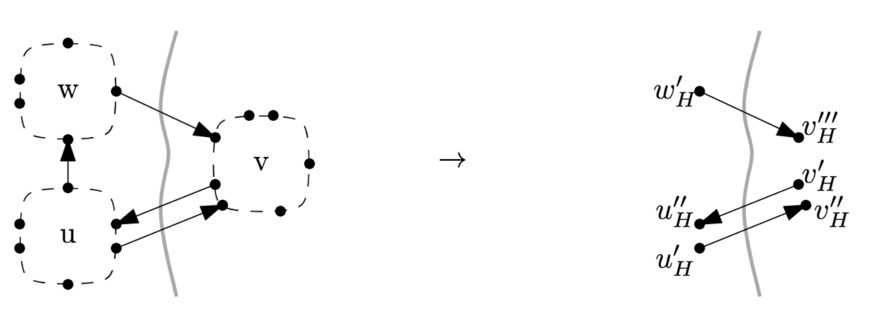
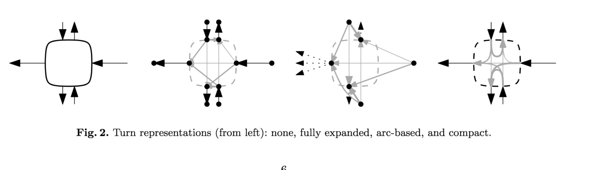
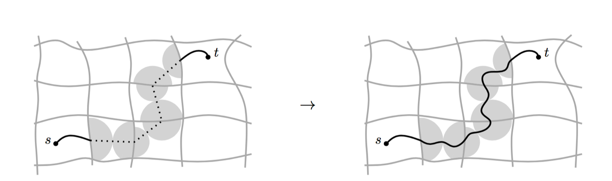

- [Customizable Route Planning](#customizable-route-planning)
  - [General](#general)
  - [CRP's problem set](#crps-problem-set)
  - [CRP Basic steps](#crp-basic-steps)
    - [Step1 Metric independent preprocessing](#step1-metric-independent-preprocessing)
      - [Overlay graph](#overlay-graph)
      - [Turns](#turns)
    - [Step2 Metric custmization](#step2-metric-custmization)
    - [Step3 Real time query](#step3-real-time-query)
  - [CRP Core ideas](#crp-core-ideas)
  - [Reference](#reference)

# Customizable Route Planning

## General
One of the big technical challenges in point to point route calculation is figuring out how to do real time pre-processing while keeping query latency low.  One of pretty common method is partitioning the graph into various cells and being able to figure out which cells need updates based on live traffic.  Only need to pre-processing particular sections of the graph and then creating shortcut edges across boundary nodes in each cell, then do routing on the overlay.  CRP is one of the best paper to summary those idea.

<!-- toc -->

## CRP's problem set
- Consider all details of road network(turns, speed limit, etc.)
- Consider different metrix(different cost function, fastest, shortest, avoid toll, avoid highway, etc.)
- Consider dynamic information
- Traffic jam and user information could reconstruct graph
- low latency

<!-- toc -->

## CRP Basic steps
### Step1 Metric independent preprocessing
  [**Graph partition**](./graph_partition.md), preprocessing, hours

  

  After partition, each cell would be abstract to "big node", only keeps entry -> exit pair.  Graph be dramatically constructed but keeps original structure.

   
  (Image from Paper of CRP)

#### Overlay graph

- Nested multi-level partition  

 
 

- H is abstract graph only contains overlays.  

   
(Image from Paper of CRP)
 

- Query applied on overlay.  

- Pruning the overlay

#### Turns
   
(Image from Paper of CRP)
 

### Step2 Metric custmization
  Apply dynamic information with cost models, each round of traffic update, seconds

  This step should be fast, live traffic could be used only after this step is ready.
  Partition data with minimum cut is crucial to this step, and in practise, move efforts into step1 could also help to speed up.

### Step3 Real time query
  Real time, per request, miliseconds
  
   
    (Image from Paper of CRP)

## CRP Core ideas
Topological and metric properties of the network is differernt.  The topology is the graph structure of the network together with a set of static properties.  The metric encodes the actual cost of traversing a road segment or taking a turn.

Partition road network with balanced count and min-cut is the most important step of CRP.  [Kernighan Lin](https://en.wikipedia.org/wiki/Kernighan%E2%80%93Lin_algorithm) and [Dinic](https://en.wikipedia.org/wiki/Dinic%27s_algorithm) are two basic algorithms.  In practise, there are METIS, PUNCH, KAHIP, Inertial flow.  For more details, please go to graph partition page.

<!-- toc -->

## Reference
- [Paper of CRP](../resource/papers/CustomizableRoutePlanningInRoadNetworks.pdf)
- [Telenav Direction team discussion](../resource/presentations/modern_routing_alg_09242018_reduced_size.pptx)
- [C++ Implementation of Customizable Route Planning (CRP)](https://github.com/michaelwegner/CRP)

