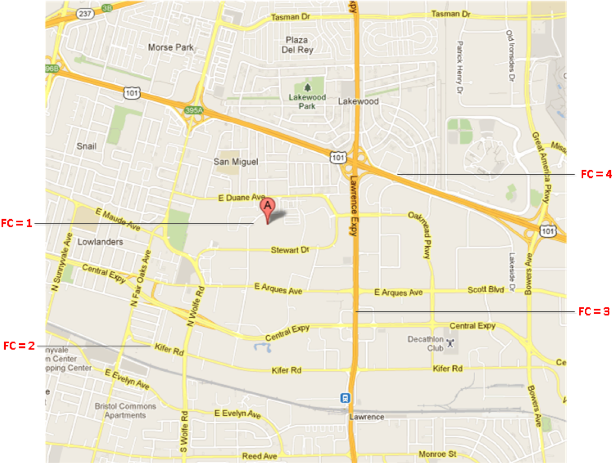
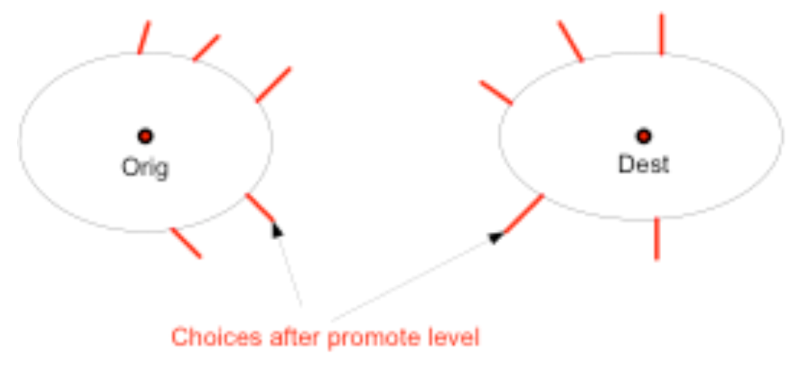
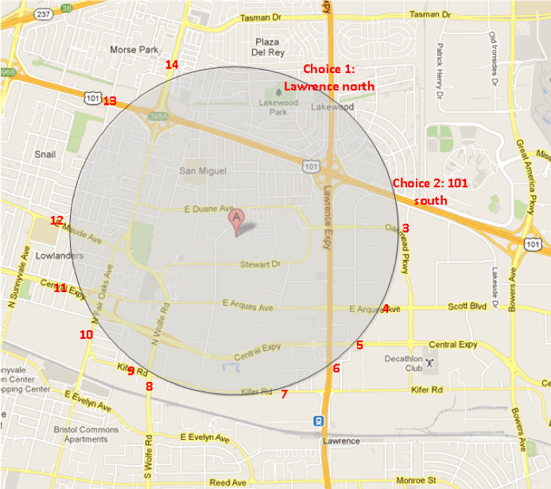

# Abstract
Function class is the attrbitue provide by data vender to identify the "importance" of road segment.  [Function class routing](../resource/presentations/FC_presentation.pptx) means prune road calculation based on function class attribute to balance performance and quality.

## Function class definition

## Candidate count strategy
The function class(FC in short) level promote algorithm need find a balance point between route quality and performance.
Route algorithm keeps a count of route choices before promoting to next higher FC level. It promotes if the choice count reach a threshold. After promotion, lower level FC roads are “invisible” to route algorithm.

Make sure there are enough choices after level promotion, so route won’t fail.

FC keeps a count of node choices in the priority queue for each level, if the choices after level promotion reach a threshold (current is 40), then it is safe to promote

The choices threshold controls the acceleration of the routing exploration. As it becomes smaller, the exploration gets more accelerated, and the route calculation tends to become faster, but the probability of resulting in a less optimal route  also becomes greater.

## Drawbacks
1. Function class routing can never find "mathematical" correct routing result.  We could analysis TomTom or HERE's data based on data analysis, but could hardly to figure out best practise for all locations.

2. Function class routing could hardly handle the model of "avoid toll" or "avoid highway".  Normally, most of important roads are highway or might contain tollbooth, avoid which means broken road network dramatically.  Without additional pre-processing and adjust level promote strategy it would get bad route result.  For more information about function class adjustment, you could go to this [document](../resource/documents/ImproveFunctionClassbasedonMicro-091117.pdf) or the [presentation here](../resource/presentations/level_promotion_adjustment.pptx)

3. Function class routing is easy to implement

## Reference
[Function Class Presentation](../resource/presentations/FC_presentation.pptx)