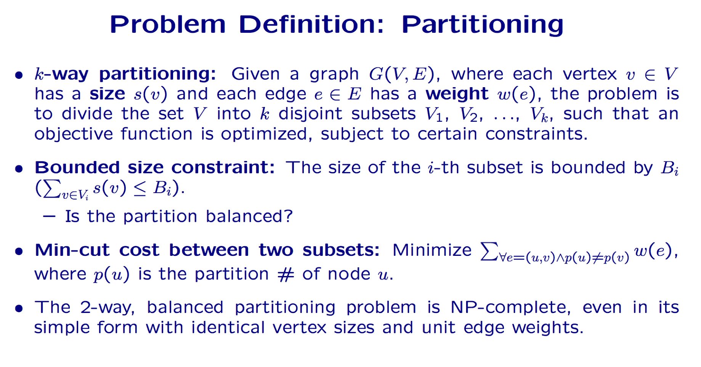
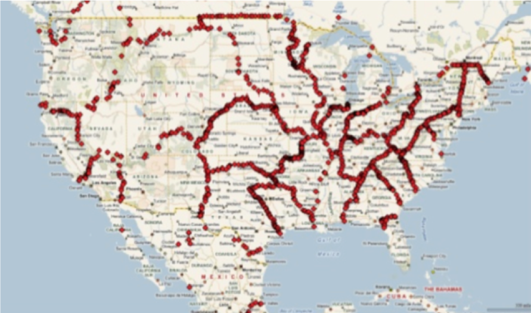
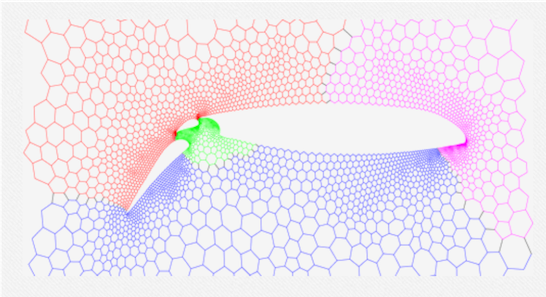
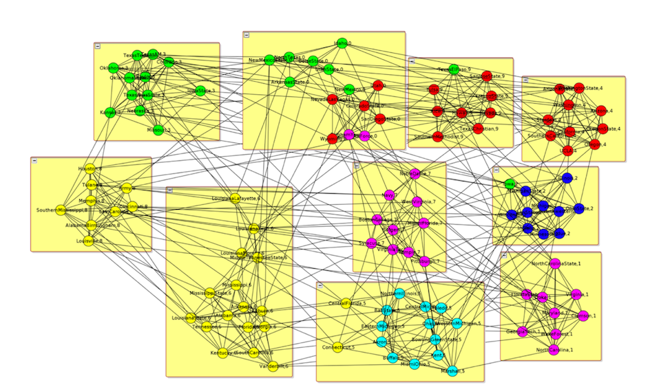

# Graph partition

## General

The graph partitioning problem asks for a division of a graph's node set into k equally sized blocks such that the number of edges that run between the blocks is minimized.  The size of each block is a configurable parameter.

## Application of the algorithm

| Road network | Graphics process | Scocial Network |
| --- | --- | --- |
|  |   |   | 

Graph partition is the first step to distribute processing graph data.

## Ideal partition result

    

## Basic Algorithm
- [Kernighan Lin Algorithm](./kernighan_lin_alg.md)

- [Max Flow Min Cut](./max_flow_min_cut.md)

## Solutions for Route network

- [METIS](./metis.md)

- [PUNCH](./punch.md)

- [Inertial Flow](./inertial_flow.md)

- [KAHIP](https://github.com/schulzchristian/KaHIP)

## Distribute Partition
- [pregel](https://kowshik.github.io/JPregel/pregel_paper.pdf)

- [Google - Affinity Clustering: Hierarchical Clustering at Scale](https://papers.nips.cc/paper/7262-affinity-clustering-hierarchical-clustering-at-scale.pdf)

- [Facebook - Balanced Label Propagation for Partitioning Massive Graphs](https://stanford.edu/~jugander/papers/wsdm13-blp.pdf)

## More information
- [Graph Partitioning and Clustering in Theory and Practice by Christian Schulz from KIT](https://par.tuwien.ac.at/teaching/2015w/195.084.psp#detailedcontent)

