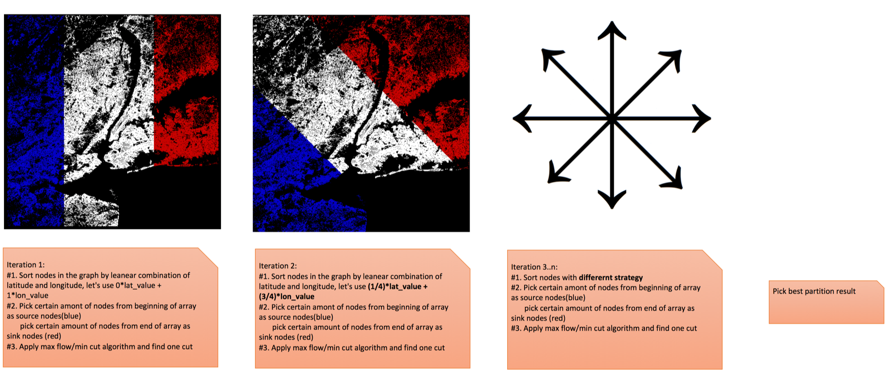

- [Inertial flow](#inertial-flow)
  - [Basic idea](#basic-idea)
  - [Implementation in OSRM](#implementation-in-osrm)
  - [Reference](#reference)

# Inertial flow

Inertial flow is one of the [graph partition algorithms](./graph_partition.md).  The idea behind inertial flow is, if you can identify many vertices on each side of a **good cut** then you could easily find a sparse cut using max-flow, the difficulty always in identifying these vertices[Khandekar, Rao, Vazirani; STOC06].  Inertial flow tries to find optimal cut by selecting different sets of vertices and apply max-flow algorithm on them, in the end will return the best partition.


## Basic idea



Strongly recommend you to read [blog post](https://daniel-j-h.github.io/post/selection-algorithms-for-partitioning/) from Daniel J.H., who implemented this in OSRM.  

## Implementation in OSRM
[computeInertialFlowCut](https://github.com/Project-OSRM/osrm-backend/blob/9234b2ae76bdbbb91cbb51142bfc0ee1252c4abd/src/partitioner/recursive_bisection.cpp#L73) is the function to calculate best partition
```C++
DinicMaxFlow::MinCut computeInertialFlowCut(const BisectionGraphView &view,
                                            const std::size_t num_slopes,
                                            const double balance,
                                            const double source_sink_rate)
{
    //...

        for (auto round = chunk.begin(), end = chunk.end(); round != end; ++round)
        {
            const auto slope = -1. + round * (2. / n);
            
            // [Perry]: makeSpatialOrder will call function reorderFirstLast listed below
            //          The function will Creates a spatial order of n * sources "first" 
            //          and n * sink "last" node ids.  The slope determines the spatial 
            //          order for sorting node coordinates.
            //          Using the idea of geo hash create 25%'s source and 25%'s sink.
            //          By only focusing on a small set on the outside of the source/sink 
            //          blob, it could save quite some overhead in initialization/search cost.
            auto order = makeSpatialOrder(view, ratio, slope);
            auto cut = DinicMaxFlow()(view, order.sources, order.sinks);
            auto cut_balance = get_balance(cut.num_nodes_source);

            {
                std::lock_guard<std::mutex> guard{lock};

                // Swap to keep the destruction of the old object outside of critical section.
                if (cut.num_edges * cut_balance < best.num_edges * best_balance ||
                    (cut.num_edges == best.num_edges &&
                     balance_delta(cut.num_nodes_source) < balance_delta(best.num_nodes_source)))
                {
                    best_balance = cut_balance;
                    std::swap(best, cut);
                }
            }
            // cut gets destroyed here
        }
}

```
[reorderFirstLast](https://github.com/Project-OSRM/osrm-backend/blob/9234b2ae76bdbbb91cbb51142bfc0ee1252c4abd/include/partitioner/reorder_first_last.hpp#L19) is the function perform sort and selecting source nodes and sink nodes
```C++
// Reorders the first n elements in the range to satisfy the comparator,
// and the last n elements to satisfy the comparator with arguments flipped.
// Note: no guarantees to the element's ordering inside the reordered ranges.
template <typename RandomIt, typename Comparator>
void reorderFirstLast(RandomIt first, RandomIt last, std::size_t n, Comparator comp)
{
    BOOST_ASSERT_MSG(n <= (last - first) / std::size_t{2}, "overlapping subranges not allowed");

    if (n == 0 || (last - first < 2))
        return;

    // Reorder first n: guarantees that the predicate holds for the first elements.
    std::nth_element(first, first + (n - 1), last, comp);

    // Reorder last n: guarantees that the flipped predicate holds for the last k elements.
    // We reorder from the end backwards up to the end of the already reordered range.
    // We can not use std::not2, since then e.g. std::less<> would lose its irreflexive
    // requirements.
    std::reverse_iterator<RandomIt> rfirst{last}, rlast{first + n};

    const auto flipped = [](auto fn) {
        return [fn](auto &&lhs, auto &&rhs) {
            return fn(std::forward<decltype(lhs)>(rhs), std::forward<decltype(rhs)>(lhs));
        };
    };

    std::nth_element(rfirst, rfirst + (n - 1), rlast, flipped(comp));
}

```
After select source and sink, use Dinic algorithm to calculate max-flow/min-cut, for more details could go to [max flow/min cut](./max_flow_min_cut.md) page
```C++
DinicMaxFlow::MinCut DinicMaxFlow::operator()(const BisectionGraphView &view,
                                              const SourceSinkNodes &source_nodes,
                                              const SourceSinkNodes &sink_nodes) const
```


## Reference
- [On Balanced Separators in Road Networks - paper](http://sommer.jp/roadseparator.pdf)
- [On Balanced Separators in Road Networks - slides](http://sommer.jp/sea2015.pdf)
- [Selection Algorithms for Graph Partitioning - blog post](https://daniel-j-h.github.io/post/selection-algorithms-for-partitioning/)
- [OSRM - issue3205 - Implement Inertial Flow Partitioner](https://github.com/Project-OSRM/osrm-backend/issues/3205)
