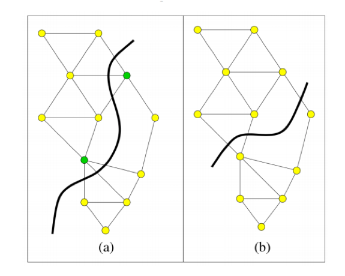
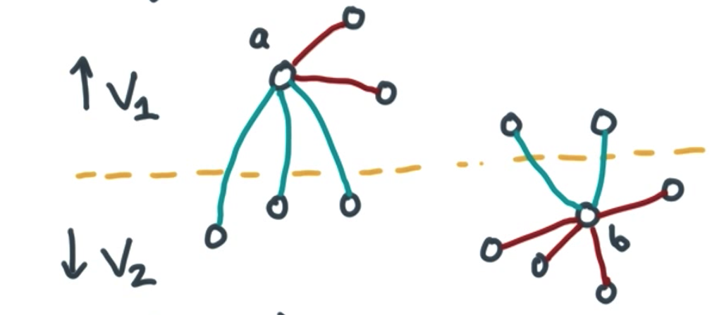
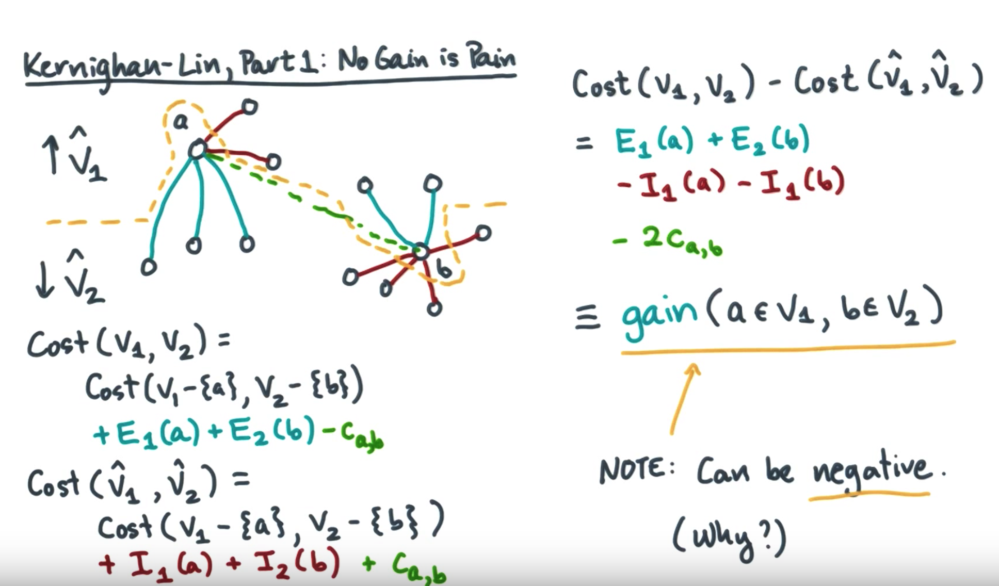
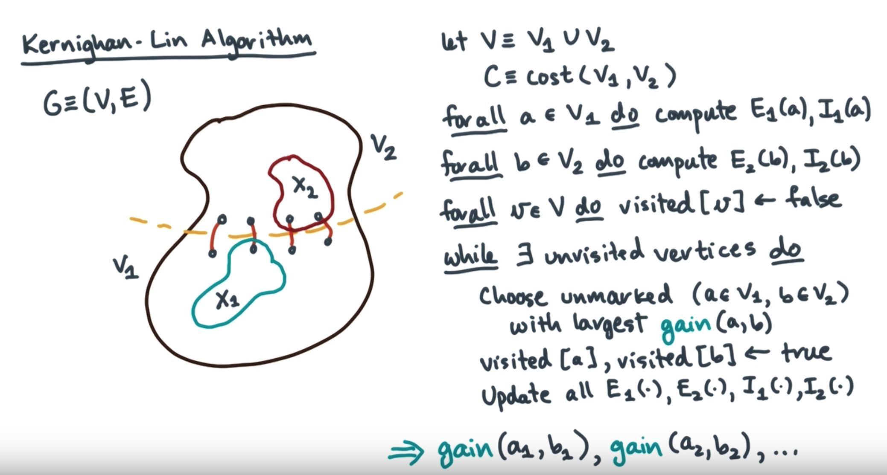
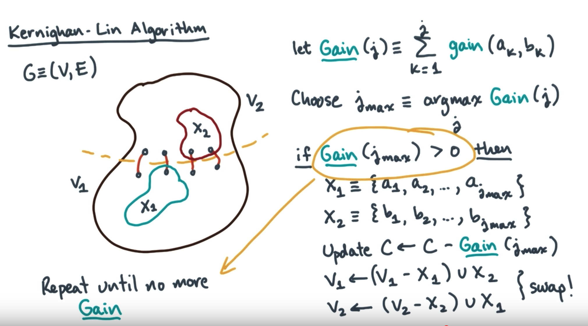

# Kernighan Lin Algorithm

## General

[Kernighan Lin](https://en.wikipedia.org/wiki/Kernighan%E2%80%93Lin_algorithm) is a heuristic algorithm for finding partitions of graphs, which is mainly used for bipartite a graph 




## Algorithm basic



For given graph be divided into two sets of vertex v1 and v2, we want to find 2 vertex belonging to different set, by switch them we could optimize cut result.

Let's say `vertex a` belonging to V1 and `vertex b` belonging to V2.  For current division, cut size is 5, by moving a to V2 and b to V1, we got worse cut size 6 which could not help to gain better cut.

Basic algorithm



Step1: calculate a sequence of gains



Step2: accumulate gains




## Key points
1. Comments about implementation
```python
        min_id = -1
        self.swaps = []
        while self.get_nominal_cut_size() < nominal_cut_size:
            nominal_cut_size = self.get_nominal_cut_size()
            min_cost = float("Inf")
            for i in range(cut_size):
                # Signle swap will calculate max gain for each combination from group_a_unchosen and group_b_unchosen
                self.single_swaps()
                cost = self.get_nominal_cut_size()
                if cost < min_cost:
                    min_cost = cost
                    min_id = i
            
            # Undo swaps done after the minimum was reached
            for i in range(min_id+1, cut_size):
                vertice_b, vertice_a = self.swaps[i]
                self.do_swap((vertice_a, vertice_b))

            # Reset unchosen group based on adjust items.
            # When there is any gain, this algorithm won't stop, so need huristic to speed up(inside single_swap)
            self.group_a_unchosen, self.group_b_unchosen = \
            self.graph.get_groups()
```

[For more context could go to code here](https://github.com/CodeBear801/Kernighan-Lin/blob/37a87d15728fbc4371725a4c3b75a517694eb286/kernighan_lin.py#L136)

The major issue for kernighan_lin is <span style="color:red"> **the cost of the algorithm is too high**</span>, which takes O(V^2*n) 

2. <span>**Kernighan Lin alg is sensitive to initial partition's result, with good initial result could convergent quickly.  But in real case its hard to estimate that.**</span>

## Reference
- [Original Paper from B.W.Kernighan and S.Lin](https://www.cs.utexas.edu/~pingali/CS395T/2009fa/papers/kl.pdf)
- [wiki](https://en.wikipedia.org/wiki/Kernighan%E2%80%93Lin_algorithm)
- [Udacity Video](https://www.youtube.com/watch?v=2swNkneUmg0)
- [python implementation](https://github.com/CodeBear801/Kernighan-Lin)
- [java implementation](https://github.com/plyr0/kernighan-lin)
