<!-- TOC -->
- [Map Matching Basic](#map-matching-basic)
  - [What is map matching](#what-is-map-matching)
  - [Different type of map matching](#different-type-of-map-matching)
    - [Onboard map matching](#onboard-map-matching)
    - [Offboard map matching](#offboard-map-matching)
  - [What's the challenge of map matching](#whats-the-challenge-of-map-matching)
  - [Why map matching is useful](#why-map-matching-is-useful)
  - [How to map matching](#how-to-map-matching)
    - [Data cleaning](#data-cleaning)
      - [Noise point](#noise-point)
      - [Dense points](#dense-points)
      - [Start, end and stop](#start-end-and-stop)
    - [Hidden markov map matching](#hidden-markov-map-matching)
      - [Why Markov-chain helps](#why-markov-chain-helps)
      - [Emission probability](#emission-probability)
      - [Transition probability](#transition-probability)
      - [Viterbi algorithm](#viterbi-algorithm)
      - [Confidence level](#confidence-level)
    - [Experience](#experience)
  - [More Info](#more-info)
  - [Reference](#reference)

# Map Matching Basic

## What is map matching
Give a sequence of GPS signals, find the most probable sequence of road segments.

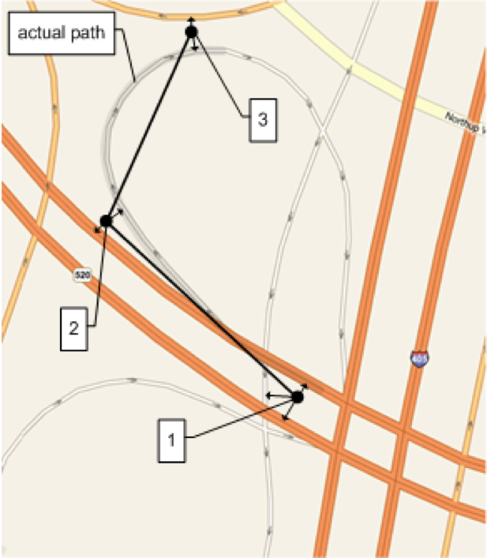<br/>
(Picture from the paper of [HMMM Through Noise and Sparseness](https://www.microsoft.com/en-us/research/publication/hidden-markov-map-matching-noise-sparseness/))

We call GPS data collected from each of our user as GPS probe data.

## Different type of map matching

### Onboard map matching
Real time map matching, always happened on embedded device for single user.  When user is driving, map matching component try to snap user's GPS trace to map data.  Onboard map matching always have richer information compare to offboard map matching(when only gps gathered), such as information from gyro(driving angle), information from vehicle(speed, gps accuracy).  
Onboard map matching always retrieve map data from local device.  During map matching, based on existing gps trace, map matching component recommends the most probable route for user.  It might maintain several route candidate during calculation and re-adjust probability based on coming gps points.  Its common that the probability of different candidate jump back and forth, but map matching system must avoid providing such experience for end user.

During navigation, detect whether user is following the route now is the main purpose of onboard navigation.  We expect which to trigger re-routing when we find user is off suggested route(deviation).

### Offboard map matching
Post processing, always happened at server side with full user gps trip.  GPS points will be recorded once every three seconds or 20 meters.
It could share the same algorithm with onboard map matching, but data cleaning would be a big part or most important part of work.
Cloud map matching always use distribute framework to process user data, such as the data for the past day.


## What's the challenge of map matching

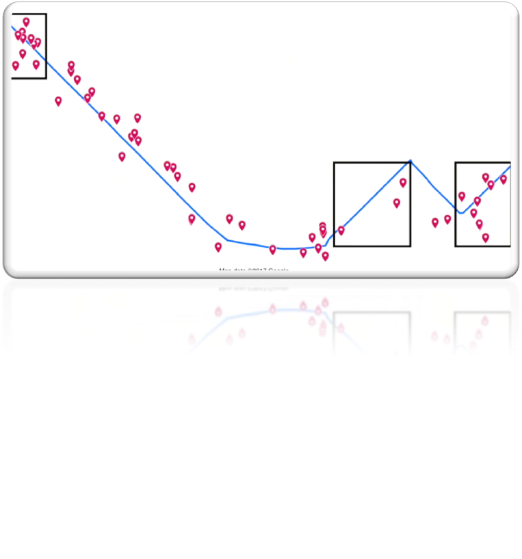<br/>

GPS points always be noisy and sparseness.  Especially when device is just started, at parking lot, passing through skyscraper.  

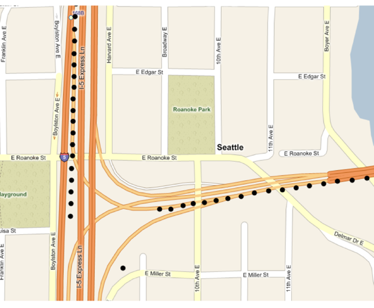<br/>
User's single trip might be represented by several GPS probe trace, deviation and lost gps data is a common situation.  
The upper picture might be caused due to user pass though a tunnel.

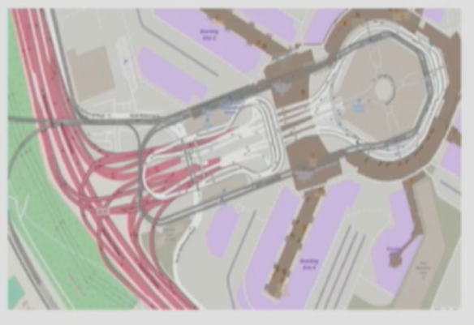<br/>
Map matching would spend a lot of efforts at complex road network, such as airport or multiple layer of road networks.  
Add also, map data might not accurately represent the real world, map matching is extremely hard at such situation.

## Why map matching is useful

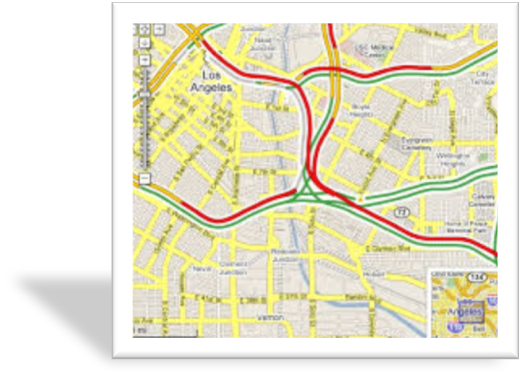<br/>
Provide accurate arriving time estimation is the target of every navigation system.  User's probe data is the ground truth when you adjusting your ETA calculation algorithm.  Map matching helps to build connection between user's probe data and map data.

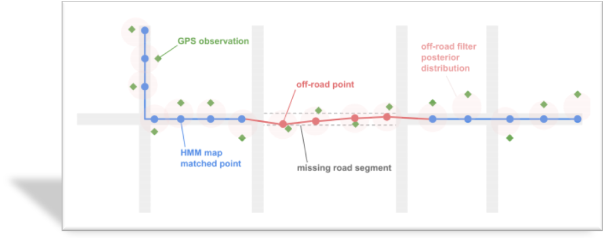<br/>
(Picture from the paper of [map matching when the map is wrong](https://arxiv.org/pdf/1809.09755.pdf))  
Not every map data accurately represent the real world.  Map making could provide lots of value when you have rich user gps trace in your database.
If you could identify entrance for POI point, best drop off location, those kind of data would make user feel more comfortable during navigation.  

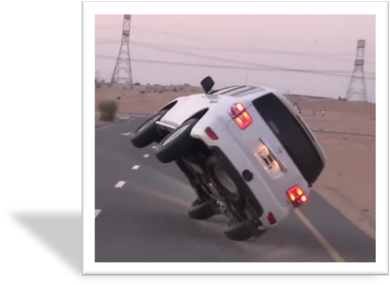<br/>
We want to understand our user's driving behavior.  User's gps trace is the data help us to understand our user more than themselves.  
Is the user afraid to drive on highway?  Can we provide more safe consideration to a specific user?

## How to map matching
Here I mainly focus on the logic of offboard map maptching.

### Data cleaning
Before match gps point into map data, we will do some cleaning just look at points themselves(without consider any information from map data).

#### Noise point
Filter strategy could be very simple.  For each pair of gps points, calculate the distance between them.  If the distance between one point to its previous valid gps point is much longer than threshold value, we will treat such point as invalid point.  

Or, we could use a more complex strategy, such as Kalman filter for such purpose.  Kalman filter will iterate gps points following its sequence, it will maintain an end point based on previously valid gps point, such point would have position, angle, speed information, etc.    Based on those data, Kalman filter would make a **prediction** for next point and compare prediction point with real gps point, based on probability it will decide whether its a valid point or not.  
Then will update end point and apply same logic on next point from following sequence.

#### Dense points

GPS device could provide higher gps sample rate than expected, we could remove unwanted points by Ramer-Douglas-Peucker algorithm.  
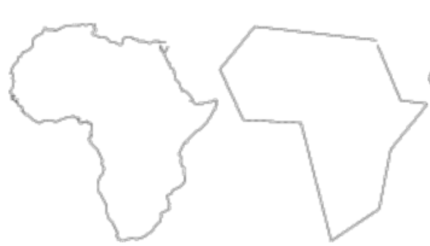<br/>


#### Start, end and stop
There are more gps noise at the beginning of trip, when user stopped and at the end of the trip.  
Depend on the purpose of map matching, we could remove some of points to avoid inaccuracy.  
There might be lots of gps points with speed = 0 when user stopped, such points could be merged into 1 or directly killed.  
We could consider to use the start point from navigation route and remove 1%~5% points from the beginning of trip.


### Hidden markov map matching

#### Why Markov-chain helps
A typical question Markov-Chain helps answer is: Given state A, how probable is state B after several steps.  
If we define the state of Markov Chain as road segments, we want to measure the probability to transition from one road segment to other road segments.  
The problem of map matching could be described as, given a sequence of gps points as observations, can you find the hidden states of a list of connected road segments which represent the trace?  

#### Emission probability
Emission probability is used to find candidates based on each of gps points.  
Road segment with lower distance to gps point would have higher probability than the one has longer distance.  

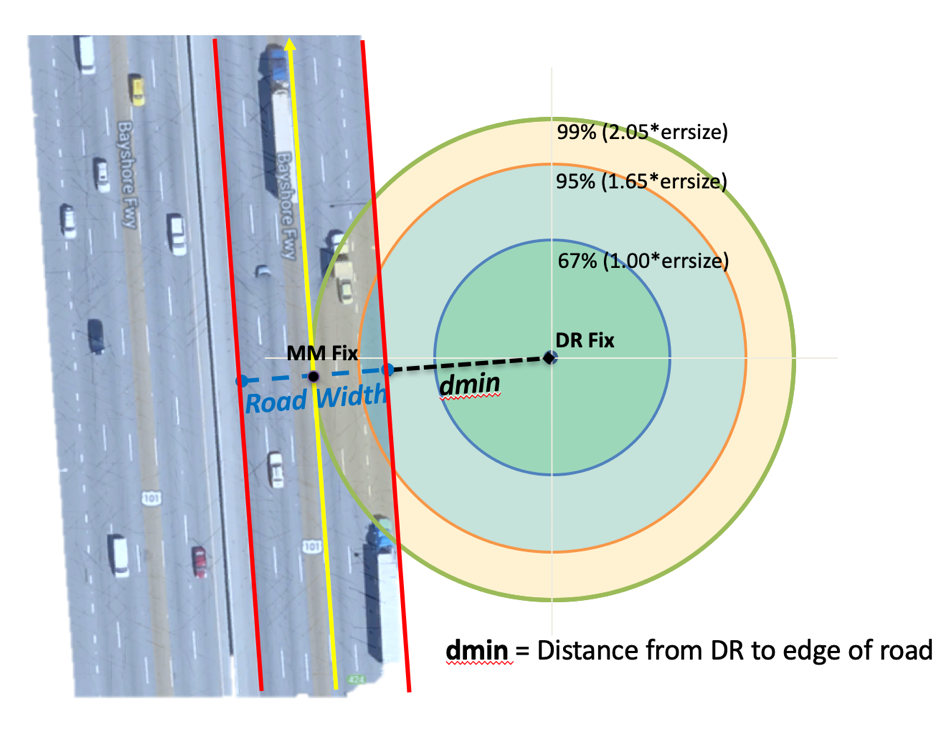<br/>
Gaussian distribution is always be used to calculate the probability.


#### Transition probability
Transition probability represent for based on the transition of road network and previous map matching result, what's the probability from last state to current state.  
There is a very important summary from the paper of [HMMM Through Noise and Sparseness](https://www.microsoft.com/en-us/research/publication/hidden-markov-map-matching-noise-sparseness/)
```
Confirmed by experiment, great circle distance and road distance 
will be about the same for correct matches.  This is because the 
relatively short distance traveled on the roads between a pair of 
correct matches will be about the same as the distance between the 
measured GPS points.
```
Still use the picture in original paper as an example, for the following case, from point 2 to point3, candidate1 need to get off highway and make a long distance to drive while candidate2 is just continue driving on ramp.  The route distance of candidate2 also shows that it's similar to great circle distance of two gps points.  
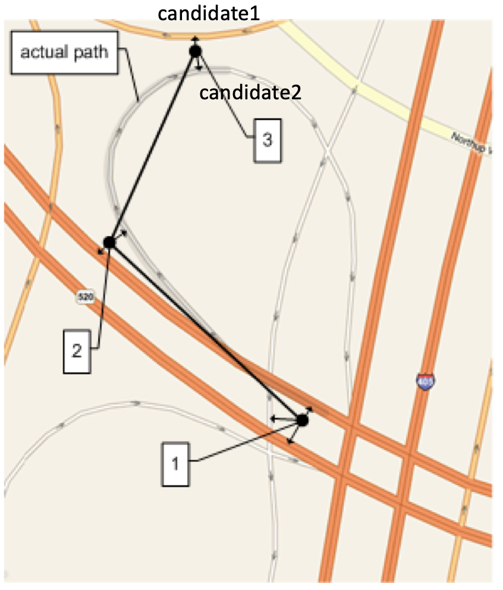<br/>


#### Viterbi algorithm
Viterbi algorithm is dynamic programming algorithm, it accumulate each step's result and get final most probable result.  

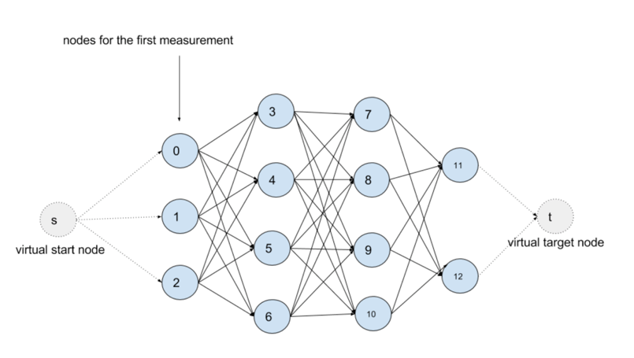<br/>

I feel its much easier to use Dijkstra to understand Viterbi.  Treat probability as cost and each of transition has one, so find the most probable path likes find shortest path between start point and end point.


#### Confidence level
After find map matching result, we could calculate the distance of route and distance of accumulate valid gps points, the similar the two value is and the high confidence we would have.  The result of (route distance - gps distance) follows Laplace distribution.  

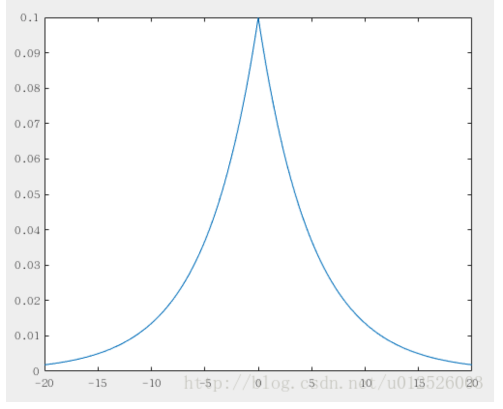<br/>

Confidence level is always used for map making.


### Experience
#1. If you have very long gps trace, its better to break which into several parts.
You could use a threshold = 200 points to break input points.  
Step1: Apply map matching for first 200 points.  
Step2: Get 10% ~ 15%'s points from previous step, let's use 20 points for example, then pick 200 - 20 points from following gps sequence, then do map matching for those 200 points.  
Repeat step2 until reach the end of gps points.  

#2. gps_precision is important for map matching result
If you use tool high value for gps_precision, you might get lots of loops add into final result.  
If you use too small value for gps_precision, you might lose some part of your route.


## More Info
- [OSRM MapMatching](../../osrm/doc/osrm_mapmatching.md)
- [Valhalla MapMatching](../../valhalla/doc/valhalla-mapmatching.md)
- [MapMatching discussion on 11202018](../../valhalla/resource/presentations/valhalla_mm_11202018.pptx)


## Reference
- [HMMM Through Noise and Sparseness](https://www.microsoft.com/en-us/research/publication/hidden-markov-map-matching-noise-sparseness/)  
- [map matching when the map is wrong](https://arxiv.org/pdf/1809.09755.pdf)
- [<<统计学习方法>> 第10章笔记](http://www.hankcs.com/ml/hidden-markov-model.html)
- [How kalman filter works](https://www.bzarg.com/p/how-a-kalman-filter-works-in-pictures/)
- [The Douglas-peucker algorithm: sufficiency conditions for non-self-intersections](http://www.scielo.br/scielo.php?script=sci_arttext&pid=S0104-65002004000100006)
