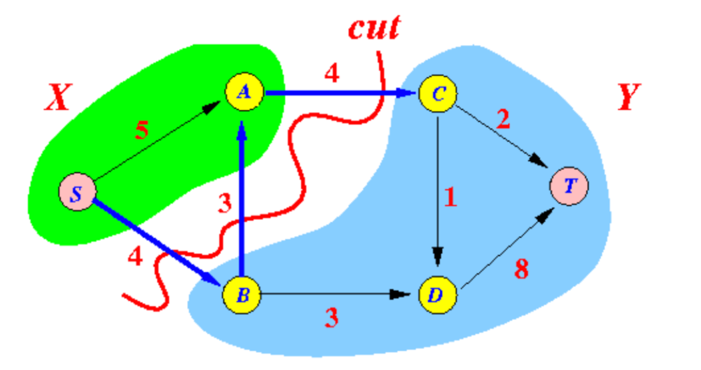
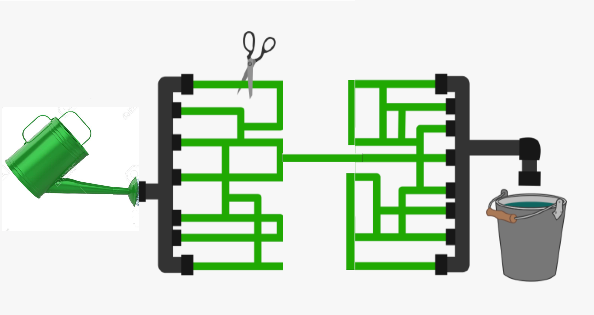
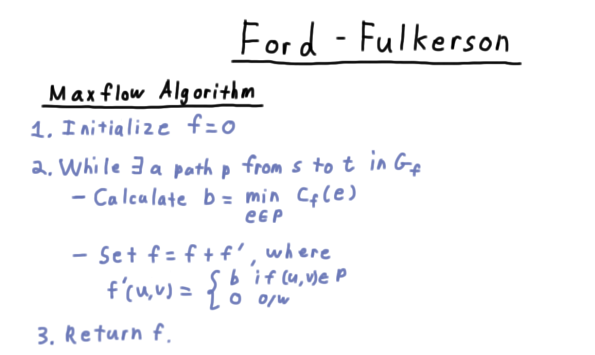
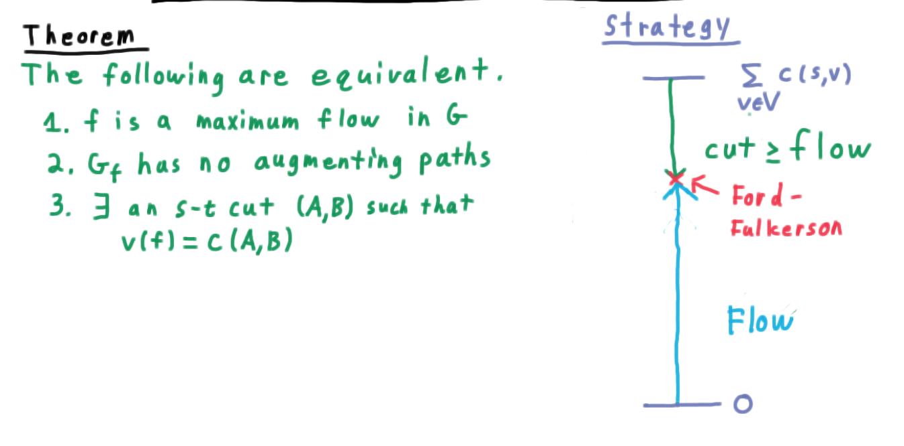
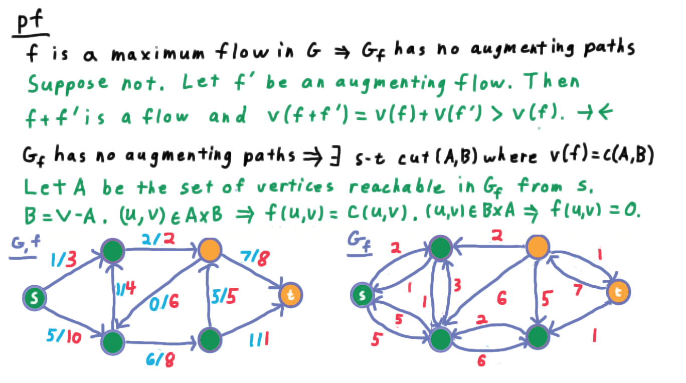
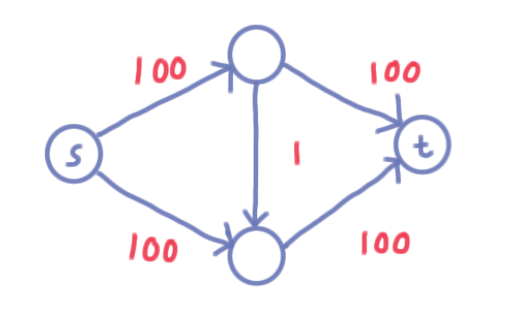
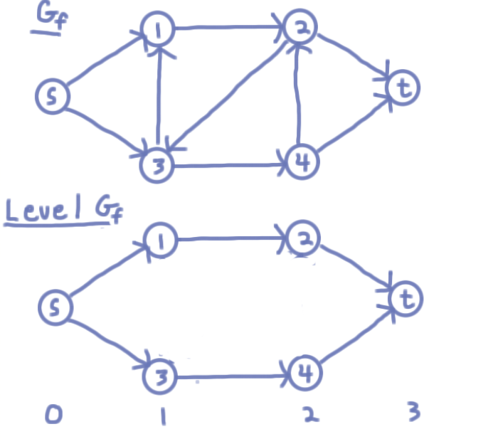

- [Max Flow Min Cut](#max-flow-min-cut)
  - [Key points](#key-points)
    - [Residual network](#residual-network)
    - [Augmenting Path](#augmenting-path)
    - [Ford-Fulkerson](#ford-fulkerson)
    - [Max flow min cut theory](#max-flow-min-cut-theory)
    - [Worst case for FF](#worst-case-for-ff)
    - [Edmonds-Karp](#edmonds-karp)
    - [Dinic](#dinic)
    - [Why level graph helps](#why-level-graph-helps)
  - [Reference](#reference)

# Max Flow Min Cut
The max-flow min-cut theorem states that in a flow network, the maximum amount of flow passing from the source to the sink is equal to the total weight of the edges in the minimum cut, i.e. the smallest total weight of the edges which if removed would disconnect the source from the sink.  Max Flow Min Cut is the algorithm be used in inertial flow to find a partition of a given graph.  


For basic ideas, please go to \<\<Introduction to Algorithm\>\>.





## Key points

### Residual network

Flow network always be modeled as directed graph, we could only choose one direction for the flow between every pair of vertics.  But it is not clear in which direction the flow should go before solving the maxflow problem.  The direction be chosen during calculation could be wrong.  So we need ability to un-sent data back, represent on graph is by adding reverse edges and let algorithm has the ability to re-route back.

Residual network is consisted by edges with residual capacity.

###  Augmenting Path
When we try to find a maximum flow we are going to start with a suboptimal flow and the augment it with a flow we find in the residual network, which is called augmenting flow.
Augmenting path is also a valid flow in original network.

### Ford-Fulkerson

```
// pseudocode
initMaxFlow

while there is an augmenting path
  find an augmenting path using DFS
  bottleneck = min(edge cost on augmenting path)
  for each edge u->v in the path
    decrease capacity u->v by bottleneck
    increase capacity v->u by bottleneck
  increase maxflow by bottleneck
```



FF begin by initializing the flow to zero. Then, while there is a path from the source s to the sink t in the residual graph, it is going to calculate the minimum capacity along such a path and then augment with a flow that has this value along that path.
Once there are no more paths in the residual graph, we just return the current flow that we’ve found f.

FF will terminate in the range of max flow value.  Its time complexity is (num_of_flow * |E|)  


### Max flow min cut theory

Max cut is the cut of all flow from source to sink, which is the upper bound for the flow network


<br/>


For the upper graph, green vertex and orange vertex are two sets and there is no augmenting path could be found.  For the residual graph in the right, we could not push any data from green to orange, and for residual value from orange to green is unused for max flow.   We could conclude, any forward edge from green set to orange set is saturated and any backward edge is unused.

### Worst case for FF


Need augment for 200 times then find max flow

Obviously, it needs method to find better augmenting path.
  - Prefer heavier paths
  - Prefer shorter paths

### Edmonds-Karp
```
// pseudocode
initMaxFlow

while there is an augmenting path
  find an augmenting path using BFS
  bottleneck = min(edge cost on augmenting path)
  for each edge u->v in the path
    decrease capacity u->v by bottleneck
    increase capacity v->u by bottleneck
  increase maxflow by bottleneck
```
Augmenting along a shortest path only creates longer ones.  If an edge on the critical path of augmenting path, augment flow by such edge will make it disapear from residual network.  Every augmenting path has at least one such edge, and each edge could be critical edge for at most v/2 times.


### Dinic
Dinic try to find better augmenting path by shorter path.   Its key insight is that the work of computing the shortest path can be recycled so that a full precomputation only needs to happen when the shortest path distance changes, not for every augmenting path.

```
initMaxFlow
while t is reachable from s in the residual graph
  find the level graph (BFS)
  for each blocking flow in the level graph (DFS)
    update the capacity in the blocking flow
    increase maxflow by bottleneck
```


Dinic start with an initial flow of zero. Then repeat the following: build a level graph from the residual flow network, and let k be the length of a shortest path from s to t. Then while there is a path from source to sink that has this length k, which is be used to augment the flow and then update the residual capacities.
Then repeat this until there are no more s-t paths and we return the current flow.  

### Why level graph helps


Level graph's creation based on the observation: augmenting along a shortest path only creates longer path.  Level graph could avoid the situation of route back and forth, once exhausted all paths of a given length, the next shortest path must be one edge longer. 


## Reference
- [Georgia Tech - Maximum Flow](https://s3.amazonaws.com/content.udacity-data.com/courses/gt-cs6505/maximumflow.html)
- CMU [max-flow-1](http://www.cs.cmu.edu/afs/cs.cmu.edu/academic/class/15451-f14/www/lectures/lec10/max-flow1.pdf) [max-flow-2](http://www.cs.cmu.edu/afs/cs.cmu.edu/academic/class/15451-f14/www/lectures/lec11/max-flow2-avrim.pdf) [dinic](http://www.cs.cmu.edu/afs/cs.cmu.edu/academic/class/15451-f14/www/lectures/lec11/dinic.pdf)
- [Ford-Fulkerson simple implementation](https://github.com/CodeBear801/zoo/blob/ff3279549f24e008c1f1cc40c376a0b02b1189b4/graph/graph_partition/ford_fulkerson.cpp#L1)
- [Dinic simple implementation](https://github.com/CodeBear801/zoo/blob/ff3279549f24e008c1f1cc40c376a0b02b1189b4/graph/graph_partition/dinic.cpp#L1)
