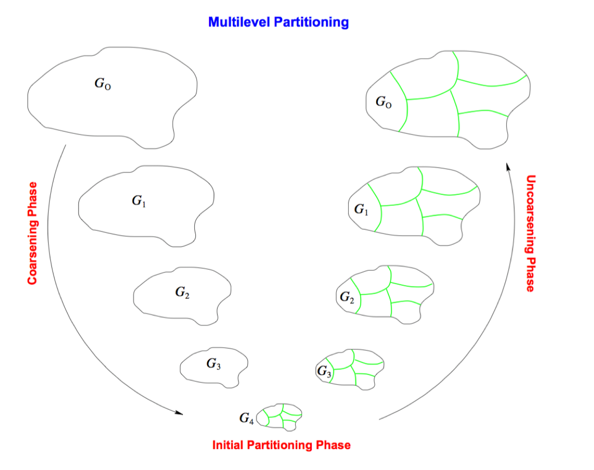
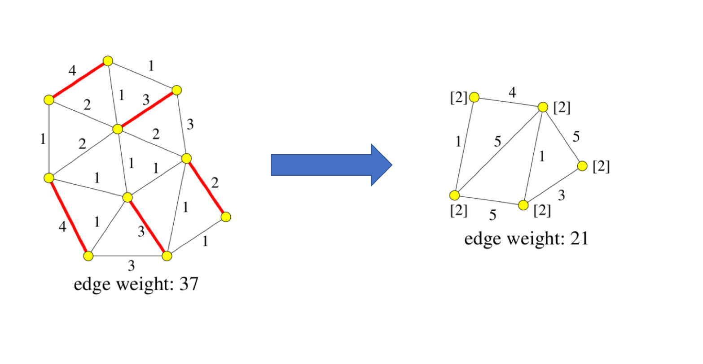
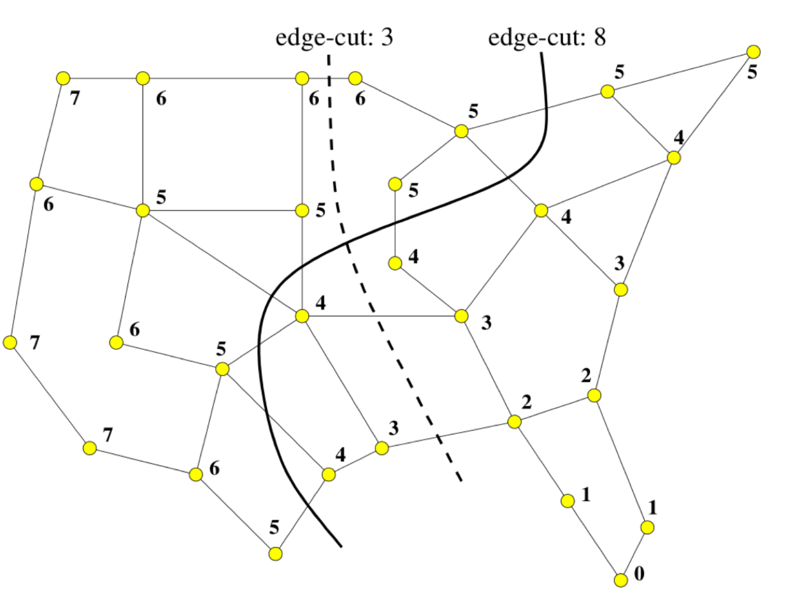

# METIS
METIS means Serial Graph Partitioning and Fill-reducing Matrix Ordering, which is a set of serial programs for partitioning graphs, partitioning finite element meshes, and producing fill reducing orderings for sparse matrices.  The algorithms implemented in METIS are based on the multilevel recursive-bisection, multilevel k-way, and multi-constraint partitioning schemes developed in our lab. 

For original papers, please refer to [Graph Partitioning for High Performance Scientific Simulations](https://pdfs.semanticscholar.org/954a/6396b843a2b15cb66b3120402fc6efde08b9.pdf) and [Hypergraph-Partitioning-Based Decomposition for Parallel Sparse-Matrix Vector Multiplication](https://github.com/emc2314/Graph500/blob/master/doc/Algorithm/Hypergraph-Partitioning-Based%20Decomposition%20for%20Parallel%20Sparse-Matrix%20Vector%20Multiplication.pdf).

## Key Point

METIS is one example of using alternative way to solving real-world problem.  Consider graphs like road network is huge, apply partition algorithms like kernighan_lin directly might never get result.  METIS will first simplify graph into a smaller one, then apply partition algorithm, then try to adjust partition result by adding selected elements back.

### Algorithm Detail

- Coarsen the graph by collapsing heavy edges. Vertex
weights and edge weights are updated. Vertex and edge
weights are initially 1.
- Repeat until the graph is small enough, then partition the
coarsest level graph by some method.
- Uncoarsen. After each uncoarsening step, refine the
partition (using, e.g., Kerninghan-Lin).

For more information, please take a look at [this](../resource/presentations/Partition_II.pptx) and original papers.

### Graph Coarsen

One way to coarsen the graph:

Edges are collapsed by using a heavy-edge matching.
A matching is a set of edges such that no two edges share a vertex.

### Partitioning based on coarsest level graph

## Reference
- [METIS Main Page](http://glaros.dtc.umn.edu/gkhome/views/metis)
- [Graph Partitioning for High Performance Scientific Simulations](https://pdfs.semanticscholar.org/954a/6396b843a2b15cb66b3120402fc6efde08b9.pdf)
- [Hypergraph-Partitioning-Based Decomposition for Parallel Sparse-Matrix Vector Multiplication](https://github.com/emc2314/Graph500/blob/master/doc/Algorithm/Hypergraph-Partitioning-Based%20Decomposition%20for%20Parallel%20Sparse-Matrix%20Vector%20Multiplication.pdf)
