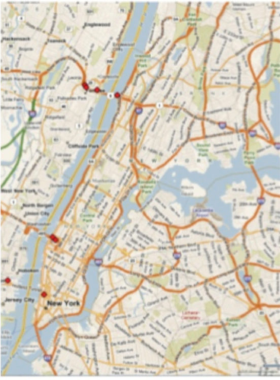
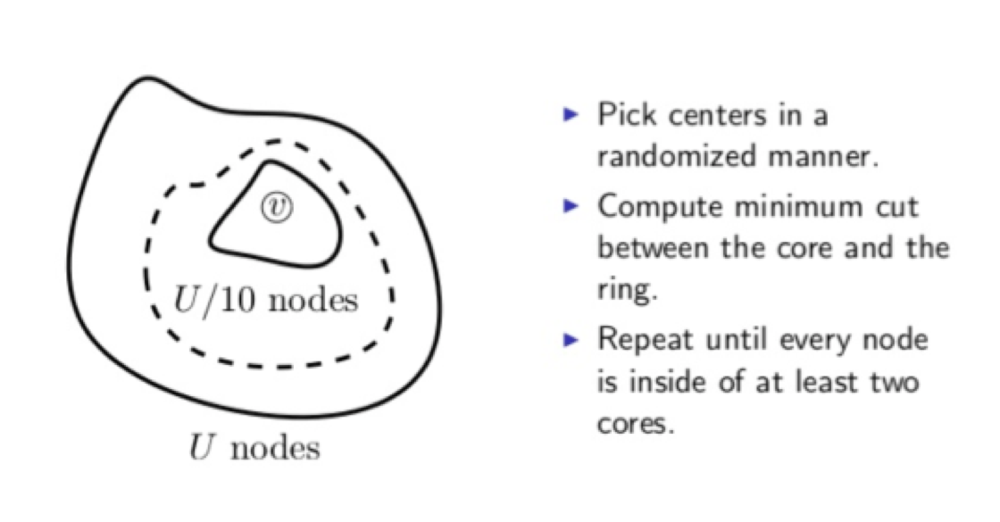
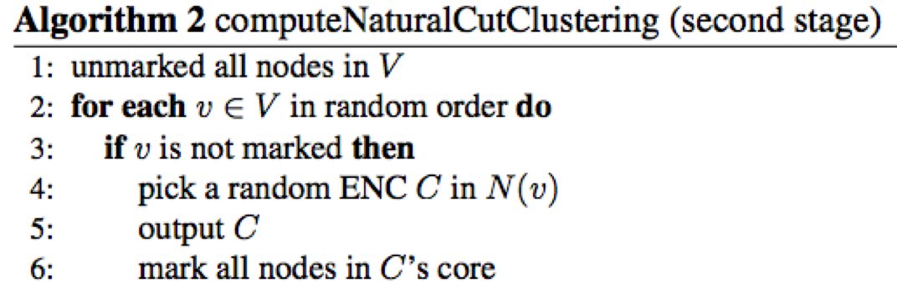
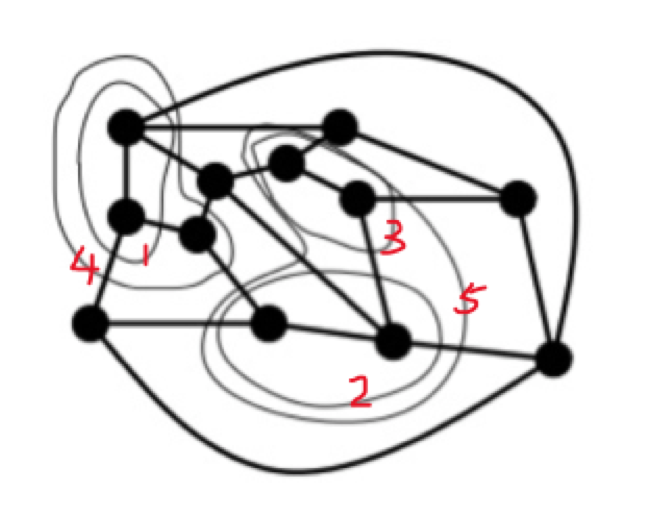

- [PUNCH](#punch)
  - [Filtering phase](#filtering-phase)
  - [Assembly phase](#assembly-phase)

# PUNCH
PUNCH means partitioning using natural cut heuristics, its intuition is, inside road networks, dense regions(grids, cities) interleaved with natural cuts(mountains, parks, rivers, deserts, sparse areas, freeways).
PUNCH discovered that road networks have remarkably small separators and it appeared to be the one capable of efficiently computing these separators.
PUNCH is divided as filtering phase and Assembly phase

## Filtering phase
Filtering phase will contract dense regions to reduce graph size, while natural cuts structure is preserved. 

Natural cuts, like the red points in the upper picture, are a group of sparse sets that separate dense areas.

Here is the diagram for how to find them

Here is the pseudo code

Picuture from [Distributed Evolutionary Graph Partitioning](https://arxiv.org/pdf/1110.0477.pdf)

The result of filtering phase is the fragment like below

## Assembly phase
There are three ingredients, greedy algorithm, local search, multistart and combination heuristics

Greedy algorithm will randomly pick well-connected small fragments and then combine them.  This step will repeat until maximal and finds initial partition.

The local search will pick two neighboring cells, disassemble them and then apply greedy algorithm to the subproblem.  The logic will be repeatly several times for every pair of neighboring cells.

