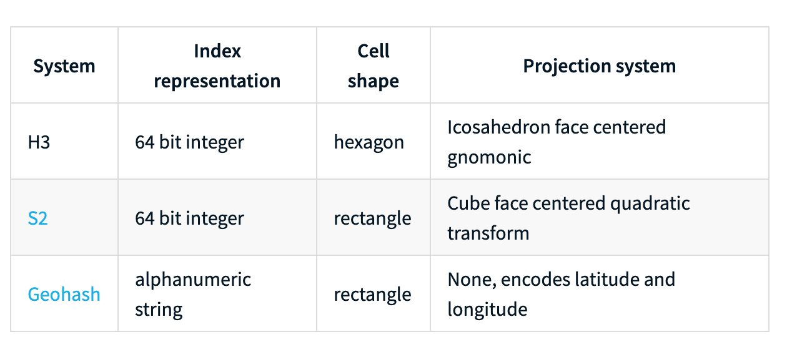

## Problems

- Given a point in the map, how to you find the nearest segment
- Given a point in the map, how to you find the nearest several segments
- Given a bounding box at any shape(rectangle, circle), how do you query map content overlapped with the shape
- Partition data based on spatial information

## Spatial Index

- Rtree
- R*Tree
- KD tree

### Static space divide

- Geohash
- Google S2
- Uber H3

## Comparison

(Table coming from [Uber H3 doc](https://uber.github.io/h3/#/documentation/overview/use-cases))

### GeoHash VS S2

### S2 VS H3

