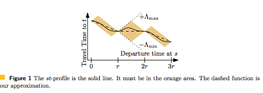

## Problem description
- Earliest arrival problem
  When you take public transportation to your destination, how to calculate route to figure out earliest arrival.

- When calculate route for long distances, how to guarantee route result consider time information.
  For example, from SF to LA need 6 hours, how to use appropriate speed profile in the middle to find suitable route

- In route calculation, is easier to consider then influence of traffic jam happened by hard to evaluate when it would done

## Important points
- Average the travel time in k time windows
- Compute one or several shortest time-independent path within each window and mark the edges in these paths
- Compute a shortest time-dependent path in the original graph restricted to the marked edges

## Freeflow and Avgflow Heuristic
- 1. Compute a shortest time-independent path according to the freeflow travel times.
- 2. Compute the time-dependent travel time along this path

In simple, it means calculate route without considering live traffic and then apply live traffic to the final route for accurate ETA.  Could potentially miss the best candidate, need adjustment.

## TD-S(Time-Dependent Simple routing)
**Preprocessing**
- 1. Fix a small set of time intervals called time windows.
- 2. For each time window and edge compute the average travel time in that window.
- 3. Each time window induces a time-independent graph. Preprocess each of these graphs using your favorite time-independent speedup technique.

**Query**
- 1. For each time window compute the shortest time-independent st-path using the employed speedup technique
and mark the edges in the path.   Generate a subgraph based on union of all route edges.
- 2. Run a basic time-dependent search on the subgraph of the time-dependent input graph induced by all
marked edges.

**Notes**
- Time windows could be rush hours and none-rush hours {0:00 ~ 6:00}, {7:00 ~ 9:00}, {11:00 ~ 14:00}, {17:00 ~ 19:00}
- In the query phase, for given origin and destination, will calculate several path on different time-window(time independently), then will union all path generate a subgraph, final time dependent query is apply on subgraph
- For time independent search, could use any optimize strategy like CH or MLD

## TD-S+A(alternatives)
Compute several alternatives for each time window and restrict the time-dependent search

## TD-S+P(Profile)
During query phase:
- 1. Mark the edges as with TD-S, compute a subgraph H
- 2. Sample at regular intervals the travel time by running the time-dependent extension of Dijkstra’s algorithm restricted to the subgraph H
The approximated profile interpolates between the sampled points linearly.



**Notes**
- Λmax and Λmin
The purpose is allow the smooth transition from static metrics on undirected graphs towards time-dependent metrics on directed graphs.  There is one important assumption: all the minimum-travel-time slopes are bounded in a given interval [−Λmin,Λmax].
```
Assumption 2.1. ∃Λmin ∈ [0, 1), ∃Λmax ≥ 0 s.t. the following holds: ∀(o, d) ∈ V × V, ∀0 ≤ t1 < t2, (D[o, d](t1)−D[o, d](t2)) / (t1−t2) ∈ [−Λmin,Λmax] .
```
The lower-bound of −1 in the minimum-traveltime function slopes is indeed a direct consequence of the FIFO property, which is typically assumed to hold in several time-dependent networks, such as road networks.   
Λmax represents the maximum possible rate of change of minimum-travel-times in the network, which only makes sense to be bounded (in particular, independent of the network size) in realistic instances such as the ones representing urban-traffic time-dependent road networks.

Question: what is profile mean?  


## TD-S+D(Dynamic traffic)


## Terms
- In the paper, shortest actually means fastest
- Time independent: Use fixed time and related cost profile to rank route
- Time dependent: Consider real time information, like A->B->C, lets say A->B takes 1 hour and B-C takes one hour.  If user start at 1PM, then when evaluate cost from B we need consider time at 2PM and for C is time at 3PM
- FIFO: A car that enters an edge earlier must leave the edge earlier than a car that entered at a later moment
- Freeflow: no traffic
- Avgflow: average speed for a time range
- Dijkstra Rank: 1. Pick a random source node s uniformly at random. 2. Order all other nodes by freeflow distance from s using Dijkstra’s algorithm. The query from s to the pow(2, i)th node in this order has Dijkstra-rank i. 
The intuition is that a query with a low Dijkstra-rank is more local than a query with a high Dijkstra-rank.

## Reference
- [Dynamic Time-Dependent Routing in Road Networks Through Sampling∗](http://drops.dagstuhl.de/opus/volltexte/2017/7897/pdf/OASIcs-ATMOS-2017-3.pdf)
- [Intriguingly Simple and Efficient Time-Dependent Routing in Road Networks∗](https://arxiv.org/pdf/1606.06636.pdf)
- [Engineering Oracles for Time-Dependent Road Networks∗](https://pdfs.semanticscholar.org/d268/cfa34d1bddacd6a3252ea2101c864c3c130d.pdf)
- [Traffic-Aware Routing in Road Networks](http://www.sommer.jp/trafficrouting.pdf)


