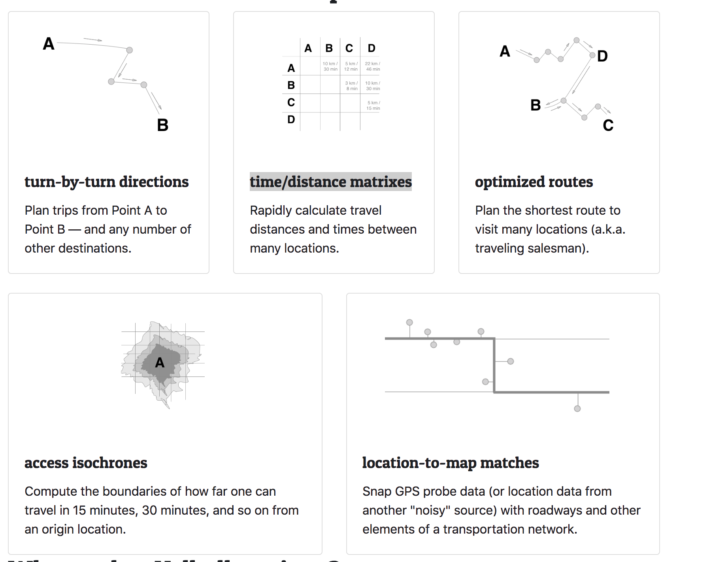

# What is Valhalla

[README](https://github.com/valhalla/valhalla/blob/master/README.md) is the first document you should read before anything.  
[Docs](https://github.com/valhalla/valhalla/tree/master/docs) provides more information if you want to go further.

# What Valhalla can do




# Code
For how to build from source code, please go to [Building from source](https://github.com/valhalla/valhalla/blob/master/README.md#building-from-source)

# Data
For how to build data, please go to document here: [Mjolnir: Getting started Guide](https://github.com/valhalla/valhalla/blob/master/docs/mjolnir/getting_started_guide.md) 

# Debug

## Data generation
Make sure valhalla_tiles.tar and valhalla.json is correctly generated.

## MapMatching
For debugging offline MapMatching, you could generate valhalla_run_map_match by modifying CMakeFile:

```diff
-set(valhalla_programs valhalla_run_route valhalla_run_isochrone)
+set(valhalla_programs valhalla_run_route valhalla_run_isochrone valhalla_run_map_match)
```

The config for valhalla_run_map_match is valhalla.json

```
./valhalla_run_map_match path/valhalla.json
```
The input for valhalla_run_map_match is {lon lat} pair

```
13.225727 52.507321
13.224886 52.507435
13.223781 52.507598
13.222418 52.507856
```

## Routing
For debugging Routing, you could try with valhalla_run_route by
```
valhalla_run_route -j '{"locations":[{"lat":52.529816,"lon":13.425419,"type":"break","city":"Berlin"},{"lat":52.510354,"lon":13.490896,"type":"break","city":"berlin"}],"costing":"auto","directions_options":{"units":"miles"}}' --config path/valhalla.json
```


