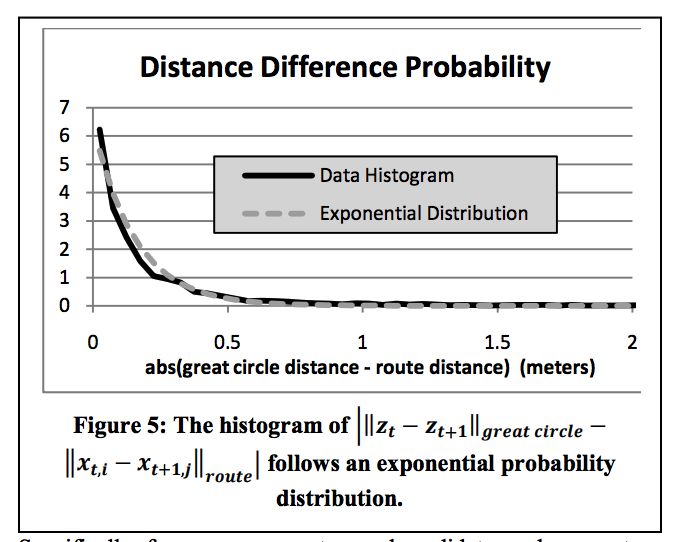
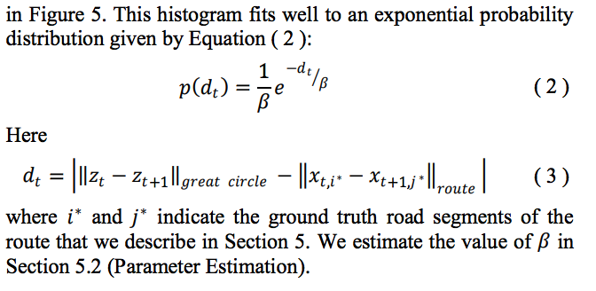
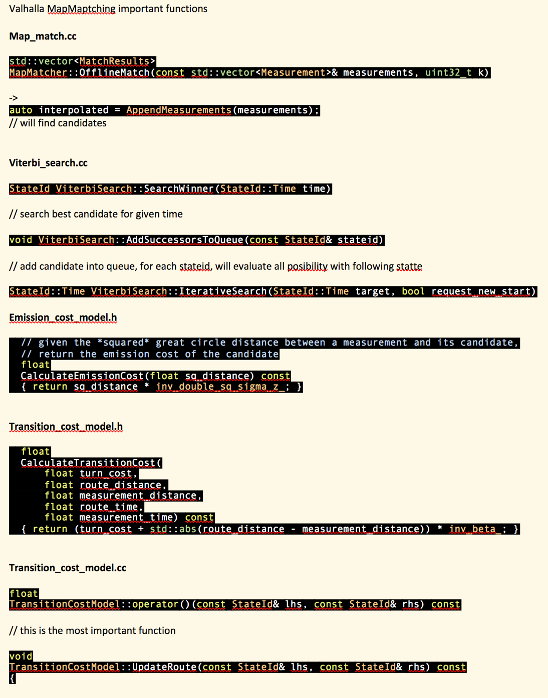

# Map Matching
Meili is the component for Map Matching, you could find a lot of useful information [here](https://github.com/valhalla/valhalla/blob/master/docs/meili.md)

The main idea of Valhalla's MapMatching is coming from this paper [Hidden Markov Map Matching Through Noise and Sparseness](https://infolab.usc.edu/csci587/Fall2016/papers/Hidden%20Markov%20Map%20Matching%20Through%20Noise%20and%20Sparseness.pdf).  This [**slide**](../resource/presentations/valhalla_mm_11202018.pptx) records the discussion within Telenav Nevigation Team. 


## Main Logic
 You could go to here for [basic knowledge of map matching](../../routing_basic/doc/mapmatching_basic.md).  

### Emission probability
Emission probability tells that the closer segment with gps point is more likely be the candidate matched to it.  
Emission cost's calculation could be found in [emission_cost_model.h](https://github.com/valhalla/valhalla/blob/2345ba1f4936b9b547f1e0e43ba18c1d733a5e52/valhalla/meili/emission_cost_model.h#L29)  

```C++
  // given the *squared* great circle distance between a measurement and its candidate,
  // return the emission cost of the candidate
  float CalculateEmissionCost(float sq_distance) const {
    return sq_distance * inv_double_sq_sigma_z_;
  }
  // [Perry] sigma_z_(sigma_z), by default 'sigma_z': 4.07, 'gps_accuracy':4.07 or '5.0'
  //         inv_double_sq_sigma_z_(1.f / (sigma_z_ * sigma_z_ * 2.f))
```

Here is the formula from original paper  
<br/>
More information could refer to the article [Update: GNSS Accuracy: Lies, Damn Lies, and Statistics](http://www.christinafriedle.com/uploads/1/8/4/7/1847486/liesdamnedliesandstatistics.pdf)  


[**Convert from Max probability to Min Cost**](https://github.com/valhalla/valhalla/blob/master/docs/meili/algorithms.md)  
We want to max probability of product of (E(u) * T(u, v))  
Equals to maximizing lg(product(E(u) * T(u, v)) -> sum(lg(EU) + lg(T(u, v)))  
Equivalent to minimizing:-sum(lg(E(u)) + lg(T(u, v))) -> sum(-lg(E(u)) + -lg(T(u, v)))  
assert 0 <= -lg(E(u))  
So cost = -1 * lg(probability)  


### Transition probability
Transition probability tells that the closer the route distance from one segment candidate to another segment candidate to the great circle distance of two gps point, the more likely second candidate be the solution.  

Transition cost's calculation could be found in [transition_cost_model.h](https://github.com/valhalla/valhalla/blob/2345ba1f4936b9b547f1e0e43ba18c1d733a5e52/valhalla/meili/transition_cost_model.h#L38)  
```C++
  // we use the difference between the original two measurements and the distance along the route
  // network to compute a transition cost of a given candidate, turn_cost may be added if
  // the turn_penalty_table_ is enabled, one could make use of time in this computation but
  // this is not advisable as traffic at the time may make readings unreliable and time information
  // is not strictly required to perform the matching
  float CalculateTransitionCost(float turn_cost,
                                float route_distance,
                                float measurement_distance,
                                float route_time,
                                float measurement_time) const {
    return (turn_cost + std::abs(route_distance - measurement_distance)) * inv_beta_;
  }
  //[Perry] 'beta': 3
```

Here is the formula from original paper  
<br/>
<br/>

### Logic flow
<br/>

## Reference
- [Meili's Algorithm](https://github.com/valhalla/valhalla/blob/master/docs/meili.md)
- [Matching GPS traces to a map](https://blog.mapbox.com/matching-gps-traces-to-a-map-73730197d0e2)


