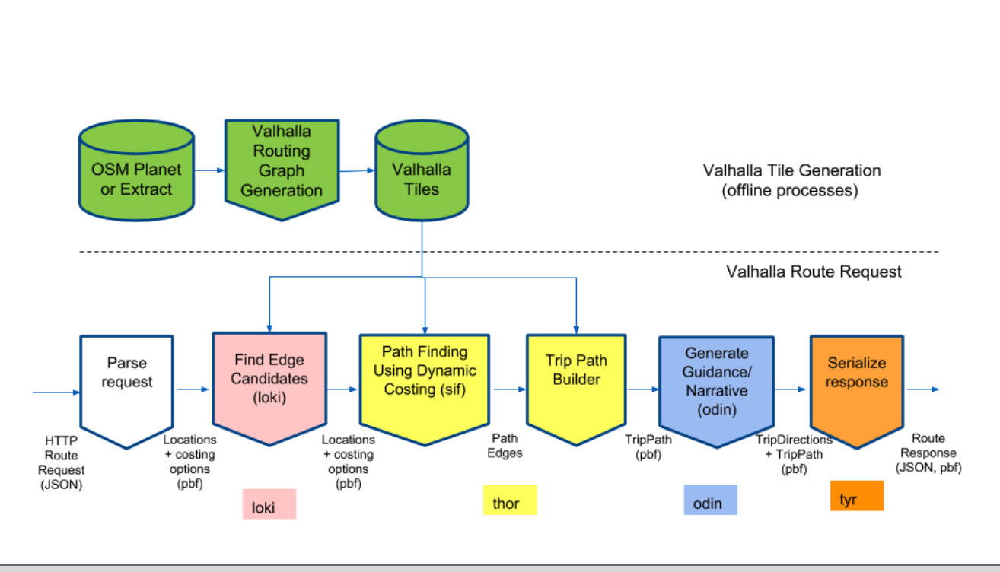

# Valhalla Routing

Thor is the component for route calculation, click here to review [path-algorithm document](https://github.com/valhalla/valhalla/blob/master/docs/thor/path-algorithm.md)

- For OD finding, [loki](https://github.com/valhalla/valhalla/blob/master/docs/loki.md) is the component mapping given coordinate to routing graph
- Bidirectional A* is the basic algorithm for path finding
- Valhalla use Fibonacci heap for priority-queue, the same as OSRM
- Valhalla use LUA as dynamic cost model configuration, which means adjust cost model to affect routing result don't need to re-compile code and data.  For more information about cost model, you could go to [sif component's doc](https://github.com/valhalla/valhalla/blob/master/docs/sif/dynamic-costing.md)
- Valhalla has 3 layer of tiles to speed up route calculation, upper layer of tile is the duplication of lower layer.  Valhalla combine edges during preprocessing as some-kind of shortcut.  For more informtation, please go to [valhalla-tiles](./valhalla-tile-general.md) for referernce
- Valhalla support multiple model route calculation, like bike, pedestrian, public transportation

## Ref links
[Routing Connectivity Map](https://medium.com/postzen/you-me-and-connectivity-a45c8214c000)
