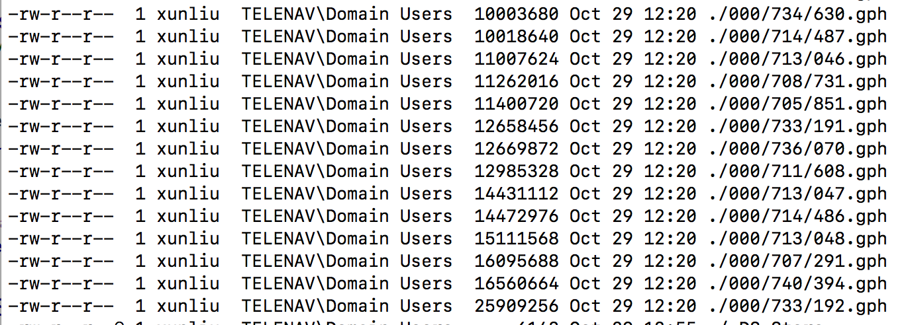

# Valhalla Tile Profile


## Size profile
Here is the largest file for California



The larget file for CA is about 25MB.  Which makes its possible that Valhalla might have large peak memory usage when start point is in the corner of dense area.  But file cache size is a configurable parameter and data structure would be much smaller when covert to routing internal data structure, would not be a big issue.

For entire CA data, it takes about 800MB on my local macbookpro, which makes its possible that Valhalla need 8GB for entire NA. <br/>


## What's inside of graph tile

```c++
  // GraphId (tileid and level) of this tile. Data quality metrics.
  uint64_t graphid_ : 46;
  uint64_t density_ : 4;
  uint64_t name_quality_ : 4;
  uint64_t speed_quality_ : 4;
  uint64_t exit_quality_ : 4;
  uint64_t has_elevation_ : 1;        // Does this tile have elevation data
  uint64_t has_ext_directededge_ : 1; // Does this tile have extended directed edge data

  // Base lon, lat of the tile
  std::pair<float, float> base_ll_;

  // baldr version.
  char version_[kMaxVersionSize];

  // Dataset Id
  uint64_t dataset_id_;

  // Record counts (for fixed size records). Node and directed edge have a max of
  // kMaxGraphId which is 21 bits.
  uint64_t nodecount_ : 21;             // Number of nodes
  uint64_t directededgecount_ : 21;     // Number of directed edges
  uint64_t predictedspeeds_count_ : 21; // Number of predictive speed records
  uint64_t spare1_ : 1;

  // Currently there can only be twice as many transitions as there are nodes,
  // but in practice the number should be much less.
  uint32_t transitioncount_ : 22; // Number of node transitions
  uint32_t turnlane_count_ : 21;  // Number of turnlane records
  uint64_t transfercount_ : 16;   // Number of transit transfer records
  uint64_t spare2_ : 7;

  // Number of transit records
  uint64_t departurecount_ : 24;
  uint64_t stopcount_ : 16;
  uint64_t routecount_ : 12;
  uint64_t schedulecount_ : 12;

  // Counts
  uint64_t signcount_ : 24;                // Number of signs
  uint64_t access_restriction_count_ : 24; // Number of access restriction records
  uint64_t admincount_ : 16;               // Number of admin records

  // Spare 8=byte words that can be used for custom information. As long as the size of
  // the GraphTileHeader structure and order of data within the structure does not change
  // this should be backwards compatible. Make sure use of bits from spareword* does not
  // exceed 128 bits.
  uint64_t spareword0_;
  uint64_t spareword1_;

  // Offsets to beginning of data (for variable size records)
  uint32_t complex_restriction_forward_offset_; // Offset to complex restriction list
  uint32_t complex_restriction_reverse_offset_; // Offset to complex restriction list
  uint32_t edgeinfo_offset_;                    // Offset to edge info
  uint32_t textlist_offset_;                    // Offset to text list

  // Date the tile was created. Days since pivot date.
  uint32_t date_created_;

  // Offsets for each bin of the 5x5 grid (for search/lookup)
  uint32_t bin_offsets_[kBinCount];

  // Offset to beginning of the lane connectivity data
  uint32_t lane_connectivity_offset_;

  // Offset to the beginning of the predicted speed data
  uint32_t predictedspeeds_offset_;

  // Marks the end of this version of the tile with the rest of the slots
  // being available for growth. If you want to use one of the empty slots,
  // simply add a uint32_t some_offset_; just above empty_slots_ and decrease
  // kEmptySlots by 1. Note that you can ONLY add an offset here and NOT a
  // bitfield or union or anything like that
  uint32_t empty_slots_[kEmptySlots];
```


|Arrays in the tile|
|------|
|NodeInfo|
|DirectedEdge|
|AccessRestriction|
|TransitDeparture|
|TransitStop|
|TransitRoute|
|TransitSchedule|
|TransitTransfer|
|Sign|
|Admin|
|GraphId|
|complex_restriction_forward_|
|complex_restriction_reverse_|
|Edgeinfo|
|Textlist|
|TrafficAssociation|
|TrafficChunk|
|LaneConnectivity|
|EdgeElevation|


