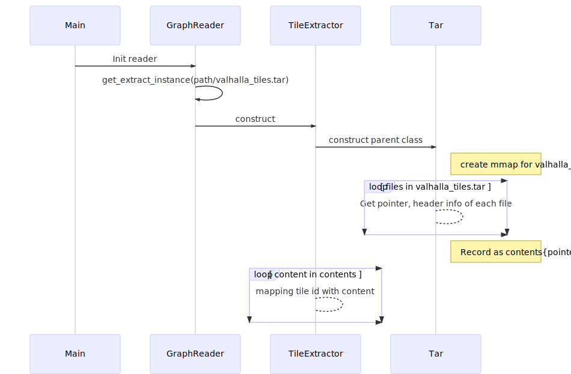

# Valhalla LoadTile logic

## Tile Definition
Tile start with header ([code](https://github.com/valhalla/valhalla/blob/63bfd80090e8722bb6e8abc0242262196b191848/valhalla/baldr/graphtileheader.h#L588)) of 264 bytes.  The definition of body([code](https://github.com/valhalla/valhalla/blob/63bfd80090e8722bb6e8abc0242262196b191848/valhalla/baldr/graphtile.h#L496)) are a bunch of arrays.  
Serialize valhalla tiles just copy arrays in the memory to file handler, which makes deserialize tile is very simple and efficient when use mmap. ([code](https://github.com/valhalla/valhalla/blob/63bfd80090e8722bb6e8abc0242262196b191848/src/baldr/graphtile.cc#L151))

## TileReaderInit
All tile data be wrapped in one tar package, there is no compression.

For configuration, passing path of valhalla_tiles.tar as "tile_extract", which is defined in valhalla.json.

Valhalla [use mmap to load entire package](https://github.com/valhalla/valhalla/blob/63bfd80090/valhalla/midgard/sequence.h#L180), [collect handler of each files](https://github.com/valhalla/valhalla/blob/63bfd80090/valhalla/midgard/sequence.h#L597), then [build a mapping between tileid <-> file handler](https://github.com/valhalla/valhalla/blob/63bfd80090/src/baldr/graphreader.cc#L35).  When access tile content, data will be directly convert from pointer of file to pointer of array.

## GetTile

For the api's definition, please go to [here](https://github.com/valhalla/valhalla/blob/3.0.0/valhalla/baldr/graphreader.h#L234)

For logic, you could find code [here](https://github.com/valhalla/valhalla/blob/63bfd80090e8722bb6e8abc0242262196b191848/src/baldr/graphreader.cc#L222)

