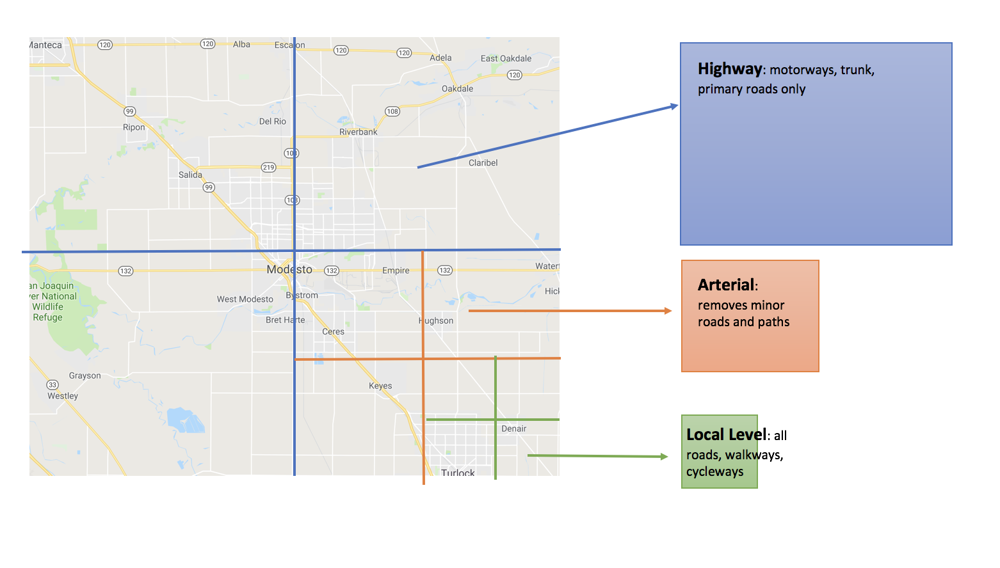
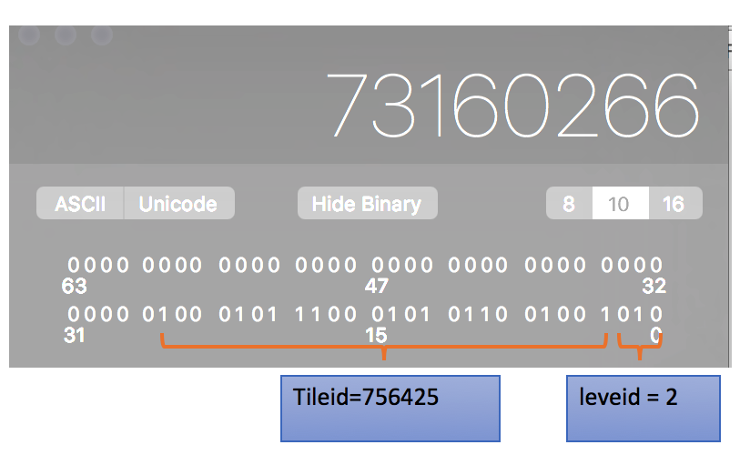

# Valhalla tiles 

Valhalla generate 3 level of tiles with different boundary size.  





## Summary
1. Fixed boundary makes it easy to implement "cacheability" and "updateability" related features.  The application could retrieve needed data for home area or along the route with limited space cost.


2. Tile is the unit which enables cacheability.  


3. Redundant data at high level balance the performance and sdcard space cost, similar way also be used in NDS.


4. Tile contains all geometry information related with certain area, its size mainly depend on the density of road network.  For more information, please go to [data profile page](./valhalla-tile-profile.md)

5. For the definition of tile, you could find code here for [header](https://github.com/valhalla/valhalla/blob/63bfd80090e8722bb6e8abc0242262196b191848/valhalla/baldr/graphtileheader.h#L588) and [body](https://github.com/valhalla/valhalla/blob/63bfd80090e8722bb6e8abc0242262196b191848/valhalla/baldr/graphtile.h#L496)


## Grid boundary

| level  | name  | Degree  | 
|------|----------|----|
| 0  | Highway  | 4  | 
| 1  | Arterial  | 1  |
| 2  | Local Level  | 0.25  |


## Example of Germany


High level grid contains lots of sub level grid, the boundary is perfectly overlapped.


## How to calculate gridid

```c++
/**
 * Identifier of a node or an edge within the tiled, hierarchical graph.
 * Includes the tile Id, hierarchy level, and a unique identifier within
 * the tile/level.
 * TODO - currently the Ids are indexes into the node and directed edge
 * "lists" for the tile/level. May need to create persistent Ids at some
 * point.
 */
struct GraphId {
 public:
  // Single 64 bit value representing the graph id.
  // Bit fields within the Id include:
  //      3  bits for hierarchy level
  //      22 bits for tile Id (supports lat,lon tiles down to 1/8 degree)
  //      21 bits for id within the tile.
  uint64_t value;
```


#### Graphid -> Tile ID
Given 73160266 as GraphID




#### Tile ID -> Position
For given tile id, the bottom corner could be directly be calculated, such as given756425, we could get (41.25, -73.75)

```python
def get_ll(id):
  tile_level = get_tile_level(id)
  tile_index = get_tile_index(id)
  level = filter(lambda x: x['level'] == tile_level, valhalla_tiles)[0]
  width = int(360 / level['size'])
  height = int(180 / level['size'])
  return int(tile_index / width) * level['size'] - 90, (tile_index % width) * level['size'] - 180
```


#### Physical file location
given 73160266, its file location is
valhalla_tiles/2/000/756/425.gph


#### Position -> Tile ID
get_tile_id(2, 41.413203, -13.623787) -> 756425

```python
def get_tile_id(tile_level, lat, lon):
  level = filter(lambda x: x['level'] == tile_level, valhalla_tiles)[0]
  width = int(360 / level['size'])
  return int((lat + 90) / level['size']) * width + int((lon + 180 ) / level['size'])
```

#### Code
You could find python code [here](../resource/code/valhalla-tiles-query.py)


## Reference
- [Why tiles](https://mapzen.com/blog/valhalla-why_tiles/)
- [Tiles doc](https://github.com/valhalla/valhalla/blob/master/docs/tiles.md)

