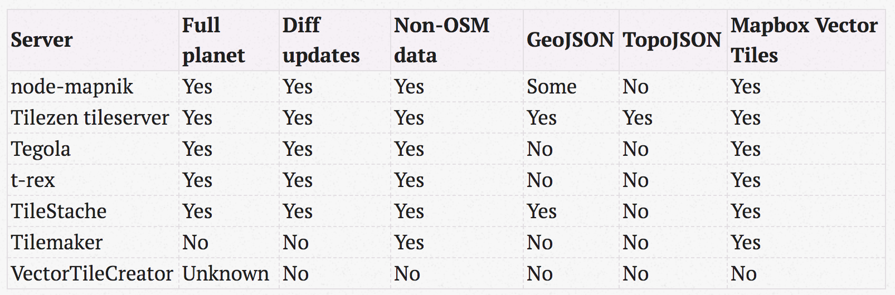

# Open Source Vector Map Solution

## Experiment Links
- [Set up vector map service based on open source solution](https://github.com/Telenav/open-source-spec/issues/4)
   + osm pbf -> tiles in mapbox's vector tile format -> [Mapbox GL JS](https://docs.mapbox.com/mapbox-gl-js/api/) to render
- [Tegola experiment](./doc/tegola_quick_experiment.md)
   + Tegola converts pbf to mapbox vector tile format, written in `golang`
- [vt2geojson experiment](https://github.com/wangyoucao577/vt2geojson)  
   + vt2geojson converts mapbox vector tile to geojson
   + https://github.com/wangyoucao577/mapeye/blob/master/vector_tile_styling.js

## Useful information
- [Vector tile specification](https://docs.mapbox.com/vector-tiles/specification/)
- [awesome-vector-tiles](https://github.com/mapbox/awesome-vector-tiles)
